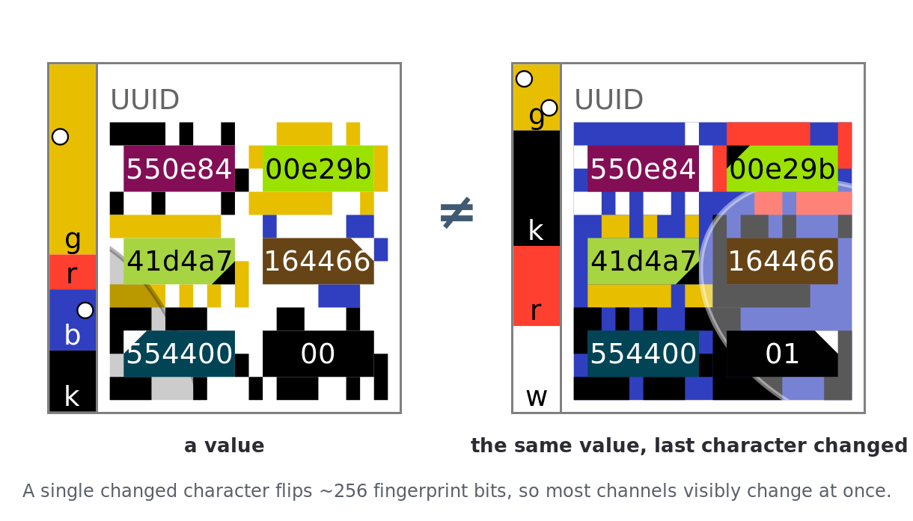
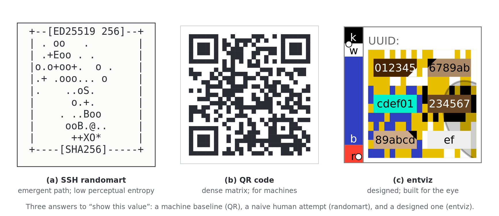
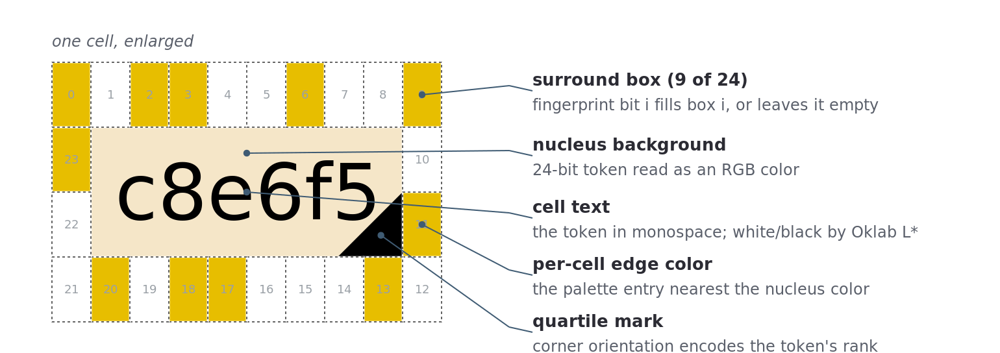
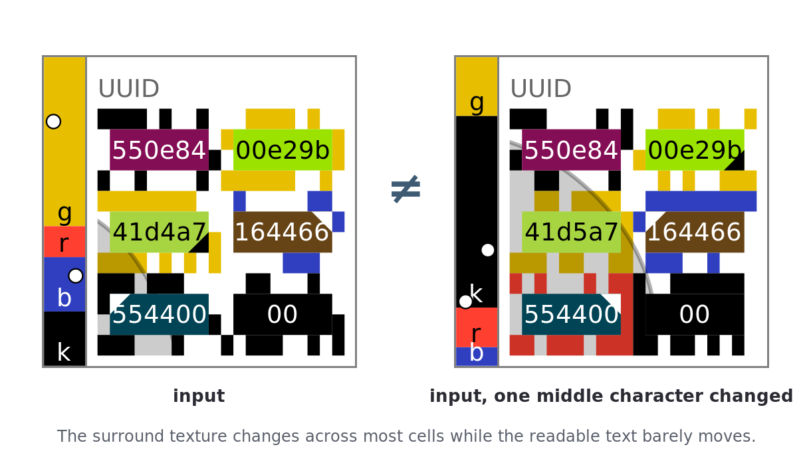
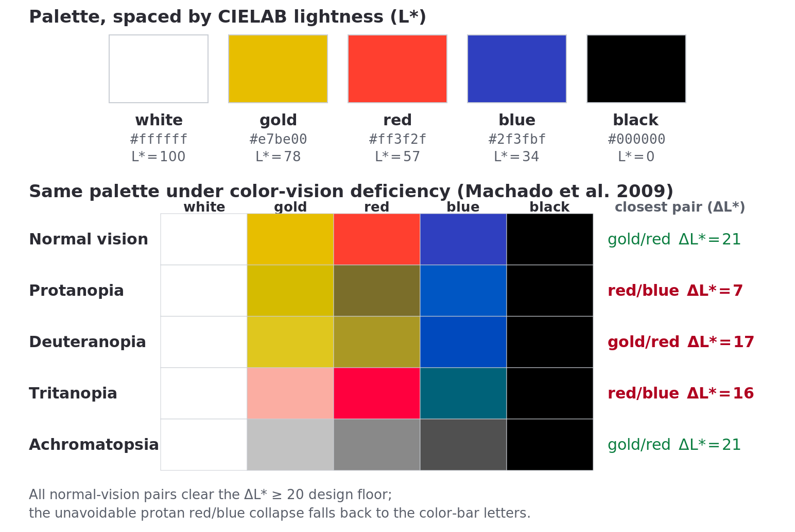
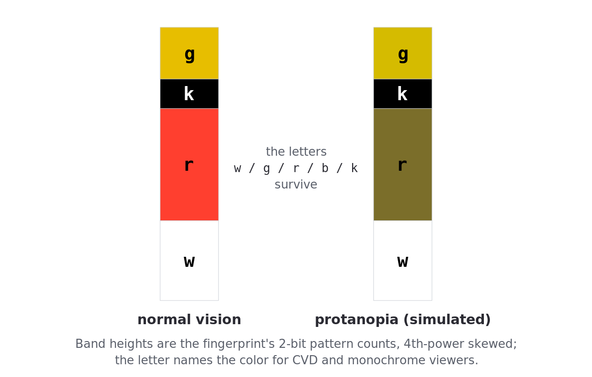
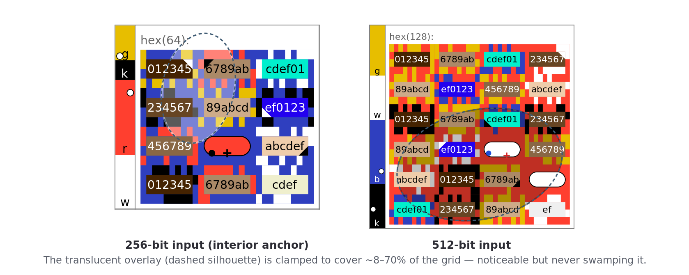
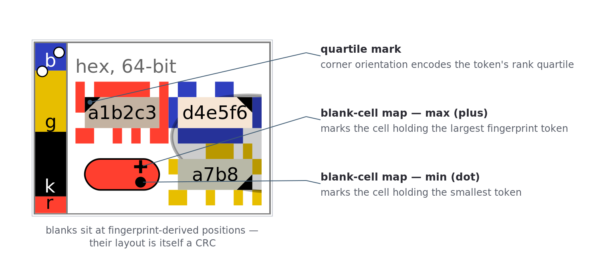
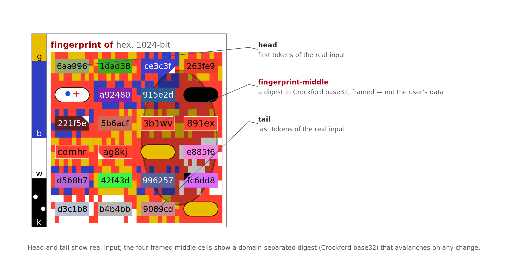

# 1. Introduction

## 1.1. The human bottleneck in cryptographic verification

Security increasingly asks the end user to do the verifying. People confirm SSH host-key fingerprints, compare Signal safety numbers, and check the first and last characters of a blockchain address before sending funds. Each of these tasks reduces to one question asked of a human: *are these two high-entropy values the same?* [1, 2].

Humans are poorly built for the question as usually posed. Comparing `fc94b0c1e5b0987c` with `fc94b0c1e5b6987c` forces a serial, character-by-character scan: slow, effortful, and easy to abandon one digit early [3]. Recent work quantifies the cost. In a 162-participant study, Turner, Shahandashti, and Petrie found that comparison errors persist even when fingerprints are chunked, that error rates climb with fingerprint length, and that the 60-digit safety numbers shipped by Signal and WhatsApp deliver less security in practice than their bit length suggests [4]. The failure is one of system design rather than user diligence. Whitten and Tygar made the case decades ago, when they showed that most security failures trace to interfaces that ignore how people work, not to careless users [5]. The task demands a cognitive mode the brain runs badly, serial symbol matching, while ignoring one it runs superbly: fast, parallel, holistic pattern recognition [6]. When the comparison fails, the cost is a man-in-the-middle compromise, a misdirected payment, or eroded trust in the tool meant to help.

## 1.2. Hash visualization as a human-centric solution

Hash visualization, introduced by Perrig and Song in 1999, attacks the bottleneck by changing the modality of the task [2]. The idea seeded a lineage of human-centric authentication visualizations, from image-recognition schemes [7] to the SSH randomart now generated by default in OpenSSH. Instead of comparing strings, the user compares pictures. The aim is to trade a known human weakness (serial string comparison) for a known human strength (holistic pattern recognition) so that a difference between two values jumps out instead of having to be hunted for. The work shifts from slow analytical judgment to fast perceptual judgment. Perrig and Song framed the security requirement precisely: a useful hash visualization must resist *near-collisions*, meaning it must be hard to find two distinct inputs that map to perceptually similar images [2].

## 1.3. Introducing entviz

This paper analyzes entviz, an algorithm for visualizing high-entropy values so a person can compare them by eye. Its stated goal is to let an untrained adult with reasonably good vision "easily decide whether two chunks of entropy are the same or different" [8]. Entviz pursues that goal not with a single clever picture but with a layered set of visual channels, each chosen to engage a specific, documented property of human perception.

Two ideas organize the design. The first is a split between *entropy channels* and *fingerprint channels*, and its rationale is the crux of the approach. The entropy channels reproduce the input faithfully — read them aloud and you have every bit — but they cannot *amplify* a difference, because two inputs differing in one place produce nearly identical text. The fingerprint channels, driven by the SHA-512 hash of the normalized input, do the amplifying: they turn a one-character change into roughly 256 flipped bits and a gross visual change, even when the input has no avalanche of its own [8]. Keeping the two roles distinct is the architectural decision on which the rest of the design rests. First, then, the two channels that carry the input directly, losslessly for inputs up to 512 bits:

1. **Text.** The normalized input, tokenized into short cells and laid out in a grid for reading and spot-checking.
2. **Nucleus background color.** A 24-bit color per cell, derived from the same bits the cell's text encodes.

The remaining channels are driven not by the input directly but by its **fingerprint** — the SHA-512 hash of the normalized input:

3. A **surround** of 24 small boxes ringing each cell, switched on or off by the fingerprint.
4. A single per-cell **edge color** for those boxes.
5. The **entviz background color**.
6. A **color bar** summarizing the fingerprint's bit statistics, with a letter naming each band.
7. A translucent **ellipse overlay** that tints part of the grid.
8. **Blank-cell positions**, including a miniature **map** marking two landmark cells.
9. **Quartile marks** — small corner triangles whose orientation encodes a rank.

Concretely: a raw hex string, a UUID, or a base64 blob can differ by a single character and otherwise look identical, yet the fingerprint-driven channels make that difference impossible to miss.

> 
>
> **Figure 1. The same value, one character apart.** A single changed character flips roughly 256 fingerprint bits, so the surround, color bar, ellipse, and landmark channels all change at once while the readable text barely moves. The difference is meant to be obvious before a single character is read.

The second organizing idea is the **visual CRC**: a small number of deterministic landmarks (the blank cells, the blank-cell map, and the quartile marks) that a user can check in a glance. They convert an exhaustive comparison ("is every cell identical?") into a cheap rejection test ("are the blank cells in the same place?"). A mismatch ends the comparison at once; only a match obliges the user to look further.

This is a deliberate departure from the stochastic, artistic generation of first-generation systems such as SSH randomart. Where randomart produces an image and hopes it is legible, entviz starts from the constraints of the visual system and builds an image to fit them.

## 1.4. Thesis and paper structure

The thesis is that entviz advances human-centric hash visualization by applying psychophysics and cognitive psychology systematically to the goal of amplifying difference, and that the same perceptual reasoning yields not only a better picture but a better *procedure* for comparing two pictures under an adversary. We defend the design with an explicit, channel-by-channel perceptual-entropy budget, and the procedure with a security argument grounded in commitment and short-authentication-string protocols. We are candid throughout that the perceptual budget is an analytic estimate and the procedure's human ergonomics are as yet untested.

Section 2 builds the perceptual and cognitive framework, including the distinction between reading a symbol and recognizing a pattern that governs the rest of the argument. Section 3 draws the distinction between visual hashes built for machine similarity detection and those built for human difference detection — a distinction that, when ignored, leads to critical security errors. Section 4 compares SSH randomart, QR codes, and entviz against that framework: the channel design, a per-channel perceptual-entropy budget, a frank treatment of color-vision deficiency, and the security argument for large inputs. Section 5 turns the analysis into a comparison procedure — two modes of use and an unpredictable, two-party verification walk. Section 6 distills design principles and states the open empirical questions. Section 7 concludes.

# 2. A perceptual and cognitive framework

Any system meant for human visual verification should be judged against how human vision and cognition actually work. This section sets out the two foundations we use: the cognitive psychology of pattern organization, and the psychophysics of distinguishability.

## 2.1. The cognitive architecture of pattern recognition

Human pattern recognition is not one skill but several interlocking systems that extract order from sensory input [9]. Two threads matter for visual hashing: how we group elements into wholes, and how much effort grouping costs when structure is absent.

### 2.1.1. Gestalt principles of perceptual organization

The Gestalt psychologists observed that perception constructs unified wholes that are more than the sum of their parts, and that the construction follows regular grouping principles [10]. Five are relevant here:

- **Figure–Ground.** We segment a scene into an object of focus and a background, which is what lets a salient mark stand out from clutter.
- **Proximity.** Elements placed close together read as one group, which is how a grid of short tokens reads as clustered chunks rather than a long string.
- **Similarity.** Elements sharing color, size, or form read as related.
- **Continuity.** The eye prefers smooth, continuous contours, so a curved silhouette is grasped as a single shape.
- **Closure.** We complete incomplete forms, perceiving a whole from a partial outline.

The lesson for design is that perception is active construction [9]: the mind imposes order where the stimulus affords it, and struggles where it does not.

### 2.1.2. Memorability and distinguishability

How readily a pattern is perceived is tied to how well it is remembered. Images carry an intrinsic memorability that is consistent across viewers and predictable from their visual content [11]. People process ordered and symmetric patterns better than random ones, and a distinctive, regular structure is both easier to encode and easier to tell apart from a near-neighbor. A visual hash should therefore aim for structured, distinctive output rather than undifferentiated texture, but only to the extent that structure does not falsely smooth over a real difference (the tension §3 develops).

### 2.1.3. The cognitive load of visual noise

The Gestalt principles act as compression: they let us summarize a complex scene cheaply. A stimulus that is dense, random, and structureless defeats them, and the brain falls back to slow, element-by-element analysis [12]. Crowding compounds the problem: densely packed elements impair recognition of any one of them even when each is individually resolvable [13]. The design imperative follows directly: minimize visual noise, maximize Gestalt coherence, and so keep the cognitive load of comparison low.

## 2.2. The just-noticeable difference

Cognitive psychology explains *how* we organize what we see; psychophysics quantifies *what* we can see at all. A visualization that promises to make differences "obvious" must produce changes that exceed perceptual thresholds. The just-noticeable difference (JND) is the formal tool, and it functions here as a design specification: a channel whose states differ by less than a JND encodes nothing a human can use.

### 2.2.1. Weber's law and the difference threshold

The JND is the smallest change in a stimulus an observer detects at least half the time [14]. Weber's law states that, over much of each sensory range, the JND is a roughly constant fraction of the baseline intensity: ΔI / I = k, with k the Weber fraction. Discrimination is relative rather than absolute: a fixed increment is easier to notice against a small baseline than a large one [15].

### 2.2.2. JND thresholds mapped to entviz features

The JND thresholds below are stable, cited results for generic visual primitives. Because entviz uses specific primitives, we map each to the channel it governs; the table's contribution is the rightmost column, which says which design decision each threshold constrains.

| Visual feature | JND threshold | Entviz channel governed | Source |
| :---- | :---- | :---- | :---- |
| **Size (length)** | Weber fraction ≈ 0.025–0.036 | Ellipse semi-axes `rx`, `ry` (16 discrete steps each); cell and box geometry | [16] |
| **Size (area)** | Weber fraction ≈ 0.13–0.16 | Ellipse **coverage fraction** (darkened share of the grid) | [16] |
| **Shape (aspect ratio)** | as low as 0.016 | Ellipse **elongation**, `rx : ry` | [16] |
| **Shape (curvature / contour)** | Weber fraction ≈ 0.11–0.14 | Ellipse **silhouette** (the clipped arc) — the only curved primitive entviz draws | [16] |
| **Angle / orientation** | lowest near 90°/180°, highest near 45°/135° | Quartile-mark **corner orientation** (4 corners); ellipse **rotation** (16 steps over 180°) | [17] |
| **Luminance contrast** | Weber fraction ≈ 0.08 | **Surround box** detection (filled vs. empty); palette lightness spacing | [14] |
| **Chromaticity (normal vision)** | ΔE ≈ 1 at the JND (MacAdam ellipses) | Nucleus background color; per-cell edge color; color-bar bands | [18, 19] |
| **Chromaticity (CVD)** | far larger and direction-dependent | Palette **lightness** separation; the honest CVD limits of §4.3 | [20, 21] |

*Table 2. JND thresholds and the entviz channel each constrains.*

Two assignments deserve emphasis. First, the **surround is not a shape channel**; it is a *luminance-contrast* channel. Each box is either filled with the edge color or left empty, so the perceptual task is detecting the presence of a small high-contrast rectangle, governed by the luminance Weber fraction, not by shape discrimination. Second, the **curvature and aspect-ratio rows point at the ellipse**, the only curved primitive entviz draws.

### 2.2.3. Acuity and color-vision deficiency

A visualization for the general population must serve more than an idealized observer. Two facts set the envelope.

**Acuity.** A common functional benchmark is 20/40 vision, at which fine detail resolvable by a 20/20 observer at 40 feet is resolvable only at 20 [22]. Any element meant to be distinguishable must stay above threshold at reduced acuity. We check the surround box against this bound in §4.3.

**Color-vision deficiency.** Red–green CVD affects roughly 8% of men and 0.5% of women — on the order of 300 million people — with deuteranomaly the most common form [23, 24]. The standard tool for reasoning about CVD quantitatively is the physiologically-based simulation of Machado, Oliveira, and Fernandes, which unifies normal vision, anomalous trichromacy, and dichromacy in one model [20]. We use it, together with the older Brettel–Viénot–Mollon construction [21], to derive the palette limits in §4.3. The consequence for design is simple and constraining: under CVD, monochrome rendering, and color filtering, *hue and chroma are the channels that degrade*, while *lightness survives*. A robust palette must therefore separate its colors by lightness rather than hue.

## 2.3. Reading versus recognizing

The two foundations above describe how vision groups a scene and where its thresholds lie. A third distinction sits beneath both, and it governs the security of every comparison we will analyze: the difference between *reading* a symbol and *recognizing* a pattern. It is the difference between reading a phone number off a card and recognizing a friend's face across a room — the first exact but effortful, the second instant but approximate — and, as we will see, only the first kind of judgment certifies bits an adversary cannot fake.

To read a character is to decode a discrete symbol from a known alphabet. The judgment is absolute and admits no tolerance: a glyph is a `7` or it is not. To recognize a pattern — a shade of blue, the size of a blob, the tilt of a line — is to match an analog quantity against a remembered one, and that judgment is always relative, always granted a margin. The distinction is old and well measured. Miller, surveying the experimental literature in 1956, found that human absolute judgment along a single analog dimension saturates at roughly seven categories — between two and three bits — however fine the underlying stimulus [25]. We can *discriminate* two nearby shades shown together, but we cannot reliably *name* one of a hundred shades in isolation. Cleveland and McGill, ranking the elementary graphical perceptions by accuracy, reached the same lesson from the other side: position and length along a common scale are judged well, while area, angle, and color are judged poorly [26]. Analog channels are low-capacity by construction.

Two consequences follow, and they organize the rest of the paper.

First, an analog channel is excellent at *detecting that two things differ* and poor at *certifying that they are the same*. Side by side, a viewer catches a shifted hue or a fatter ellipse at once — the visual avalanche of §3.2 rides on exactly this. But asked whether a single analog impression matches a remembered reference to many bits, the same viewer cannot deliver: the tolerance that makes recognition fast is the tolerance an adversary hides inside. A discrete symbol has no such tolerance. Read correctly, it certifies its bits exactly, and a channel of *k* independent symbols certifies *k* times as much, with no Miller ceiling.

Second, dense fields of discrete marks are not, in practice, read — they are recognized, and so they fall back into the analog regime. The surround's 24 boxes carry 24 bits, but no one verifies a 24-box ring box by box; the eye takes it in as a texture. The change-blindness literature is blunt about the cost: observers routinely miss large changes between two views of a busy scene when the views are not perfectly aligned in time and place [27, 28]. A channel is only as discrete as the viewer's willingness to decode it one element at a time, and that willingness runs out fast.

This distinction reframes the perceptual-entropy budget of §4.3.9. It predicts that the readable text will dominate any *careful* comparison — text is the one channel a human decodes symbol by symbol — and that a *habituated* viewer, who has stopped reading and now only recognizes a few landmarks, is left with the meager analog bits those landmarks carry. It is the reason entviz cannot escape some reliance on text, and the reason §5 builds a procedure to make that reliance unavoidable when it matters.

# 3. Visual hashes for machines vs. humans

"Visual hash" names two classes of algorithm with opposite goals. Conflating them is a design error with security consequences, so we separate them with two terms used throughout this paper: **perceptual hashing** for machine similarity detection, and **authentication visualization** for human difference detection. The labels are our framing rather than settled field terminology; the distinction they name is one we articulate explicitly and build the analysis around.

## 3.1. Perceptual hashing for machine similarity

Perceptual hashing solves near-duplicate detection for media [29]. Its governing principle is robustness: two perceptually similar files should hash to *similar* digests, so the hash survives content-preserving changes such as recompression, resizing, or watermarking [30]. The mechanism is noise reduction: canonicalize the image (downscale, grayscale), abstract its low-frequency content (often via a DCT), and compare the results by a distance such as Hamming [29]. The canonical applications are content identification, copyright matching, and forensic detection of known illicit media. The question answered is: *are these two items essentially the same despite superficial differences?*

## 3.2. Authentication visualization for human distinguishability

Authentication visualization inverts every one of those choices. Its principle is sensitivity, not robustness. The goal is what we term a **visual avalanche effect**: a one-bit change in the input must produce an obvious change in the image, mirroring the avalanche of the underlying cryptographic hash [2]. Every input bit is signal; there is no "noise" to discard. The algorithm's job is to push any input change above the JND threshold, and to do so while resisting near-collisions: it must be computationally infeasible to find two distinct inputs whose images look alike [2]. The applications are human-in-the-loop verification: SSH host keys, messaging safety numbers, payment addresses. The question answered is: *are these two values exactly equal?* Using a machine perceptual hash here would introduce a critical, exploitable vulnerability: it is built to call distinct-but-similar inputs "the same," which is the attacker's goal.

Entviz sits squarely in this second class, and its entropy/fingerprint split is what operationalizes the avalanche. The text and nucleus channels preserve the input faithfully; the fingerprint channels guarantee that *any* input change, even one the input's own structure would hide, lands as a visible change.

# 4. Three representations compared

We compare three systems against the framework above: SSH randomart, an early human-centric attempt; QR codes, a purely machine-centric baseline; and entviz.

> 
>
> **Figure 2. Three answers to "show this value."** A machine baseline (QR), a naive human-centric attempt (randomart), and a designed one (entviz), at comparable size. The sections below read each against the perceptual framework of §2.

## 4.1. SSH randomart

OpenSSH's randomart is the most widely deployed hash visualization. The "drunken bishop" algorithm walks a chess bishop diagonally across a 17×9 grid, each successive 2-bit chunk of the fingerprint choosing one of four diagonal moves; each cell is drawn according to how often the walk visited it [31]. The scheme descends, by its own account, from Perrig and Song's *Random Art* [2] and "the concept of random art" [31] — but where Random Art evaluates an arithmetic expression at every pixel to make a colour image, the drunken bishop renders to ASCII, a cheaper and coarser cousin. The result is more structured than noise (typically a central cluster with radiating arms), but its patterns are emergent rather than designed, and built from a single primitive: the visited cell. User studies show people search such images for incidental Gestalt cues — participants reported looking "at general cues like the placement of the dots or big letters like B or S or E" — rather than reading a designed structure [3].

Empirically, randomart is a mixed result. It supports reasonably fast comparison and beats raw hex on detecting a substituted key, but trails verbal encodings, is awkward to describe aloud, and is costly to generate [6]. Its deepest limitation is perceptual entropy, and here the literature is thinner than the comparison usually admits. The drunken-bishop analysis of Loss, Limmer, and von Gernler constructs *collisions* — many keys whose images look alike — but reports no figure for how many images a human can tell apart; it lists "How many visualizations can a person distinguish?" among its open questions [31]. The one published measurement of a randomart-*family* visualization's perceptual entropy is Hsiao et al.'s: sampling images and counting perceptually-similar pairs, they estimated **19.71 to 23.71 bits** with 91.4% probability [6]. That measurement is of Perrig and Song's *pixel-based* Random Art [2], though — a different and richer visualization than the SSH ASCII art, which Hsiao et al. explicitly set aside. So no direct measurement of SSH randomart's perceptual entropy exists; we take the ~22-bit pixel-Random-Art figure as the closest available proxy — likely a generous one, since the coarser ASCII art has fewer visual degrees of freedom than the pixel image and so plausibly carries fewer distinguishable states, not more — and we state the artifact gap rather than hide it. Either way the magnitude is low enough to make near-collision attacks a concern: an adversary who can produce an image perceptually identical to a target's defeats the verification.

## 4.2. QR codes

QR codes optimize for machine reading — data density, fast acquisition, error tolerance — and against human reading [32]. The format packs data into a grid of modules with finder and timing patterns for the scanner, a quiet zone, and Reed–Solomon error correction that tolerates damage [33]. For a human comparing two of them, a QR code is close to a worst case: a dense, high-frequency field that violates every Gestalt principle, offering no proximity grouping, no continuity, no closure, nothing to hold [32]. It is included here as the baseline that shows what happens when human factors are not a design input at all: a local maximum for machines, a global minimum for human comparison.

## 4.3. Entviz

### 4.3.1. Algorithm and goal

Entviz begins by normalizing the input. It strips *presentation* prefixes — Ethereum's `0x`, say — and canonicalizes case, while keeping and binding any *identity*-bearing prefix, such as a CESR derivation code. It then computes the SHA-512 **fingerprint** of the normalized core **text**: the UTF-8 bytes of the characters as written, hashed *as text* and never decoded to the value's raw bytes. This text-not-bytes choice is deliberate. It keeps every channel agreeing on identity — the text channel is verbatim and cannot be made encoding-invariant — and it closes a collision surface, since distinct malleable encodings can decode to identical bytes; the cost is that two encodings of one value render differently, a fail-safe false negative rather than a false match. Entviz then splits the input into 24-bit **tokens** laid out in a grid, one token per cell. The text and nucleus-color channels read from the input, so for inputs of 512 bits or fewer the visualization is **lossless** — the text alone, read aloud with case, transmits every bit. Every other channel reads from the fingerprint. This is the entropy/fingerprint split of §1.3, and it is what lets entviz amplify difference for inputs that have no avalanche of their own.

> 
>
> **Figure 4a. Anatomy of a cell.** Nucleus (text on its background color), the 24-box surround in the per-cell edge color, and an optional quartile triangle, labeled.

### 4.3.2. The text channel

Breaking a long string into a grid of short tokens applies Proximity directly: the eye reads clusters, not a monolith [10]. Chunking lowers the load of comparison and affords spot-checking: a user can verify one cell against a known value without reading the rest [8]. This is corroborated by the finding that error rates rise with unchunked fingerprint length [4].

### 4.3.3. The surround channel

Around each nucleus, entviz draws 24 small rectangles in a ring — 10 above, 10 below, 2 on each side. Bit *i* of the cell's fingerprint token fills box *i* or leaves it empty; filled boxes all take a single per-cell **edge color** [8]. There are no shapes, no per-edge palette, and no corner rectangles.

The Gestalt argument is clean. The edge color is chosen as the palette entry perceptually nearest the cell's nucleus background (§4.3.4), so the filled boxes read as the nucleus color *leaking outward* through a fingerprint-controlled pixel pattern. By Similarity, ring and nucleus bind into one perceived object; the on/off pattern gives that object a texture that avalanches with the fingerprint. Larger structure emerges across cells and, above all, from the ellipse overlay (§4.3.6), not from any single cell's shape. The perceptual task here is **luminance-contrast detection** of a small filled rectangle, governed by the luminance Weber fraction (≈ 0.08, [14]) rather than shape discrimination. That is why the channel keeps working at reduced acuity and under CVD, where lightness survives.

*Surround box and ordinary vision.* At the 12-point/96-dpi reference, a box is 6×10 px (`box_width = 0.375·font_size_px`, `box_height = 0.625·font_size_px`), about 1.6 mm × 2.6 mm. At a 50 cm viewing distance it subtends roughly 11 × 18 arc-minutes. A 20/40 observer resolves features near 2 arc-minutes, so a filled box sits an order of magnitude above the acuity floor; detecting it is a contrast judgment, not an acuity one. The channel is legible for ordinary vision.

> 
>
> **Figure 4b. The surround avalanche.** One input beside a one-character-different input: the surround *pattern* shifts on every cell, and under v10 the surround *color* changes on the fingerprint-colored singleton cells (the top-left and the two quartile cells, below), while the readable text barely moves. This is the direct illustration of §3.2's visual avalanche.

**Two comparison modes, and a gap between them.** A *careful* reader works cell by cell and has the whole fingerprint to draw on; almost any change betrays itself. A *casual* reader glances, and a glance reads neither text nor surround pattern — it takes in the color gestalt (the background and the broad field of cell colors). entviz promises the glance suffices for most differences, so the glance is the mode that matters and the one an adversary attacks. The two modes have different bandwidths, and a channel rich in one can be empty in the other. The surround *pattern* carries 24 fingerprint bits per cell, yet a glance cannot read it: in an earlier draft of Figure 4b, half the boxes had toggled and the two surrounds still read as the same texture. What a glance *does* read — color — was the channel that moved least on a small change, because the text and nucleus color are entropy-derived (five of six cells untouched), the surround color echoed the nucleus, and the only color that could move the whole picture, the entviz background, carries just two bits and so stays unchanged once in four — freezing the palette with it. Measured over 100,000 one-character-neighbor pairs (CIEDE2000 distance; see the `casual-avalanche` experiment), **about a quarter (≈24%) of the background-unchanged cases were casually color-identical**, concentrated in dense full-grid inputs — a random UUID and its one-character neighbor, ~61% within that quarter.

**Color singletons (v10).** The fix is to put fingerprint signal into the channel the glance uses, as a few discordant color *singletons* — cells colored against the grain of their neighbors, which the eye finds pre-attentively. Three cells take their surround edge color from the fingerprint rather than from their nucleus: the top-left cell (the first fixation in left-to-right reading) and the two cells holding the first and second quartile ftoks (already fingerprint-positioned, and they move with the fingerprint, so a recolor shifts both a hue and a location). Blanks — which only the larger inputs carry — are filled from the fingerprint too, by a hybrid rule that colors the lone map-bearing blank of a small input (a Legal Entity Identifier, say) but keeps it a findable anchor when siblings can carry the color. The effect depends on rarity: a few discordant cells pop out, but recolor many and the field becomes noise, so the rule is deliberately partial, which also scales down to small grids. Measured, the locked design takes the background-unchanged quarter from about a quarter to **0.33%** color-miss, and every input type below half a percent; the quartile recolor alone rescues the full-grid inputs that have no blanks (UUID, ~61% → ~2%), while the blank fill rescues the small inputs that do (an LEI, ~10% → ~0%).

Two honesties. These levers buy *casual salience*, not collision resistance: the careful-comparison channels are unchanged and the few bits the levers spend are already spent elsewhere; their job is to move a difference the careful reader would catch anyway into the channel a glance can catch. And while the miss rates are measured, the claim that rarity preserves pop-out — that a handful of recolored cells helps where a gridful would hurt — is a perceptual argument from the feature-search literature, not a result a human study has yet confirmed. For the same reason the four fingerprint cells of a large entviz are left uncolored: they read as deliberately neutral, they already avalanche in their text, and on a crowded grid they are part of the coherent field a singleton needs in order to stand out.

### 4.3.4. Nucleus and edge color — chromaticity and the Oklab rule

The **nucleus background** is the 24-bit token value read as an RGB color. It is lossless for ≤512-bit inputs but is a *hint*, not a primary channel: fine color gradations fall below the chromaticity JND and vanish entirely on displays with fewer than 16 million colors, so the spec is explicit that nucleus color must never be a sole comparison method [8]. For most cells the **edge color** is *deterministic* given the nucleus background (the nearest of the four non-background palette entries by a green-weighted RGB distance), so it carries **zero independent bits**; its role is to bind the surround to the nucleus, not to add entropy. The exception is the three fingerprint-colored singleton cells of §4.3.3, whose edge color is drawn from the fingerprint (two bits each) to carry the casual-avalanche signal rather than the nucleus echo.

**The text foreground rule.** Cell text is white or black, chosen by the **Oklab perceptual lightness** L of the nucleus background: white if L < 0.6, else black [34]. This is a small but real piece of perceptual engineering. The naive rule (WCAG relative luminance < 0.5) over-weights green and mispairs saturated dark greens with black text, where the eye expects white; Oklab places the same colors near the perceptual midpoint and pairs them correctly. The 0.6 threshold (rather than Oklab's nominal 0.5 midpoint) biases toward white because small dark glyphs on a mid-gray field read less crisply than light glyphs of the same lightness gap. The same rule colors the color-bar letters and the quartile marks.

**The palette, and an honest CVD account.** The five colors are white `#ffffff`, gold `#e7be00`, red `#ff3f2f`, blue `#2f3fbf`, and black `#000000`. Black is always an edge color and never a background (it is too heavy as a field). The design decision that matters is that the palette is spaced along **lightness (CIELAB L\*)**, not hue, for the reason given in §2.2.3: lightness is the one channel that survives CVD, monochrome rendering, and CSS color filters. Their lightnesses are white 100, gold ≈78, red ≈57, blue ≈34, black 0.

Gold's position is a true optimum, not a guess. Holding white, red, blue, and black fixed and moving only gold, the two adjacent gaps (white→gold and gold→red) equalize at L\* ≈ 78.5, the **maximin**, giving each a gap of ΔL\* ≈ 21. A lighter gold — `#ffd966` at L\* ≈ 88, say — would leave the white→gold gap at only ΔL\* ≈ 12, the weakest pair in the palette and nearly invisible on a grayscale or achromatopsia rendering. Gold/red can accept the equal-and-no-larger gap because it carries a hue cue (yellow vs. red) as backup; white/gold has no hue backup that survives CVD, so the lightness budget is spent equalizing it.

We are explicit about a metric trap here, because it generalizes. An obvious approach is to maximize pairwise **ΔE76** (Euclidean distance in CIELAB) under CVD simulation. That is the wrong target: ΔE76 rewards chroma, and chroma is the very channel that collapses under CVD. Optimizing ΔE76 optimizes the *least* robust dimension; a higher ΔE76 is not a safer palette. We discarded a ΔE76-"optimized" palette that looked worse to every observer and optimize on ΔL\* instead [18, 20].

We state the limit rather than hide it. Lightness spacing is robust but not CVD-proof. Under **protanopia**, simulation darkens red until its lightness approaches blue's: the red/blue pair collapses to ΔL\* ≈ 7 *for any choice of gold*, because we are not moving red or blue. No palette over these five hues removes it. Table 4 records the worst-case pairs.

| Vision | Closest pair | ΔL\* | Note |
| :---- | :---- | :---: | :---- |
| Normal | gold/red | 21.3 | every pair ≥ 20 (design floor met) |
| Protanopia | red/blue | **7.4** | red darkens onto blue; no gold choice fixes it |
| Deuteranopia | gold/red | 17.2 | hue cue remains as backup |
| Tritanopia | red/blue | 15.7 | |

*Table 4. Worst-case palette separation (ΔL\*) under normal vision and three dichromacies, via the Machado et al. (2009) severity-1.0 matrices; achromatopsia modeled as luminance-only [20]. Normal-vision pairwise ΔL\* are all ≥ 20 (white/gold 21.6, gold/red 21.3, red/blue 23.3, and larger for the rest).*

Because color alone cannot be trusted under severe CVD, **no entviz channel depends on color alone.** The color bar carries letters (§4.3.5); quartile rank is carried by orientation, not color (§4.3.7); blank landmarks are carried by position; and the surround is a luminance task. The spec's CVD claim is correspondingly scoped: every cell is *detectable* against its background by all viewers (a lightness judgment), but two palette colors are not always *discriminable* from each other under severe CVD, so the algorithm never makes a comparison rest on that discrimination. We make no stronger claim: that all palette colors are discriminable for all users would be unsupported.

> 
>
> **Figure 4c. The palette under CVD.** The five colors spaced by CIELAB lightness, then simulated under normal vision, the three dichromacies, and achromatopsia, with the closest pair flagged per row.

### 4.3.5. The color bar

Along the left edge, entviz draws a **color bar**: a four-band histogram of the fingerprint's 2-bit patterns. It counts how many of the 256 disjoint 2-bit slices of the digest equal each of 00/01/10/11, raises each count to the fourth power, and sizes the bands by those skewed shares in descending order [8]. The fourth-power skew is a perceptual choice: a uniform digest produces four near-equal raw counts that read as an indecisive smear, whereas the skew amplifies the most frequent pattern into a clear pecking order the eye can grasp at a glance. Because the slice count is always 256, the bar's proportions are comparable across inputs of any size.

Each band carries a lowercase letter naming its color (`w`, `g`, `r`, `b`, `k`) at the cell-text size, its own color chosen by the Oklab rule. The letters address the CVD and monochrome cases: the color bar is the channel most relied on under habituated comparison, and a letter gives every viewer a verbal discriminator independent of hue ("the top band is `g`"). The bar is wide enough for the letters to render legibly.

Two features sharpen the bar as a *discrete* channel in the sense of §2.3. First, the band **order** is decoupled from the band sizes: the bands stack by the order in which each 2-bit pattern first appears while scanning the digest, so the sequence of letters carries information independent of the heights. Second, the bar gains two small **markers** — a filled circle in each gutter, one left and one right — each placed in one of a few fixed-height slots by a *second, domain-separated* digest of the input, and told apart by which gutter it sits in rather than by shape. The markers earn their place for three reasons. They are **discrete**: a viewer checks whether each sits in the same slot, a position judgment rather than an analog one. They are **independent** of every primary-fingerprint channel, by the same domain-separation argument that protects the fingerprint-middle (§4.3.8), so an attacker who has matched the gestalt has not thereby matched them. And they are **always present** — unlike the blank-cell map, which vanishes when the grid happens to have no spare cells — so every entviz, of any size, carries at least one discrete, color-independent landmark beyond its text. To survive monochrome and non-browser renderers, the markers are drawn opaque, a white fill inside a thin black outline, rather than with a blend mode that inverts against the band beneath; the halo keeps a marker legible even where it straddles two bands, and it renders identically everywhere [8].

> 
>
> **Figure 4d. The color bar.** The skewed bands with their `w/g/r/b/k` letters, beside a protanopia-simulated copy showing the letters survive.

### 4.3.6. The ellipse overlay

On every entviz, regardless of input size, a translucent **ellipse** anchored and sized from the fingerprint darkens (or, on a blue background, lightens) the surround and grid beneath it without touching the nuclei or text [8]. The anchor is chosen from the grid's interior corners on larger grids and its outer corners on small ones, so the silhouette is a centered blob on big grids and a clipped quarter- or half-ellipse on small ones. Semi-axes, rotation, and anchor each take one of 16 fingerprint-driven steps. The overlay gives the whole entviz a large organic shape that a glance can compare; it is the channel that most directly engages Continuity (a smooth contour) and area/aspect discrimination ([16], Table 2).

The design choice worth recording is the **coverage clamp**. The semi-axes are bounded to `[0.22·d_far, 0.58·d_far]`, where `d_far` is the distance from the anchor to the farthest grid corner. An internal audit drove the real implementation across every grid the algorithm produces and found that unconstrained semi-axes would let the overlay degenerate at both extremes: on 3–11% of inputs it darkened under 8% of the grid (an invisible sliver) and on up to 10% of large near-square grids it darkened over 80% (swamping the grid and erasing the covered-vs-uncovered contrast that is the overlay's entire value). The clamp scales both bounds with the grid, holding coverage in roughly the 8–70% band with a median near 32%, noticeable but partial on every grid. The same audit confirmed the overlay's discriminative value under the right model: two overlays are distinguishable if their coverage, location, *or* aspect differs (a disjunction), and under that model two random overlays collide only about 0.5–2.2% of the time. The rendering splits into a low-opacity interior fill plus a higher-opacity 2-px edge stroke, so the silhouette stays crisp while the cells beneath remain legible.

> 
>
> **Figure 4e. The clamped ellipse.** Two grids with the overlay's silhouette traced (dashed), showing noticeable-but-partial coverage on each.

### 4.3.7. Visual CRCs

When the grid has more cells than tokens, the empties are not dumped at the end; they are placed at fingerprint-derived positions (the median fingerprint token's cell, and the endpoints of an ASCII sort), so blank *position* itself becomes a CRC that a glance can check [8]. Each blank carries a rounded-rectangle outline (and, since v10, a fingerprint-colored fill — §4.3.3). The first blank in reading order additionally becomes a **map**: a miniature scale model of the whole grid, marking the cell that holds the largest fingerprint token with a **plus** and the smallest with a **dot**. The max/min identity is carried by *shape*, not color, so it survives even total color blindness, where the two markers' colors collapse to near-equal grays. On the map's white/gold anchor fill the plus is red and the dot blue; but when a small input's lone blank is itself the map cell, v10 fills that cell from the fingerprint and the markers take a luminance-contrast color instead (the shape still carrying the identity). The map reports *positions*, naming the exact landmark cells, and uses no blend mode, so it renders identically in browsers and in non-browser rasterizers.

Up to four cells carry a **quartile mark**: a small right triangle in one nucleus corner, the corner (top-left, top-right, bottom-right, bottom-left) encoding which quartile the cell's fingerprint token falls in. (Fewer than four appear when the token count is not a multiple of four and a quartile's first slot falls on the padding used to divide the list — a 6-token UUID, for instance, shows three.) Rank is carried by *orientation* alone (there is no per-quartile color), and the triangle is filled in the cell's text color, so it adds a checkable landmark without depending on color or any compositing mode. By Figure–Ground, both marks break the grid's regularity and draw the eye, converting comparison into the cheap rejection test of §1.3.

> 
>
> **Figure 4f. Blank-cell map and quartile marks.** A grid annotated to show the map's plus (max) and dot (min) landmark markers and a corner-triangle quartile orientation. The markers are black here because this small input's lone blank is the fingerprint-filled map cell, so they take a luminance-contrast color; their plus/dot *shape* carries the max/min identity.

### 4.3.8. Large inputs

Inputs over 512 bits cannot be shown losslessly in a 22-cell grid, and how entviz truncates is where its threat model is most interesting. entviz shows the **head** (first 8 tokens) and **tail** (last 8 tokens) as real input entropy, the parts a user recognizes and can check against a known value, and fills the four **middle** cells with a *fingerprint readout* rather than input bytes [8]. A bold dark-red `fingerprint of` marker on the top label warns that the text is no longer a linear scan of the input, and the type parenthetical (`hex(200)`, `b64(1024)`) carries the original byte length.

The middle carries a subtle requirement: its text must avalanche on *any* input change, so that even a screen-reader comparison — which cannot see the gestalt — catches a difference. Filling the middle with input *body* slices would avalanche only probabilistically: a low-entropy or structured body can render identical middle cells for two different inputs. entviz instead fills the middle from a hash, so it avalanches by construction. Two further constraints make the guarantee literally hold:

- **Render in a single, injective, glyph-safe alphabet.** Rendering the middle in the input's own alphabet fails on the 5-bit alphabets (bech32, base32, Crockford32): they display only 20 of each cell's 24 bits, dropping a nibble per cell, so the rendering is *not injective* — two inputs differing only in the dropped bits show identical middle text. The cure is a fixed alphabet wide enough to be injective. entviz uses **five lowercase Crockford base32 characters**, the shortest option meeting three constraints at once — injective on 24 bits, a single letter case (so reading aloud needs no capitalization cue), and free of look-alike glyphs (Crockford omits `i`, `l`, `o`, and `u`). Five is the floor: four characters would demand a 64-symbol alphabet, which forces mixed case or punctuation and reintroduces homoglyphs, while base58 cannot reach 24 bits in four characters at all, since 58⁴ = 11,316,496 < 2²⁴. The middle cells are already marked as a digest readout — neutral background, a gold-or-white frame, the `fingerprint of` label — and the unfamiliar alphabet is one more candid signal that these are not the user's data.
- **Use a separate, domain-separated digest.** Reading the middle from the *primary* fingerprint would be a mistake: its bytes also drive the color bar and the middle cells' own surround, so matching the displayed middle would match those gestalt channels for free, and the "match the middle *and* independently match the gestalt" framing would overstate the barrier. entviz instead derives the middle from a second digest, `SHA-512("entviz/fingerprint-middle/v6\0" ‖ core)`, which domain separation makes uncorrelated with the primary fingerprint. The displayed middle is therefore independent evidence.

With both refinements, an attacker who has matched a target's head and tail must additionally produce a **96-bit partial preimage** (4 cells × 24 injective bits ≈ 2⁹⁶) of the second digest to match the *text* channel — and must *separately* match the primary-fingerprint gestalt, an independent problem the domain separation keeps uncorrelated. The 96 bits buy only the text channel; the gestalt is its own, additional cost. We note one residual caveat that the spec also records: for the 5-bit alphabets the head and tail cover 160 bits each rather than 192 (the token floors to four characters), because the head and tail are sized in whole *tokens* as recognition anchors, not in a fixed bit count.

Blank placement for large inputs uses the same fingerprint-driven rule as short inputs, so a long input's blanks vary with its fingerprint rather than sitting at fixed separator positions — they carry the same CRC-like signal as a short input's. The accepted cost is that a blank may fall inside the head or tail run; reading order is preserved, so this is an ergonomic cost, not an ambiguity.

> 
>
> **Figure 4g. Large-input layout.** A >512-bit input showing the head, four framed fingerprint-middle cells, and tail, under the bold red `fingerprint of …` label.

### 4.3.9. The perceptual-entropy budget

The channels are redundant by design: a difference faint in one is usually loud in another. A single flipped input bit barely moves the text but reshapes the surround across most cells, shifts the color bar, moves the ellipse, and relocates the blank-cell landmarks. This redundancy is the algorithm's robustness against a momentary lapse or an individual perceptual weakness.

We now make the main quantitative claim explicit, and we are careful about its status. The relevant security quantity, following Perrig and Song [2] and the perceptual-entropy measurement of Hsiao et al. [6], is **perceptual entropy** — the logarithm of the number of images a human can reliably tell apart, which bounds near-collision resistance. Table 3 estimates it per channel for a representative mid-size entviz (an 11-token, 256-bit input), under two viewing regimes: a **careful** side-by-side comparison and a **habituated** comparison in which the user checks only a few salient landmarks. Of the two, the **habituated** column is the security-relevant one — the smaller figure, and the behaviour a real attacker exploits (§5.1).

| Channel | Nominal states | Careful (bits, est.) | Habituated (bits, est.) | Notes |
| :---- | :---- | :---: | :---: | :---- |
| Text (input) | full input | ≈ input size (lossless ≤512 bits) | 0–3 | read carefully, transmits everything; glanced, almost nothing |
| Surround (24 boxes × 11 cells) | 2²⁶⁴ nominal | 20–40 | 5–10 | texture differences visible side-by-side; coarse under a glance |
| Nucleus background (11 cells) | 24 bits/cell | 10–20 | 0–3 | coarse color category only; sub-JND gradations excluded |
| Edge color | — | 0 | 0 | deterministic from nucleus background |
| Entviz background | 4 | 2 | 2 | very salient; only 2 bits |
| Color bar | order + skew of 4 bands | 4–6 | 3–5 | most habituation-relied; letters aid CVD/mono |
| Ellipse overlay | anchor × rx × ry × rotation | 6–10 | 4–7 | coverage/location/aspect; ≈0.5–2.2% collision per audit |
| Blank positions + map | placements + 2 landmark cells | 4–8 | 3–6 | CRC; high salience |
| Quartile marks | 4 cells × 4 orientations | 3–6 | 2–4 | orientation-coded; color-independent |
| **Total (gestalt, excl. text)** | | **≈ 50–95** | **≈ 20–40** | |

*Table 3. Estimated per-channel perceptual entropy for an 11-token entviz, normal vision, 16M colors. The figures are analytic estimates, not measurements; the ranges are deliberately wide. The "careful" column also includes the readable text channel, which for ≤512-bit inputs is lossless and so dominates — making the careful total trivially exceed the ~22-bit figure measured for pixel Random Art [6] (the closest published proxy; see §4.1). An internal adversarial analysis [35] estimates roughly 220–270 bits careful and 25–40 bits habituated for larger inputs; we treat both as ceiling estimates and lean on neither.*

Under **careful** comparison the result is not close: the text channel alone is lossless for ≤512-bit inputs, so a careful user checks effectively the full input — a floor far above the ~22-bit proxy of §4.1, and one no pixel-walk visualization has been shown to reach. But careful comparison is not the threat. Real attacks exploit **habituation** (the T6 attacker of the threat model): a user who has seen the "right" entviz many times and now checks only the color bar, the blank positions, and the ellipse silhouette. The security-relevant quantity is therefore the **habituated** total, which we estimate at roughly **20–40 bits**, resting on the landmark channels — color bar, blank positions, quartile marks, ellipse — because those are what a habituated user still checks. We resist bracketing this against randomart's number, because no comparable figure exists: the one published randomart-family measurement (~22 bits [6]) is of a different artifact and, like our own *careful* column, a whole-image estimate rather than a habituated one, and no habituated measurement exists for any randomart visualization. The honest reading is narrower than a head-to-head: entviz's habituated security **has not been measured**, it is the smaller of our two figures, and it is where any real comparison to randomart would have to be drawn. Section 6.3 makes its measurement the paper's central open problem. We deliberately do not claim that entviz "represents all bits perceptibly"; perceptual bits are far fewer than nominal bits, and saying otherwise would misstate the very quantity the comparison turns on.

Two different quantities hide inside the phrase "how many bits". One is the chance that two *unrelated* inputs collide in a channel — a question about a random pair, answered by multiplying the per-channel match probabilities, and for any honest comparison it is astronomically small. The other is the *work* an adversary must spend to grind a near-collision against the specific features a user checks — a question about a chosen pair, answered by the difficulty of matching that feature set all at once. Table 3 estimates the second, because it is the one an attacker actually faces. The discrete/analog split of §2.3 explains the shape of the result: a careful user reads the discrete text and so checks bits an attacker cannot cheaply forge, while a habituated user recognizes a few analog landmarks whose tolerance an attacker can grind into. The habituated number is low not because the gestalt channels are weak, but because recognition, unlike reading, leaves room to hide.

### 4.3.10. Summary comparison

| Dimension | Perceptual hashing (machines) | SSH randomart | QR codes | Verbal / numeric SAS | Entviz |
| :---- | :---- | :---- | :---- | :---- | :---- |
| **Primary goal** | similarity detection | distinguishability | data storage & retrieval | distinguishability | difference amplification |
| **Target user** | automated systems | human (security-aware) | machine vision | human (untrained adult) | human (untrained adult) |
| **Core mechanism** | feature abstraction & noise reduction | random-walk path | dense matrix encoding | fingerprint encoded as words or digits, read serially | fingerprint-driven multi-channel mapping (text + nucleus lossless; surround, color bar, ellipse, CRCs avalanche) |
| **Information density** | low | low | very high | lossless (full fingerprint) | lossless ≤512 bits; bound by fingerprint above |
| **Cognitive load (comparison)** | n/a | moderate | extreme | moderate (serial reading; verbal channel aids) | low |
| **Key Gestalt principles used** | n/a | weak emergence | none | none (sequential symbols) | proximity, similarity, continuity, closure, figure–ground |
| **Est. perceptual entropy** | n/a | unmeasured; ~22 bits for the related pixel Random Art [6] | n/a (intractable for humans) | full fingerprint if read in full; usability falls with length [4] | careful ≫ 22 (text-dominated); **habituated ~20–40 bits, modeled, unmeasured** |

*Table 1. Visual-hashing philosophies and implementations. The entviz perceptual-entropy cell is an analytic estimate; see §4.3.9 and §6.3.*

The verbal and numeric-SAS class deserves its place in that table, because it — not randomart or QR — is entviz's real-world competitor: it is the encoding actually deployed, in the safety numbers of Signal and WhatsApp and in word-list fingerprints. Read in full it is lossless, and the evidence does not flatter entviz. Livsey et al. found verbal verification *more* usable than visual comparison on their task [36], while Turner et al. found that even these encodings shed effective security as they lengthen [4]. Entviz does not claim to beat a verbal string on raw usability. Its claim is narrower, and it falls out of §2.3: entviz keeps a readable — hence verbal-equivalent — text channel *and* adds fingerprint-driven difference amplification and a gestalt that a verbal string has no way to carry. And, as §5 argues, a verbal comparison faces the same habituation and partial-checking weakness that the seeded walk is built to answer.

# 5. Comparing under adversity — two modes and a verification protocol

Everything so far concerns what entviz *shows*. Security depends equally on what the user *does* with it, and the two are not the same problem. A picture rich enough to separate a billion values is worthless if the user studies one corner of it. This section turns the channel analysis into a comparison procedure, and treats the human's behavior as part of the system to be designed.

Two failure modes bound the problem, and they call for opposite remedies. Most comparisons are not adversarial at all: a user has pasted a key and wants to know whether it is the one they meant. The danger is an honest slip — a transposed character, a truncated paste — and the visual avalanche of §3.2 already defends against it. Any one-character change reshapes the surround, the color bar, the ellipse, and the landmark cells at once, so the difference is loud in several channels and a cursory comparison usually catches it — though, as §2.3 warns, a truly inattentive viewer can miss even a loud change. We call this the **casual mode**, and for it the right instruction is the simple one: look at the whole picture; if anything differs, the values differ. The **adversarial mode** is harder, and it is where the verification literature lives. Here an attacker has chosen one of the two values and ground it offline against a target, hunting an input whose entviz matches the target in whatever features the user is likely to check — the T1 and T6 attackers of the threat model. The casual instruction fails against this attacker, because the attacker has optimized for exactly the glance the casual user gives.

## 5.1. The security of a partial comparison

Make the central observation precise. When a user verifies only part of an entviz — a few cells, the color bar, the blank positions — the security of that verification equals the difficulty of finding a second input that matches the target in *every feature the user checked, at once*. Features the user skips cost the attacker nothing; features the user checks must all be reproduced together. This recasts the two regimes of §4.3.9. The careful total is large because a careful user checks the text, and the text is discrete and lossless. The habituated total is small not because the gestalt channels are individually weak — collectively they bind the entire fingerprint — but because a habituated user checks only a predictable handful of analog landmarks, and an attacker who knows *which* handful can grind a near-collision against just those. The vulnerability is not the channels. It is the predictability of the user's attention.

## 5.2. An unpredictable, two-party verification walk

The defense follows from naming the disease. If the danger is that the attacker knows which features the user will check, the cure is to choose those features *after* the attacker has committed to an input, and to choose them so that neither party to the comparison can predict or steer the choice. This is the strategy of short-authentication-string (SAS) protocols, which secure a key exchange by having both parties confirm a short value an attacker cannot influence in advance [37, 38].

Concretely, we propose a **seeded comparison walk**. Two parties confirming that they hold the same value — Alice and Bob, comparing safety numbers over a voice call — each choose a short nonce, a digit or two. They combine the nonces into a seed; the seed deterministically orders a checklist of spot-checks (read cell 7; name the top color-bar band; locate the left-gutter marker; read cells 2 and 19); and both walk the identical ordered list until they have confirmed a target number of bits. Because the order is fixed by the seed, and the seed is fixed only at comparison time, an attacker who committed to an input hours earlier cannot have known which checks would come up, and so must have matched a large fraction of the *whole* list rather than a cheap corner of it.

The gain is concrete before it is general. An attacker who has matched the half-dozen cheapest items of a twenty-item checklist survives a five-check walk only about once in twenty-five hundred, and the odds worsen with every added check. In general, if the checklist holds *K* items, the attacker has matched *J*, and the walk performs *L* checks, the attacker survives only when all *L* fall inside the matched *J* — probability C(*J*, *L*) / C(*K*, *L*), which drops steeply as *L* grows. This bound assumes the seeded order is effectively uniform over the C(*K*, *L*) possible check sets, which requires the seed to carry about log₂ C(*K*, *L*) bits — roughly fourteen for the example above. A seed too short to realize that many orderings lets the attacker do somewhat better than the bound; a seed long enough turns the habituated user — the weakest in the threat model — into something close to the careful one, without asking them to read everything.

One subtlety decides whether the scheme is sound, and the coin-flipping literature settled it long ago. If Alice announces her nonce first, Bob — or a man in the middle relaying between them — can pick his own nonce to steer the seed toward an ordering that spares the attacker's unmatched checks. The fix is commitment: each party first sends a binding, hiding commitment to their nonce, and only after both commitments are exchanged does either reveal. Blum framed this as flipping a coin over the telephone, where neither caller may control the result [39]; the commitment is what removes the last mover's advantage [40].

A second subtlety is particular to *human* nonces. A one- or two-digit nonce carries almost no entropy, so a bare hash of it is no commitment at all: the counterparty hashes the hundred possibilities and reads the value straight off. This is not an oversight to patch but the defining requirement of a commitment scheme — *hiding* demands that the commitment be randomized, formed over the nonce together with a high-entropy opening value disclosed only at reveal [40]. With that randomizer the commitment hides; without it, the construction is theater. The seed need not be large, but it cannot be tiny either. It must carry enough entropy to make the ordering effectively unpredictable — on the order of log₂ C(*K*, *L*) bits, about fourteen for the worked example, which two pooled human nonces reach comfortably. Past that threshold its length stops mattering, because what then defends the comparison is that the value was committed *before* the seed was drawn, not the seed's size; below it, the walk realizes too few orderings and the bound above is optimistic.

## 5.3. Read it all when you can

For a short input there is a stronger move than any walk: read the whole thing. The text channel is lossless at or below 512 bits, so a user who reads every cell aloud, with case, has verified every bit, and no attacker can defeat a full reading. The walk is in fact a degraded full reading, and the trade-off can be made exact. If two inputs differ in *d* cells and the walk reads *k* random cells of *N*, it misses the difference only if all *d* differing cells fall among the unread ones, with probability C(*N* − *d*, *k*) / C(*N*, *k*). For a single-cell adversarial difference this is (*N* − *k*) / *N*, which reaches zero only as *k* approaches *N* — that is, only when the walk has become a full reading. The seeded walk therefore earns its keep precisely where reading everything is impractical: large inputs, or a user whose patience is shorter than the grid. It is a way to spend a fixed budget of attention well, not a way to buy security that a full reading would not already provide.

## 5.4. Accessibility is the same problem as security

The discrete/analog distinction of §2.3 gives the walk one more property worth naming. Its security target is constant, but the *path* to that target adapts to the viewer, because the bits a check yields depend on what the viewer can discriminate. A red–green–deficient user reads no bits from a red-versus-green judgment and fewer from the dominant-color gestalt, but the *full* bits from every discrete, color-independent check — the cell text, the color-bar letters, the quartile orientations, the marker positions. Because text is the highest-capacity channel and is entirely color-independent, a text-heavy walk is automatically robust to color-vision deficiency. The property that makes the walk secure against a habituated attacker — that its hard bits ride on discrete symbols — is the same property that makes it accessible. A conformant verification tool can hold the bit target fixed and simply schedule more discrete checks for a viewer who cannot use the analog ones, reaching the same assurance by a longer path.

We are candid about the status of this proposal. The security argument is analytic, and we believe it sound: it reduces to the near-collision resistance of the underlying hash, the well-understood guarantees of commitment, and a seed carrying enough entropy to make the check order effectively unpredictable (the coverage premise of §5.2). The *human* claims are not measured. That a seeded walk holds a habituated user's attention better than an open instruction; that two lay people can run a commit-and-reveal step over a phone call without error; that the bit target we would recommend matches real patience — these are hypotheses, and §6.3 lists them among the experiments this paper calls for. The protocol is offered as a principled design, defensible in its security and explicit about its untested ergonomics.

# 6. Synthesis and design principles

## 6.1. Synthesizing the analysis

The three systems trace a clear arc. QR codes show what pure machine-centric design yields: high density, zero human legibility. Randomart is a pioneering but naive human-centric step: it replaces a string with an image but leans on the weak, emergent patterns of a random walk, and pays for it in low perceptual entropy and ambiguous features. Entviz is the more deliberate design. It avoids the visual noise that sinks QR codes and the structural weakness that limits randomart, and it does so by an act of perceptual engineering. Rather than generate an image and hope a human can read it, it starts from the visual system's constraints and assembles channels to fit them: a tokenized text grid, a luminance-contrast surround, a lightness-spaced palette, fingerprint-driven gestalt channels, and the visual-CRC landmarks. Its strength is not any single channel but the architecture: the entropy/fingerprint split that lets it preserve the input *and* amplify difference at once.

## 6.2. Design principles

Six principles generalize from the analysis.

- **Principle 1 — Maximize Gestalt coherence, minimize visual noise.** Build from simple, regular primitives arranged so that Proximity, Similarity, Continuity, and Closure do the grouping for the viewer. Avoid the high-frequency, structureless texture that forces element-by-element analysis. (Primitives should be *simple and regular*, not necessarily *nameable* — entviz's surround and ellipse are not nameable shapes, yet they group well.)
- **Principle 2 — Design above perceptual thresholds (JND), for the real population.** Every encoded difference must exceed the JND for the feature carrying it, and the margin must hold for reduced acuity and for color-vision deficiency. Concretely: do not let any comparison rest on a discrimination that CVD removes — carry information by lightness, position, orientation, and verbal label, and treat hue as a bonus.
- **Principle 3 — Provide salient landmarks (visual CRCs).** Include a few easily checked features derived from global properties of the input, so comparison can short-circuit to a cheap rejection test instead of an exhaustive scan.
- **Principle 4 — Encode redundantly across complementary channels.** Carry the same difference through several channels — text, texture, color, position, shape — so a difference missed in one is caught in another, and so the system degrades gracefully when a viewer or a display lacks one channel.
- **Principle 5 — Carry hard verification bits on discrete-symbol channels; let analog channels do recognition.** A discrete symbol is read without tolerance and certifies its bits exactly; an analog quantity is recognized with tolerance, saturates near a few bits per dimension (Miller [25]), and offers an adversary a margin to hide in. Spend the security budget on channels the viewer decodes symbol by symbol — text above all — and treat color, size, and shape as fast difference-detectors, not as load-bearing bits.
- **Principle 6 — Make the adversary's target unpredictable.** When verification is partial, its security is the difficulty of matching every checked feature at once, so a fixed, well-known check set is one an attacker optimizes against. Choose what to check by a value fixed only at comparison time and steerable by neither party — a committed, then revealed, shared nonce — so the attacker must match the whole picture, not the part they can predict [39, 37].

## 6.3. Open problems

The analysis is theoretical, and its central number is unmeasured. We state the open problems plainly.

**The habituated perceptual-entropy of entviz is the single most important unknown.** Section 4.3.9 estimates it at 20–40 bits, but that is a model, not a result. A companion paper [35] takes up the same quantity from the adversary's side — grinding the hashing work needed to forge each casually-checkable channel — and argues it is better described as a *curve*, rising from an involuntary one-glance gestalt to the lossless text ceiling, than as a single figure; it corroborates the low-to-mid range of the glance while stressing that its perceptual tolerances are themselves modeled, not measured on people. The decisive experiment is a controlled study of *habituated* users — people who have seen a reference entviz many times — under simulated man-in-the-middle substitution, time pressure, and realistic inattention, measuring how often a crafted near-match slips past. The methodologies of recent fingerprint-verification studies are a ready template: Livsey et al. ran a 62-participant comparison of visual versus verbal verification and found visual comparison more effective against non-security-critical errors while verbal felt easier [36]; Turner et al. ran 162 participants on the effect of fingerprint length [4]. An entviz study should compare entviz against randomart and against a word-based encoding on the same task, and should report the habituated as well as the fresh-eyes condition, because the gap between them is exactly where entviz's claimed advantage lives or dies.

**The CVD account needs human confirmation.** Table 4 derives the palette's limits from simulation. The protanopia red/blue collapse and the adequacy of the letter/position/orientation fallbacks should be confirmed with CVD observers or Ishihara-calibrated testing, not left at the math.

**Several quantities are estimated where they could be measured.** The legibility of the smallest rendered elements (the color-bar letter on a short band, the five-character Crockford base32 middle cells at small point sizes) and the discriminability of the surround texture at a glance are all amenable to direct measurement rather than the back-of-envelope checks given here.

**The verification protocol's human factors are untested.** Section 5 argues, on security grounds, for a seeded comparison walk with a commit-and-reveal step. Whether two lay users can run that step over a phone call without error, whether a seeded walk holds a habituated user's attention better than an open instruction, and what bit target real patience supports are empirical questions the security argument cannot answer. They belong in the same study, against the same habituated condition, as the perceptual-entropy measurement above.

Until these are settled, the right characterization of entviz is *theoretically motivated and internally adversarially reviewed, but empirically untested*. The comparison to randomart should be read narrowly: entviz's careful, text-dominated comparison clears the only published perceptual-entropy measurement of any randomart-family visualization (~22 bits — and for the pixel variant, not the SSH art [6]), while the habituated regime where real attacks live is unmeasured for entviz and randomart alike.

# 7. Conclusion

This paper analyzed entviz against a framework drawn from Gestalt psychology, the psychophysics of the just-noticeable difference, and the security notion of near-collision resistance. Its contributions are four. First, it sets out a framework for evaluating human-centric visual hashes and maps each perceptual threshold to the entviz channel it constrains. Second, it draws the distinction between machine-centric perceptual hashing, which prizes robustness to similarity, and human-centric authentication visualization, which must prize sensitivity to difference — a distinction whose violation is a security bug. Third, it describes and justifies the design channel by channel: the entropy/fingerprint split that preserves the input while amplifying difference; the luminance-contrast surround; the lightness-spaced palette with its honestly stated CVD limits; the salient visual CRCs; and the domain-separated fingerprint-middle that gives large inputs a guaranteed, injective avalanche behind a 96-bit barrier. Fourth, it turns that analysis into a comparison procedure: a casual mode that leans on the visual avalanche to catch honest errors, and an adversarial, commit-and-reveal verification walk whose unpredictable coverage defends the habituated user that real attacks exploit.

The bottom line is that entviz is a well-motivated design whose central security claim is a careful estimate, not a measurement. Under careful comparison it clears the only published randomart-family measurement comfortably; under the habituation that real attacks exploit, neither entviz nor randomart has been measured, so the comparison there is open, not won. As cryptographic verification continues to land in the hands of non-experts, the value of getting this right grows. Entviz shows a productive path, design from the visual system outward, and also shows the work that remains: the user study that would turn a principled estimate into evidence.

# References
[1] Azimpourkivi, M., Topkara, U. and Carbunar, B. 2020. Human Distinguishable Visual Key Fingerprints. In *Proceedings of the 29th USENIX Security Symposium (USENIX Security '20)*. USENIX Association, 2237–2254. https://www.usenix.org/conference/usenixsecurity20/presentation/azimpourkivi

[2] Perrig, A. and Song, D. 1999. Hash Visualization: A New Technique to Improve Real-World Security. In *Proceedings of the International Workshop on Cryptographic Techniques and E-Commerce (CrypTEC '99)*. 131–138. https://netsec.ethz.ch/publications/papers/validation.pdf

[3] Tan, J., Bauer, L., Bonneau, J., Cranor, L. F., Thomas, J. and Ur, B. 2017. Can Unicorns Help Users Compare Crypto Key Fingerprints? In *Proceedings of the 2017 CHI Conference on Human Factors in Computing Systems (CHI '17)*. ACM, 3787–3798. https://doi.org/10.1145/3025453.3025733

[4] Turner, D., Shahandashti, S. F. and Petrie, H. 2023. The Effect of Length on Key Fingerprint Verification Security and Usability. In *Proceedings of the 18th International Conference on Availability, Reliability and Security (ARES 2023)*. ACM, Article 26, 11 pages. https://doi.org/10.1145/3600160.3600187

[5] Whitten, A. and Tygar, J. D. 1999. Why Johnny Can't Encrypt: A Usability Evaluation of PGP 5.0. In *Proceedings of the 8th USENIX Security Symposium (SSYM '99)*. USENIX Association, 169–184. https://www.usenix.org/conference/8th-usenix-security-symposium/why-johnny-cant-encrypt-usability-evaluation-pgp-50

[6] Hsiao, H.-C., Lin, Y.-H., Studer, A., Studer, C., Wang, K.-H., Kikuchi, H., Perrig, A., Sun, H.-M. and Yang, B.-Y. 2009. A Study of User-Friendly Hash Comparison Schemes. In *Proceedings of the 2009 Annual Computer Security Applications Conference (ACSAC '09)*. IEEE, 105–114. https://doi.org/10.1109/ACSAC.2009.20

[7] Dhamija, R. and Perrig, A. 2000. Déjà Vu: A User Study Using Images for Authentication. In *Proceedings of the 9th USENIX Security Symposium (SSYM '00)*. USENIX Association, 45–58. https://www.usenix.org/legacy/events/sec00/full_papers/dhamija/dhamija_html/

[8] Hardman, D. 2026. *entviz — Algorithm Specification.* Version 10. https://dhh1128.github.io/entviz/spec

[9] Wagemans, J., Elder, J. H., Kubovy, M., Palmer, S. E., Peterson, M. A., Singh, M. and von der Heydt, R. 2012. A Century of Gestalt Psychology in Visual Perception: I. Perceptual Grouping and Figure-Ground Organization. *Psychological Bulletin* 138, 6 (2012), 1172–1217. https://doi.org/10.1037/a0029333

[10] Koffka, K. 1935. *Principles of Gestalt Psychology.* Harcourt, Brace and Company, New York. https://archive.org/details/in.ernet.dli.2015.7888

[11] Isola, P., Xiao, J., Torralba, A. and Oliva, A. 2011. What Makes an Image Memorable? In *Proceedings of the 2011 IEEE Conference on Computer Vision and Pattern Recognition (CVPR 2011)*. IEEE, 145–152. https://doi.org/10.1109/CVPR.2011.5995721

[12] Sweller, J. 1988. Cognitive Load During Problem Solving: Effects on Learning. *Cognitive Science* 12, 2 (1988), 257–285. https://doi.org/10.1207/s15516709cog1202_4

[13] Whitney, D. and Levi, D. M. 2011. Visual Crowding: A Fundamental Limit on Conscious Perception and Object Recognition. *Trends in Cognitive Sciences* 15, 4 (2011), 160–168. https://doi.org/10.1016/j.tics.2011.02.005

[14] Gescheider, G. A. 1997. *Psychophysics: The Fundamentals* (3rd ed.). Lawrence Erlbaum Associates, Mahwah, NJ. ISBN 978-0805822816.

[15] Fechner, G. T. 1860. *Elemente der Psychophysik.* Breitkopf & Härtel, Leipzig. https://archive.org/details/elementederpsyc00fechgoog

[16] Regan, D. and Hamstra, S. J. 1992. Shape Discrimination and the Judgement of Perfect Symmetry: Dissociation of Shape from Size. *Vision Research* 32, 10 (1992), 1845–1864. https://doi.org/10.1016/0042-6989(92)90046-L

[17] Heeley, D. W. and Buchanan-Smith, H. M. 1996. Mechanisms Specialized for the Perception of Image Geometry. *Vision Research* 36, 22 (1996), 3607–3627. https://doi.org/10.1016/0042-6989(96)00077-6

[18] MacAdam, D. L. 1942. Visual Sensitivities to Color Differences in Daylight. *Journal of the Optical Society of America* 32, 5 (1942), 247–274. https://doi.org/10.1364/JOSA.32.000247

[19] Sharma, G., Wu, W. and Dalal, E. N. 2005. The CIEDE2000 Color-Difference Formula: Implementation Notes, Supplementary Test Data, and Mathematical Observations. *Color Research & Application* 30, 1 (2005), 21–30. https://doi.org/10.1002/col.20070

[20] Machado, G. M., Oliveira, M. M. and Fernandes, L. A. F. 2009. A Physiologically-Based Model for Simulation of Color Vision Deficiency. *IEEE Transactions on Visualization and Computer Graphics* 15, 6 (2009), 1291–1298. https://doi.org/10.1109/TVCG.2009.113

[21] Brettel, H., Viénot, F. and Mollon, J. D. 1997. Computerized Simulation of Color Appearance for Dichromats. *Journal of the Optical Society of America A* 14, 10 (1997), 2647–2655. https://doi.org/10.1364/JOSAA.14.002647

[22] Tripathy, K. and Gupta, A. 2024. Evaluation of Visual Acuity. In *StatPearls* [Internet]. StatPearls Publishing, Treasure Island, FL (updated May 1, 2024). https://www.ncbi.nlm.nih.gov/books/NBK564307/

[23] Birch, J. 2012. Worldwide Prevalence of Red-Green Color Deficiency. *Journal of the Optical Society of America A* 29, 3 (2012), 313–320. https://doi.org/10.1364/JOSAA.29.000313

[24] National Eye Institute. 2019. *Types of Color Vision Deficiency.* U.S. National Institutes of Health. Retrieved June 3, 2026 from https://www.nei.nih.gov/learn-about-eye-health/eye-conditions-and-diseases/color-blindness/types-color-vision-deficiency

[25] Miller, G. A. 1956. The Magical Number Seven, Plus or Minus Two: Some Limits on Our Capacity for Processing Information. *Psychological Review* 63, 2 (1956), 81–97. https://doi.org/10.1037/h0043158

[26] Cleveland, W. S. and McGill, R. 1984. Graphical Perception: Theory, Experimentation, and Application to the Development of Graphical Methods. *Journal of the American Statistical Association* 79, 387 (1984), 531–554. https://doi.org/10.1080/01621459.1984.10478080

[27] Simons, D. J. and Levin, D. T. 1997. Change Blindness. *Trends in Cognitive Sciences* 1, 7 (1997), 261–267. https://doi.org/10.1016/S1364-6613(97)01080-2

[28] Rensink, R. A., O'Regan, J. K. and Clark, J. J. 1997. To See or Not to See: The Need for Attention to Perceive Changes in Scenes. *Psychological Science* 8, 5 (1997), 368–373. https://doi.org/10.1111/j.1467-9280.1997.tb00427.x

[29] Monga, V. and Evans, B. L. 2006. Perceptual Image Hashing Via Feature Points: Performance Evaluation and Tradeoffs. *IEEE Transactions on Image Processing* 15, 11 (2006), 3452–3465. https://doi.org/10.1109/TIP.2006.881948

[30] Ofcom. 2022. *Overview of Perceptual Hashing Technology.* Office of Communications, UK. Retrieved June 3, 2026 from https://www.ofcom.org.uk/siteassets/resources/documents/research-and-data/online-research/other/perceptual-hashing-technology.pdf

[31] Loss, D., Limmer, T. and von Gernler, A. 2009. *The Drunken Bishop: An Analysis of the OpenSSH Fingerprint Visualization Algorithm.* Technical report (September 20, 2009). http://dirk-loss.de/sshvis/drunken_bishop.pdf (Archived at https://archive.org/details/TheDrunkenBishop.)

[32] ISO/IEC. 2015. *ISO/IEC 18004:2015 — Information Technology — Automatic Identification and Data Capture Techniques — QR Code Bar Code Symbology Specification* (3rd ed.). International Organization for Standardization, Geneva. https://www.iso.org/standard/62021.html

[33] Reed, I. S. and Solomon, G. 1960. Polynomial Codes Over Certain Finite Fields. *Journal of the Society for Industrial and Applied Mathematics* 8, 2 (1960), 300–304. https://doi.org/10.1137/0108018

[34] Ottosson, B. 2020. *A Perceptual Color Space for Image Processing (Oklab).* Blog post (December 23, 2020). https://bottosson.github.io/posts/oklab/

[35] Hardman, D. 2026. *Measuring the Glance: An Adversarial Estimate of Habituated Perceptual Entropy in entviz and SSH Randomart.* Codecraft Papers. https://dhh1128.github.io/papers/m-glance.html

[36] Livsey, L., Petrie, H., Shahandashti, S. F. and Fray, A. 2021. Performance and Usability of Visual and Verbal Verification of Word-based Key Fingerprints. In *Human Aspects of Information Security and Assurance (HAISA 2021)*. IFIP Advances in Information and Communication Technology, Vol. 613. Springer, 199–210. https://doi.org/10.1007/978-3-030-81111-2_17

[37] Vaudenay, S. 2005. Secure Communications over Insecure Channels Based on Short Authenticated Strings. In *Advances in Cryptology — CRYPTO 2005*. Lecture Notes in Computer Science, Vol. 3621. Springer, 309–326. https://doi.org/10.1007/11535218_19

[38] Pasini, S. and Vaudenay, S. 2006. SAS-Based Authenticated Key Agreement. In *Public Key Cryptography — PKC 2006*. Lecture Notes in Computer Science, Vol. 3958. Springer, 395–409. https://doi.org/10.1007/11745853_26

[39] Blum, M. 1981. Coin Flipping by Telephone: A Protocol for Solving Impossible Problems. In *Advances in Cryptology: A Report on CRYPTO 81*. 11–15.

[40] Naor, M. 1991. Bit Commitment Using Pseudorandomness. *Journal of Cryptology* 4, 2 (1991), 151–158. https://doi.org/10.1007/BF00196774
