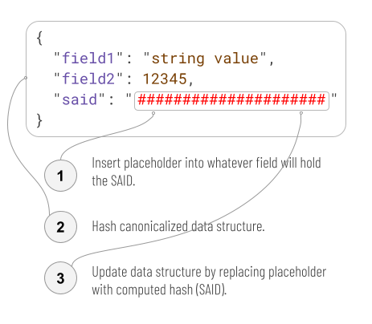
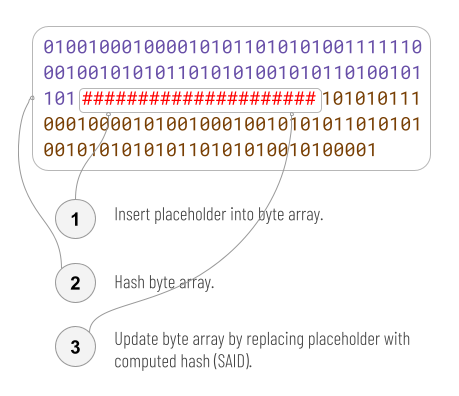
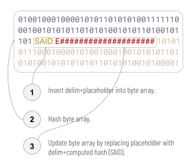
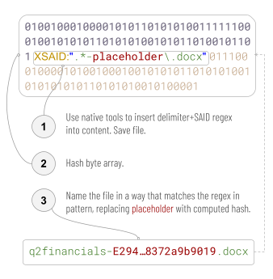

## 1. CESR SADs and SAIDs
The CESR spec defines self-addressing data (SAD) as a data structure that contains a special kind of reference to itself — a self-addressing identifier (SAID). Space for the SAID is initially reserved in the SAD by storing a placeholder value. Once full, the data structure is canonicalized and hashed. The output hash is then encoded using CESR rules to make it self-describing, and inserted into the SAD, replacing the placeholder. [1]

When a SAD holds its SAID, the correspondence between the two can be checked, making the data structure versioned and authenticatable. [2, 3, 4, 5, 6, 7] Any change to the SAD or SAID breaks the correspondence. The SAID can also be used by itself as a tamper-evident reference to or compression of its associated SAD, enabling extremely efficient caching. Embedding additional, foreign SAIDs in a given SAD is a linking strategy that enables complex and decentralized graphs of authenticated data. These graphs are far more efficient, secure, and robust across untrusted storage and internet disruption than the generic Semantic Web, which has no such guarantees. They are a core building block of authentic chained data containers (ACDCs). [8]

<figure id="fig1">
  
  <figcaption>Figure 1: CESR's saidification algorithm</figcaption>
</figure>

## 2. Opaquely Structured Data
Imagining the relationship between SAD and SAID as one of a data structure to a field works well for structured serialization formats like JSON, CBOR, or MsgPack. However, what if we want to securely reference, share, and cache data that isn't structured the way CESR's saidification algorithm expects? The world is full of data like this. Consider YouTube's video catalog, or the set of documents on a company's SharePoint, or a personal collection of digital photos, or an invoice attached to an email as a PDF. It would be helpful if such data could also participate in efficient, robust, authenticated data graphs.

Some excellent work has been done in this area. IPFS allow a file to be hashed and added to a global, decentralized web of content-addressable storage. Content identifiers (CIDs) in IPFS are somewhat like SAIDs. [9] Ethereum Swarm [10] and Git Large File Storage [11] also have analogs. However, these systems are primarily container-oriented: they focus on storage and retrieval of the data, not on the more limited question of how to model its identity and interrelationships. They therefore do too much to be a pure solution to our current challenge.

Data formats such as video, documents, and spreadsheets do embody data structures — often, dramatically sophisticated ones — but programmatic access to them tends to run through an application or an API and a library that hides fields and structural details. In many cases, the formats are also wholly or partly proprietary. Both of these characteristics lead us to describe such formats as opaquely structured.

We could imagine adding a custom field to hold a SAID in an opaquely structured data format. However, fields in such formats may be invisible to, or even stripped by, handling software. Even if we could solve the mechanics, computing the hash of the data structure minus the SAID field is problematic, since each format has its own canonicalization rules, and they are often poorly or entirely undefined in public documentation. Even more challenging, the set of opaquely structured data formats grows constantly.

## 3. Solution
### 3.1 Byte array
The first step toward a solution is to embrace the opacity of these formats and simply view them as byte arrays (or alternatively, as a 3-field data structure: bytes-before, SAID, bytes-after). This completely eliminates canonicalization problems — any bytewise difference is significant — and it gives us an easy and wholly generic, robust saidification algorithm. Rather than traversing structure to find a field in the data, we simply scan the byte stream for the placeholder:

<figure id="fig2">
  
  <figcaption>Figure 2: naïve algorithm for a SAID in a byte array</figcaption>
</figure>

### 3.2 Delimiters
Although this makes saidification easy, it creates a new problem, which is that there's no reliable way to find the SAID once it's been inserted. After all, the SAID is a byte sequence that we can't predict in advance.

The simple solution is to use delimiters in both step 1 and step 3:

<figure id="fig3">
  
  <figcaption>Figure 3: byte array with delimiter + SAID</figcaption>
</figure>

We call this modified algorithm (including minor enhancements described in 3.5 below) the bytewise SAID algorithm, a SAD that uses it a bytewise SAD, a SAID produced by it a bytewise SAID (or bSAID for short), and a delim+placeholder an insertion point.

Notice that in addition to adding a delimiting prefix, Figure 3 changes the placeholder from a series of red # characters to red # characters preceded by an "E" character. This is just an example. The formal requirement for insertion point syntax is that the sequence consist of the 5-byte delimiter "SAID:", followed by either a SAID template or an actual SAID. A SAID template is a one- or 2-character CESR primitive code for a digest (e.g., "E" for a Blake3 hash), followed by as many "#" bytes (0x23, number sign when interpreted as ASCII) as are required to make the template exactly as long as the SAID that will replace it (e.g., 43 #s for a Blake3 hash, since the full length of a Blake3 SAID is 44, including the "E" prefix). In ABNF:

#### 3.2.1 ABNF
```abnf
insertion_point = "SAID:" placeholder
placeholder = template / said
code44 = "E" / "F" / "G" / "H" / "I"
code88 = "0D" / "0E" / "0F" / "0G"
template = (code44 "#"*43 / code88 "#"*86)
said = (code44 base64url*43 / code88 base64url*86)
```

A regex that correctly matches insertion points in an arbitrary byte stream is:

#### 3.2.2 Regex
```
SAID:([EFGHI](?:[-_\w]{43}|#{43})|0[DEFG](?:[-_\w]{86}|#{86}))
```

Note that this regex is case-sensitive, and it MUST match as a byte stream (e.g., be declared as rb"..." in python) rather than as unicode text, or the \w construct will produce invalid results.

Recall that standard JSON saidification accepts any JSON object, normalizes it, finds a field that will hold the new SAID (using a field named "d" as a default), replaces any prior value of that field with a string that contains exactly as many # characters as the SAID will replace, then hashes the data and replaces the # characters with the SAID.

In contrast, the bytewise SAID algorithm does no normalization, since we know nothing about the format of the byte stream. It locates the insertion point by searching for the appropriate byte pattern, puts the placeholder into template form if it is an actual SAID value, then hashes the entire byte stream. Thus, the bytewise SAID algorithm might hash a byte stream containing "E"+ 43 "#" bytes, whereas the JSON algorithm might hash a byte stream containing 44 "#" bytes. The reason for this divergence is that it is not dangerous to change the size of a JSON file, but it may be dangerous to change the size of a byte stream in an unknown format. Therefore, the placeholder MUST contain a prefix that specifies which of several SAID types the document author intends, and the number of "#" characters that follow must add up to the exact length of the new SAID, so the file size will be unchanged.

After saidification, we can find the SAID by searching the bytes for the delimiter, "SAID:", followed by a recognizable SAID.

### 3.3 Inserting the SAID
So far, our solution has glossed over how we choose a location for the SAID. Should it go at the beginning, the middle, or the end? 

The answer to this question is usually uncomplicated: we prefer a location where a file format allows document metadata. Most opaquely structured file formats offer explicit support for arbitrary metadata. HTML allows <meta> tags; PDFs and most Adobe file formats support XMP metadata; JPEG and MPEG support Exif; Microsoft Office formats support arbitrary keyword tagging. We can insert a delim+placeholder using the native tools of an opaquely structured file type (e.g., with application features or a library/API), then save the file, open the resulting byte stream, and saidify using our naive bytewise SAID algorithm.

It may seem like inserting our SAID with a library/API is a troublesome new requirement (a dependency on a file format library); after all, saidification of JSON just requires JSON features from a programming language. Our initial algorithm in 3.1 was even more primitive in its requirements. However, three considerations prevent this new dependency from being a burden:

1. If software is already creating opaquely structured data anyway, then it is extremely likely to be doing so through an API/library; the need for a library is a defining characteristic of that data category even before we saidify. (Any software that deals with opaquely structured data as raw bytes must have minimal library-like knowledge. Example: code can write HTML as raw bytes, but if it does, it probably understands tags a little bit, so asking it to add a <meta> tag is trivial.)

2. Ordinary users don't need a library or upgraded tools. They can create the SAID metadata using existing, tested features in whatever programs they already use to work with the content. There is good documentation about how to do it, and we don't have to maintain it.

3. We are only imposing this library requirement on writers, not readers. Readers can discover the SAID value with a generic, naive byte scan, written once for all file types.

An additional benefit of this approach is that many metadata schemes for opaquely structured data already recognize a particular metadata item that maps to the "identifier" concept in Dublin Core (ISO 15836, a metadata standard). [12] This happens to be the very semantic that SAIDs express. So, by setting metadata for the identifier concept using the SAID:<value> convention, we are simultaneously giving the document a SAID, and giving it a permanent identifier that existing, SAID-ignorant metadata features will accept. This is an interoperability and backward compatibility win, and it introduces a huge audience to SAIDs without any special effort, tooling, or documentation from SAID proponents.

A few opaquely structured data formats lack explicit metadata support. For example, source code written by programmers could be considered opaquely structured data, and there is no universal metadata mechanism for source code. Markdown is another format without metadata (unless you count YAML prefixes [13]). If a format doesn't support metadata, then we give the fallback answer: insert the SAID as a comment, using whatever commenting mechanism the format recognizes. This answer works even if the comment is as primitive as a parenthetical note in ordinary, human-editable sentences that comprise the text of a file. For example, if a chef had software for recording recipes, one per file artifact, and it lacked metadata support, the chef could simply put a note at the end of every recipe's instructions: "(SAID: <SAID value>)".

### 3.4 Externalized SAIDs
For many opaquely structured data formats, the bytewise SAID algorithm is simple and sufficient.

However, in certain cases a difficulty remains. Some file types are compressed, encrypted, or have their own internal integrity checks. If so, using native tools to insert a placeholder somewhere before a file is saved may be easy. However, using non-native tools to poke a SAID value into the byte stream later may be impossible. Either encryption/compression renders the delim+placeholder byte sequence unrecognizable, or an arbitrary change to the bytes of the file breaks the integrity checks and make the file invalid. Microsoft's .docx files (a .zip of a folder that includes the main document content plus attached graphics and metadata) use an opaquely structured data format that has this challenge. [14] PDFs appear to be similar. [15, 16]

For these cases, we take advantage of one additional location that is always an option for writing, without special tools: the filename. Writing the SAID there lets us saidify any opaquely structured file that can't be modified after it's written, by simply renaming it. This resembles an approach proposed for self-certifying pathnames in SFS, except that the input to the hash is content, where SFS's was a server and public key. [17]

This may seem like a futile exercise. The same flexibility that allows us to embed a SAID in a filename will allow someone else to remove the SAID. However, before saidifying, we can insert into the file content a regex to express a constraint on the file's name. This makes such a rename tamper-evident, much as an edit to a saidified JSON file is. 

We call this (including minor enhancements described in 3.5 below) the externalized SAID algorithm, a SAD that uses it an externalized SAD, a SAID produced by it an externalized SAID (or xSAID for short), and the combination of delimiter+regex an exsertion instruction:

<figure id="fig4">
  
  <figcaption>Figure 4: byte array with delimiter + SAID regex</figcaption>
</figure>

This algorithm avoids any rewrite of the data structure after it's saved by its native tools, but it guarantees that a SAID is carried with the file wherever it goes, because any person or tool that sees the opaquely structured data in its decompressed/decrypted form can discover that a naming constraint exists on the file. If the file is (re)named improperly, it becomes an invalid match for the file's content. However, a proper name can be restored by renaming again in a way that conforms to the requirements in the regex.

Our placeholder is the same as with the bytewise algorithm: either a template or an actual SAID value of exactly the right length. As with the bytewise algorithm, the hash is always over a byte stream with a placeholder in template form. The delimiter changes a bit: instead of SAID, we have XSAID, to make it clear that the actual SAID value is externalized instead of appearing inline in the content. We also need quotes to contain the regex that contains the placeholder. We use the placeholder to break the regex into a pre-regex and a post-regex. The filename then must consist of anything that matches pre-regex, followed by the calculated SAID, followed by anything that matches post-regex. This allows the SAID to take up less than the full filename, preserving some of the normal naming flexibility so the manager of the file's container can also make human-friendly choices about the name, within constraints the content author sets.
3.5 Multiple SAID references in a single file
The default saidification algorithm produces exactly one SAID for a given JSON object, but since objects can be nested, it is possible for a single JSON file to contain many SAIDs that roll up hierarchically. Saidification must proceed from greatest to least depth so the SAID of outer objects includes the SAIDs of inner objects.

Neither the bytewise algorithm nor the externalized algorithm can deal with the concept of nesting, since the internal structure of the file MUST be treated as opaque. However, we offer two enhancements that make the algorithms more flexible and convenient.

#### 3.5.1 Bytewise echoes
In the bytewise algorithm, the first occurrence of a valid insertion point defines a secondary search string. All other occurrences of the placeholder in the same file, called echoes, are replaced by a template when calculating the SAID value, and are then replaced by the calculated SAID value once it is known. This allows file content to reference its SAID in multiple places. For example, a markdown file could use echoes to display a SAID in YAML frontmatter and in a visible title, and place the less user-friendly delimiter+placeholder in an HTML comment:

<figure id="fig5">
  
  <figcaption>Figure 5: A delim+placeholder and its echoes</figcaption>
</figure>

#### 3.5.2 Combined algorithms
A single file may use both the bytewise and the externalized algorithms. If the bytewise algorithm is practical for a given file, the externalized algorithm is not necessary to communicate the SAID. However, it may be useful to bind the filename and file content together more strongly.

In such a case, the placeholders in the insertion point and the exsertion instruction are required to match. Given that constraint, both placeholders and all echoes are placed in template form. Then the bytewise algorithm is applied, causing the SAID to be calculated and the insertion point and all echoes (including the echo in the exsertion instruction) to be updated. Then the filename is updated as well.

### 3.6 Implementation
A reference implementation in python of the bytewise and externalized SAID algorithms, as well as the standard saidification algorithm for JSON, is packaged as a bash script, `saidify`, at https://dhh1128.github.io/keri-tools. This implementation should be considered an oracle for testing purposes.

## 4. Summary
The SAD and SAID mechanism can be extended to arbitrary file types, including many that are commercially important and that do not support the standard saidification algorithm. Implementation is easy, and does not require specialized tooling. We treat files as byte arrays and use one of two algorithms. The bytewise algorithm is appropriate for file types that can be rewritten after they are saved by native tools. It inserts a SAID at a location marked by a delimiter. The externalized algorithm works for file types that cannot be rewritten after they are saved. It saves a placeholder in the file and then externalizes the SAID to a filename in a way that conforms to the placeholder's requirements.

Using this technique, we can — without changing file formats or tools at all — allow existing, rich, ubiquitous file types to participate as first-class citizens in the verifiable data graphs enabled by SADs and SAIDs.

---
## References
[1] Smith, S. 2024. Composable Event Streaming Representation (CESR). Trust Over IP Foundation. https://trustoverip.github.io/tswg-cesr-specification/.

[2] Driscoll, J. R., Sarnak, N., Sleator, D. D., and Tarjan, R. E.. 1986. Making data structures persistent. In Proceedings of the eighteenth annual ACM symposium on Theory of computing (STOC '86). Association for Computing Machinery, New York, NY, USA, 109–121. https://doi.org/10.1145/12130.12142.

[3] Miller, A., Hicks, M., Katz, J., and Shi, E. 2014. Authenticated data structures, generically. SIGPLAN Not. 49, 1, 411–423. https://doi.org/10.1145/2578855.2535851.

[4] Goodrich, M., Tamassia, R., Triandopoulos, N., and Cohen, R. 2003. Authenticated data structures for graph and geometric searching. In Cryptographers’ Track at the RSA Conference (pp. 295-313). Springer, Berlin, Heidelberg.

[5] Tamassia, R. 2003. Authenticated Data Structures. In: G Di Battista, U Zwick (eds) Algorithms - ESA 2003. ESA 2003. Lecture Notes in Computer Science, vol 2832. Springer, Berlin, Heidelberg. https://doi.org/10.1007/978-3-540-39658-1_2

[6] Smith, S. and Gupta, V. Decentralized Autonomic Data (DAD) and the three R’s of Key Management. 2018. In Rebooting Web of Trust Spring 2018. Available at https://bit.ly/3YIAqVj (accessed August 17, 2024).

[7] Sheff, I., Wang, X., Ni, H., van Renesse, R., Myers, A. 2019. Charlotte: Composable Authenticated Distributed Data Structures, Technical Report. arxiv.org.

[8] Smith, S. 2024. Authentic Chained Data Containers (ACDCs). Trust Over IP Foundation. https://trustoverip.github.io/tswg-acdc-specification/.

[9] Benet, J. 2014. IPFS - Content Addressed, Versioned, P2P File System. https://doi.org/10.48550/arXiv.1407.3561.

[10] Swarm: storage and communication infrastructure for a self-sovereign digital society. 2021. https://www.ethswarm.org/swarm-whitepaper.pdf.

[11] git-lfs. Git Large File Storage. https://git-lfs.com/.

[12] Dublin Core Metadata Initiative. 2024. Dublin Core Metadata Element Set, Version 1.1. http://dublincore.org/documents/dces/.

[13] Oren, B. K., Evans, C., and I döt Net. 2009. YAML Ain’t Markup Language (YAML™) Version 1.2. https://yaml.org/spec/1.2/spec.html.

[14] ISO and IEC. 2016. ISO/IEC 29500-1:2016. Information technology — Document description and processing languages — Office Open XML File Formats — Part 1: Fundamentals and Markup Language Reference. https://www.iso.org/standard/71691.html.

[15] Kongsuwan, N. 17 Aug 2024. Personal communication.

[16] Pfeifle, K. 26 Sep 2012. Stack Overflow. Answer to "Are all PDFs compressed?". https://stackoverflow.com/a/10548893.

[17] Mazières, D., Kaashoek, M. F. Sep 1998. Escaping the Evils of Centralized Control with self-certifying pathnames. Proceedings of the 8th ACM SIGOPS European workshop: Support for composing distributed applications. Sintra, Portugal: MIT. https://dl.acm.org/doi/pdf/10.1145/319195.319213.
