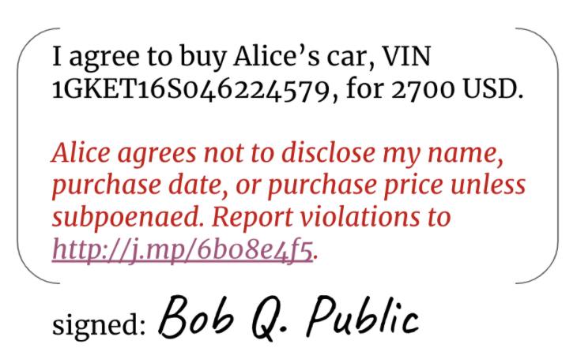

>Thanks to [John Phillips](https://github.com/JohnOnGH) for some helpful feedback. 

Am I crazy if I am a privacy hawk, but I’m opposed to unfettered anonymity?

I think people should be free to live their lives without [Siri or Alexa or Google Assistant listening to private bedroom conversations](https://web.archive.org/web/20210127150914/https://www.nytimes.com/2019/08/21/technology/personaltech/alexa-siri-google-assistant-listen.html). I find the surveillance economy repugnant. The Snowden revelations leave me convinced that government eavesdropping needs more constraints. The amount of information that [GAFA](https://web.archive.org/web/20210127150914/https://en.wikipedia.org/wiki/Big_Four_tech_companies) captures about users makes my skin crawl, and I hate the [Hobson’s choice](https://web.archive.org/web/20210127150914/https://en.wikipedia.org/wiki/Hobson%27s_choice) in “free” software that mines my personal data.

However, I also spent years working on artificial intelligence technologies to impute reputation to the entire observable internet, and I am haunted by the day I asked one of my systems to help with an FBI request to say where child pornography might be hiding. Almost immediately, the AI identified over 5000 web sites. That is just… horrifying. And [tech appears to be making the problem worse](https://web.archive.org/web/20210127150914/https://www.nytimes.com/interactive/2019/11/09/us/internet-child-sex-abuse.html).

## Tension by consensus

Today, most perspectives on these issues seem to fall into one of three positions on a privacy ~ oversight continuum (which, by the way, happens to match an anarchy ~ tyranny continuum used by political theorists):

### 1. Privacy zealots
These folks worry (wisely!) about the erosion of personal privacy. They advocate strong encryption and mix networks and anonymous payments and other tools that hide everything they do. If they acknowledge problems like the one in my child pornography story, they tend to take a very libertarian view: potential abuse is the inevitable and acceptable consequence of our need to guarantee freedom.

### 2. Watchdogs
These folks worry (wisely!) about the rising tide of cybercrime and fraud. Unable to outlaw strong encryption by individuals, they advocate laws that require back doors in encryption, strong identification of parties moving money, and cooperation with a pervasive deployment of monitors and closed-circuit cameras. If they acknowledge problems with surveillance, they tend to take a paternalistic view: some entity must be trusted with oversight, and the government is the only logical answer.

### 3. Pragmatists
These folks worry (wisely!) that neither of the other two camps is facing reality. They advocate compromise, assuming a win~lose dynamic: we have to give up some privacy to get some oversight, and we have to give up some oversight to get some privacy. Nobody can have everything they want, and we might as well face that fact.

## A better way
None of these three views satisfy me. To privacy zealots, I say, “Abuse isn’t just a potential. It’s a real issue, with intolerable costs.” To watchdogs, I say, “Who watches the watcher? Remember Lord Acton: ‘Power tends to corrupt, and absolute power corrupts absolutely.’” To pragmatists, I say, “Privacy is already so eroded, and oversight is already so unreliable, that a compromise that further weakens either ideal is a dystopian nightmare.”

We need an answer that’s strong at both ends of the spectrum. We need pragmatism with only negligible tradeoffs.

The privacy versus oversight dichotomy arises from the assumption that only two categories of actor exist: interactors who might be malicious, and enforcers trying to eradicate malicious behavior. In such a worldview, accountability is imposed from the outside, and enforcers must have special powers.

But what if we change our assumptions?

I think there are many fundamentally good people in the world who don’t want to launder money, buy illegal drugs on Silk Road, or traffick children. And I think these people would be happy to facilitate enforcement so the malicious could be caught — if they had a reasonable say in enforcement rules, if they could trust the enforcement mechanism to be fair, if the mechanism were impervious to abuse by hackers or powerful institutions, and if the mechanism had little effect on their practical privacy.

## How it might work
Is that combination of guarantees achievable? I think so. It will require some changes to our mindset, though. Here are three examples of what I call “reciprocal negotiated accountability” techniques that might help.

### 1. Digital watermarks and data terms of service

Today, most shared data imposes no accountability on the recipient. For example, if I want to prove I said something, I can digitally sign it, thus binding myself to the recipient’s satisfaction:

But what guarantees do I receive in return? Even if I exchange consent receipts with the other party, I don’t know whether they will comply with agreed terms in subsequent sharing. I have no monitoring mechanism. For all I know, my signed doc is handed to a data broker the moment I’m looking the other way.

What if I always included the equivalent of a watermark with every digital artifact that I signed, such that it would be impossible to prove I signed it without also disclosing the watermarked data? And what if the watermark included an identifier that would let me track that particular piece of signed data, plus its associated terms of service? Consider the red “watermark” addition to the signed payload here:

Now, since digital signatures can only be verified against unmodified data, the data can only be shared in signed form if the watermark is also shared. This turns every person who sees my signed data into a potential enforcer of my terms of service. Plus, the identity of the party who received the data, and my identifier for that data (here, a URL where violations can be reported) become searchable content in any data corpus. The signer has a way of holding the recipient more accountable, without decreasing privacy in any way.

Watermarks get a lot more valuable if we use governance to enforce the constraint that only watermarked data &mdash; data that reveals where it came from, and with what terms and conditions &mdash; is legal to persist. I'd like to see a future GDPR or CCPA that says that anyone who has data about a data subject, but who can't show the associated watermark, must delete it because it's assumed to have an illegal origin...

This sort of watermark could be included with every presentation of verifiable credentials (VCs), raising the level of accountability in the entire ecosystem. But even without VCs, simple variants on watermarks are doable today. Gmail supports a convention where email addresses can include optional identifiers: bob.q.public@gmail.com and bob.q.public+some-other-identifier@gmail.com are always delivered to the same mailbox, though only the short form is registered. When you sign up for an online service, if you give your email using the second form (e.g., bob.q.public+the-service-youre-using@gmail.com), you can then monitor spam to see whether your contact information is leaking from that service.

### 2. Provisional anonymity
Suppose Alice wants to be anonymous on a social network, but the network has a no-trolling, no-bullying policy. How can she be accountable but anonymous at the same time?

Alice can use verifiable encryption to encrypt PII like her name and phone number (step 1 below). She gives the encrypted payload to the social network (step 2a), and submits the key to decrypt this PII to the network’s independent escrow service (step 2b). Verifiable encryption means Alice can prove to the network that she’s encrypted her real PII, and that she’s truly escrowed a key to unlock it. Alice can now operate anonymously (step 3) — but if the network ever finds her guilty of abuse, it can approach the escrow service with proof of the abuse and get Alice’s key so she can be de-anonymized (step 4).

This is real anonymity, not a watered-down compromise at the middle of the privacy ~ oversight continuum. Neither the escrow service nor the social network has to be trusted to do the right thing, because neither can undo the anonymity on its own. Hackers that penetrate either barrier will find nothing useful. Multiple escrow services could be used in a sharding scheme, if increased assurance is needed.

And yet, this anonymity is conditional, because it enables genuine oversight, too. If there is consensus that Alice has abused her privileges, cooperation of the other stakeholders can unmask her. It therefore preserves incentives to act in responsible ways, while protecting the privacy of well-behaved actors.

### 3. Opt-in Front Door Keys
Building on the previous two ideas, it is possible to create a system that secures communication with strong encryption and no back doors, but that allows carefully constrained oversight. Governments, for example, can catch criminals and prove their misdeeds — but law-abiding citizens can also limit surveillance overreach and hold law enforcement accountable. This is not a mediocre compromise between the ideals of a privacy hawk and the practical realities of law enforcement; it is the best of both worlds. If this sounds like science fiction, read on.

In a properly secured agent-oriented SSI ecosystem, each device owned by a private individual has its own asymmetric encryption key pairs. The public half of these keys are declared in a DID document. When Alice wants to send a private message to Bob, she looks up Bob’s DID document, finds all the public keys that he says should have his decryption privilege, and encrypts in a way that any of his private keys can decrypt. This lets Bob read Alice’s message with equal ease on his iPhone or his Android tablet or his laptop (keys 1, 2, or 3 in the diagram below), without breaking the security guideline to never copy or share keys.

Notice that I gave three examples of keyed devices (iPhone, tablet, laptop), but the diagram shows four decryption keys. To build our system that protects privacy while allowing constrained oversight, Bob can create and add to his DID doc an additional key that is capable of decrypting his messages, and he can place this key in a blinded escrow service. This is an oversight key. If auditors need to read Bob’s messages, they can do so, by getting key 4 out of escrow.

This is not a back door to Bob’s security; it is a key to Bob’s front door, created by Bob himself. It works just like any of his other keys. There is no pre-emptive weakening of the cryptography to provide special access.

So how can Bob be sure such a key is not abused?

Well, Bob and Alice can agree on terms of service, and embed in the plaintext of their messages a tamper-evident watermark like the one I described earlier. It might say something like this:

>I agree to let law enforcement decrypt this message if all of the conditions in this legal agreement are met: https://www.congress.gov/crs-product/R48592.

Adding such a watermark guarantees that any time the plaintext of the message is seen, the legal constraints governing its decryption are also revealed. Such a decrypted message could not be used as evidence without the constraints being known to all parties. And the constraints cannot be modified or substituted.

The legal agreement might stipulate things like:

* Decryption must be authorized by a FISA court.
* A record of the process that released the decryption key from escrow must be archived at location X for legal challenge.
* A determination that the communication is innocent must trigger an immediate purge of the message and all its metadata from law enforcement records, plus instructions to the escrow service to notify the key owner that their oversight key has been used, so it can be rotated.

I’ve framed this example in terms that make sense in a US legal jurisdiction, but the legal agreement could target something different — or could even target many different legal jurisdictions, each with its own constraints and provisos.

The third bulleted provision above is interesting. It makes intrusion temporary and cancelable — a big deal, since all conversations that I’ve heard about the tension between privacy and law enforcement assume permanence. Back doors must exist before they’re needed, and they continue to exist when the need is gone. But here, instead, we’re giving the owner of the encrypted data a fair chance to re-key the front door. Today, such stipulations would be unacceptable in a FISA context — but perhaps legislators will allow them in the future, once they know such options exist, and that they improve privacy without degrading access.

Such a system for reciprocal accountability has some additional benefits that may not be obvious:

* A key can be marked in a DID document as usable for decryption but not for encryption. This lets auditors read Bob’s messages without being able to masquerade as Bob.
* Auditors other than law enforcement can use this mechanism. For example, a corporation might use it to check how its employees give tech support; a medical malpractice auditor could evaluate advice that a doctor gives to patients.
* Different decryption keys can be escrowed with different constraints on oversight, allowing granular control instead of the blunt instrument of unlocking everything for whoever asks.
* Oversight keys can be used to solve end-of-life and guardianship problems. (Bob is in the middle of a high-stakes financial transaction when he dies. How do we unlock the last message he received, and use it to contact the other party?)
* The escrow service never holds any encrypted messages. This means it cannot be a vector for leaks of data. It only has to be trusted to follow the rules for release from escrow, not to be a good custodian over sensitive data.
* The escrow service is also unaware of the meaning of any of the keys that it has. This ensures its impartiality. It also means the behavior of the escrow service can be audited — even aggressively and continually — without endangering anyone’s privacy.
* People who control DIDs (and vendors who provide services to them) don’t need to adapt their behavior to different regulatory environments. They can just use software to automatically keep an extra key to the front door registered at an escrow service. The escrow service can then react to an evolving variety of complex rules on how release might be justified. The user experience and the architecture of the system both remain pure.
* If there’s a guarantee that innocent people will quickly find out that their oversight key should be rotated, and if innocent data will be purged, then it becomes possible for auditors enforcement to do random checks. For example, financial regulators could randomly check the monetary amount of financial transactions secured by DID keys, looking for money laundering activities. Or law enforcement could randomly check for child pornography in secure chats. This creates a deterrent effect without any serious degradation of privacy. (Escrow release could treat spot-checks and more in-depth reviews differently in terms of notification.)
* There is no technical requirement that people participate in the mechanism. It’s opt-in, and usable on a case-by-case basis. In some legal jurisdictions, all users of SSI tech might be required to “opt” in — but in others, this might create two self-selected groups. One would be people who know they are behaving legally, and whose bar for privacy is medium-high rather than extreme. The other might include hard-core privacy hawks as well as criminals. The first group would be easy to spot-check, and therefore mostly uninteresting to law enforcement (which could do just enough to keep honest people honest). The second group would contain a mixture of innocent but very private people, and people trying to abuse privacy for nefarious purposes. Law enforcement would not be able to surveil the latter group, but because the group would be much smaller than the known-safe group, law enforcement could focus its other fact-finding methods in the most productive places.
* It may be possible to combine this technique with homomorphic encryption, such that an oversight key decrypts to something that’s not plaintext, but rather searchable ciphertext. Such a search would let an auditor ask whether enumerated warning indicators exist, without seeing the data as plaintext.

## Conclusion
I’m calling this family of techniques “reciprocal negotiated accountability,” because auditors and those they audit negotiate some compromises that hold one another accountable. The fact that accountability flows both directions is crucial — privacy zealots can’t enable crime, and law enforcement can’t impose surveillance without recourse. And these are not grit-your-teeth compromises for either side; rather, they’re clever ways to split apart concerns, letting minor concessions on one side produce big benefits for the other. They’re win-win.

I’m sure the three techniques I described do not embody all the possibilities. Other clever ideas await our discovery. Instead of viewing privacy and oversight as a strict tradeoff, let’s put our heads together and find ways to have both.