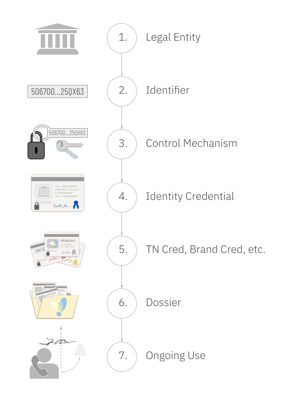

>This article is a guest post in [The Evidence Advantage](https://www.linkedin.com/pulse/part-1-evidence-advantage-building-trust-new-era-randy-warshaw-fpxpe/), a series by Randy Warshaw, CEO of Provenant, about how to transform telco by guaranteeing that all interactions are accompanied by comprehensive evidence. The series is strongly recommended as important context.

## What is "evidence"?

We all know that evidence gives us a reason to believe an assertion. In a previous article in this series, we talked about the difference between a DNA sample and a lab report about genetic markers. We can easily imagine how both of these forms of data might be "evidence" in a murder trial — although it's worth noting that they support slightly different use cases. And intriguingly, neither is likely to be "evidence" in a dispute about copyright. Understanding why helps us refine our casual definition.

Context matters. Evidence is only noteworthy in relation to controversial assertions, and controversy depends on context. In a murder trial, the identity of unknown parties might be a crucial fact that needs proving. But in a dispute about copyright, other questions matter. This changes what constitutes "evidence".

*Evidence is data that supports an assertion that's controversial in a given context.*

## What evidence does telco need?

So what assertions of fact are controversial in telco?

Vishing, smishing, SIM swap fraud, caller ID spoofing, Wangiri fraud, OTT account hijacking, interconnect bypass, call center impersonation, international revenue share fraud, conference call trolling, and most other known patterns of abuse in telco all have a common ingredient: the fraudster uses an identity that belongs to someone with different access or reputation.

When we communicate in person, the speaker is obvious. When we use technology instead, the context shifts, and the evidence needs to shift, too. The first and most foundational assertion that needs proving is *who's on the other end* of a remote connection.

Because fraudsters play on subtle mismatches in assumptions, it's important to think rigorously about what type of evidence is adequate to prove identity. The type of identity we're talking about here is precise, not fuzzy, and it's legal, not informal. Precise legal identity is the only form of identity that's adequate to hold remote parties legally and financially accountable; any lesser form leaves gaps that can be exploited.

After identity, the second most foundational question in remote communication is probably the *channel* — that is, the telephone number, the chatbot, the website, the social media handle, or the other mechanism(s) that the sender uses when they send. Channels are not identities, but they are owned by known identities, and they have reputations and other characteristics that we use as scaffolding for trust. A call or text from the local bank shouldn't arrive via a phone number from the other side of the world. Further, the local bank shouldn't just use any local phone number — it should use one that's known to belong to the bank.

When callers or remote chat/messaging counterparties are enterprises, another crucial question involves *brand*. Brand is sometimes conflated with identity, but it's quite distinct. The global conglomerate that we casually refer to as Coca Cola consists of businesses incorporated in numerous jurisdictions around the world. Each has a separate legal identity, but all of them may share a license to word marks like Fanta, and Sprite, and to associated logos. People who receive a call may be content to know that it comes from the makers of Fanta. However, a fraud solution can't just determine that a brand is associated with a particular logo; it must decide whether the caller that's asserting brand characteristics is a legal entity that's known to have a license to the specific brand assets in question.

Yet another crucial issue in B2C or B2B communication is delegation. A call center or Business Process Outsourcer (BPO) is not the legal entity that owns a brand, but it needs to originate communications using the identity and the branding of its client. Since fraudsters might claim to be delegates, the authenticity of delegation needs to be provable. And delegation is not the end. Some telco contexts may require proof of valid settlement contracts, or proof of humanness instead of AI, or proof of any number of additional assumptions. The potential scope of evidence is unbounded.

## How is evidence created?
In a criminal trial, the source of each piece of evidence, and its chain of custody, are acknowledged by all stakeholders to be vital considerations. DNA that's sampled from a contaminated crime scene is unreliable, and genetic reports are only useful if they can be connected back to valid DNA samples.

The same is true in telco. Assertions of fact must come from entities that are qualified to make those assertions, and they must be captured in a form that is tamper-proof and permanent. Furthermore, if facts change in a way that alters context or interpretation, there must be a way for the attesters to react and the world to find out.

[Verifiable Voice Protocol](https://dhh1128.github.io/vvp/draft-hardman-verifiable-voice-protocol.html) (VVP) is a formal methodology for applying these principles in the context of phone calls. VVP can be used in both enterprise and consumer contexts, and it can provide evidence about both callers and callees. Let's focus on a B2C use case and follow how evidence is created.

First, the business is formally identified. This means that its existence and its defining properties in a specific legal jurisdiction are verified, and an identifier for that business is discovered or chosen. The legal system created the entity, and it must be the definitive source of truth on this question. The entity's identifier must be meaningful and unambiguous in every context where the business intends to communicate, even outside that jurisdiction. An exemplary choice for such an identifier is the LEI from GLEIF. This legal entity identifier is globally accepted, an [ISO standard](https://www.iso.org/standard/85628.html), and the required method for tracking businesses that engage in various international financial transactions.

Next, the business's identifier is bound to some mechanism for proving control (e.g., a secret that only the business owner knows). This step is absolutely crucial, because it is what prevents a fraudster from impersonating the business. The binding must be extremely strong from a technological perspective, so that [quantum computing](kspqs.pdf), advances in AI, and determined attacks by hackers stand little chance of exploiting a vulnerability. This is why cryptography must be used. The binding must also be extremely strong from a governance and process perspective, so that social engineering can't wrest control away. There must be proper checks and balances in how the control mechanism is exercised, plus a careful and permanent audit trail. An excellent choice for such a control mechanism is an autonomic identifier (AID) bound via group multisig to a vLEI. This solution has numerous best-in-class security and governance properties, and a lifespan as long as that of the organization.

## A note about credentials
The link between a business's control mechanism and its defining attributes is embodied in a credential. A credential is a small digital file that's cryptographically signed by an issuer. It is bound to its holder by a cryptographic key. This binding prevents anyone else from using it, because a presentation of the credential must be accompanied by a digital signature that only the holder can create. (X509 certificates are generation-1 digital credentials; today's solutions can leverage generation-3 ACDCs, which have [important advantages](x509-prob). Tokens, familiar to many telco readers, lack a binding to a holder and are too ephemeral to store as permanent evidence, but they play a role later in our strategy.)

## More credentials
After getting an identity credential, the business must next acquire a credential to prove it has the right to use the phone number that will be the source of its calls. The authoritative source of such a credential should be the rangeholder (e.g., the carrier) that rents the phone number to the business. The credential that they issue must be bound to the legal entity's control mechanism so no other party can use it. It must also have a low-latency revocation mechanism, so that if the business ceases to pay for the phone number, its right to use terminates as well.

Next, the business requests documentation that it has the right to use brand assets such as a logo or word mark. This evidence may come from the same organization that vetted the business's identity, but the analysis behind it must be different. Instead of checking public records of incorporation, trademark databases and brand licensing agreements are researched, and the question is not whether the brand assets are real, but whether they are usable by the specific legal identity that was already identified. If the answer is yes, the result is the issuance of a brand credential. Like the phone number credential, this one also must be bound to the legal entity's control mechanism, and must support revocation by the issuer.

Any other credentials that the business needs must also be issued by an authoritative source. Different sources may have different reputations, and may be authoritative on different questions. For example, the source of truth on settlement agreements may be very different from the source of truth on human-vs-AI questions. Verifiers ultimately decide what's acceptable. Regardless of source,  each credential must be bound to the business's control mechanism, and must be revocable in real-time.

The end of the evidence creation process is for the business itself to create some evidence. It is the only possible source of truth about its own intentions. If a call center or BPO must be empowered to represent it, then the business uses its control mechanism to sign a credential to that effect. If a UCaaS service provider emits the business's outbound calls, it may also need delegated authority.

## Final assembly — the dossier
At this point, the business collects all the evidence that it has received or created, and connects the artifacts to each other, making them a definitive embodiment of its intentions to place verifiable voice calls with a specific combination of provable characteristics, by placing them in a *[dossier](https://trustoverip.github.io/kswg-dossier-specification)*.

This dossier is tiny. It snapshots a collection of tamper-evident hyperlinks to tamper-evident credentials. Like a credential, it is signed by the business's control mechanism, but it is a general attestation of fact to the public, so it is best imagined as an affidavit of intent.

A dossier is associated with one or more ordinary HTTPS URLs where it can be downloaded. It also has a permanent hash that makes the dossier itself tamper-evident. Anyone who wants to access the dossier can do an ordinary HTTP GET from the web-accessible location(s) where the business has published it, using the hash to guarantee they're looking at the intended evidence.

## How is the evidence used?
When the business makes an outbound call, the SIP INVITE carries (inside a STIR-compatible Identity header formatted as a JSON web token) a tiny hyperlink to this dossier, plus the source phone number and any brand assertions. Parties that encounter the call can download the dossier, validate its hash, and inspect all the linked evidence. The Identity header is signed, either by the business itself or by a party that has delegated authority to make calls on the business's behalf. Fraudsters cannot fake such a signature. When this signature is combined with all the verifiable evidence in the dossier, the callee therefore knows:

* The party that signed the Identity header did so with explicit authority from the creator of the dossier (the business).
* The legal identity and core attributes of the business that is accountable for the call, even if the call was made by a call center or BPO acting on the business's behalf.
* Whether the business has the right to use the phone number that originated the call.
* Whether the business has a right to use the brand attributes that were asserted for the call.
* Any other crucial facts, such as whether the business has settlement contracts that guarantee payment to service providers, whether the caller is a human versus an AI, etc.
* The business has not revoked its intention to make verifiable phone calls with this combination of characteristics.
* None of the other issuers of credentials have revoked their credentials due to changes in phone number or brand usage rights, etc.

## How is this solution different from previous attempts?
This mechanism is incredibly lightweight — it just adds a small header to an outbound call, and the evidence referenced in that header can be evaluated with extreme efficiency. (Similar techniques can be applied in SMS and RCS, web meetings, and other telco contexts.)

Despite the simplicity, the robustness of its guarantees are a huge leap forward. The evidence in a dossier can be arbitrarily rich and capable of eliminating the evidence gaps that fraudsters exploit today.

As a bonus, this strategy is maximally decentralized. It doesn't depend on a giant database in the sky — every attestation is directly traceable back to its source of truth, and downloadable in tamper-evident form from any web URL where a given business wants to publish. Verification doesn't depend on a fabric of certificate authorities that might be trusted in one jurisdiction but unknown in another. It doesn't depend on a blockchain that has problems with scale, privacy, and regulatory compliance.

Best of all, this solution delivers value as soon as one enterprise uses it on outbound communication. It doesn't require a national mandate, or any infrastructure upgrades, and it can be used as a supplement to other strategies like SHAKEN, BCID, and RCD. This means that evidence can be added one business at a time, without any prior coordination. Any verifier — an international gateway, a regulator, an analytics engine, a terminating service provider, or even an auditor ten years in the future who wants to know what a business did to protect its customers in the past — can begin examining evidence at their convenience, and will immediately distinguish between calls where trust is based on guesswork, and calls where it can be based on evidence. Once this happens, reputation and incentives will take care of the rest.
