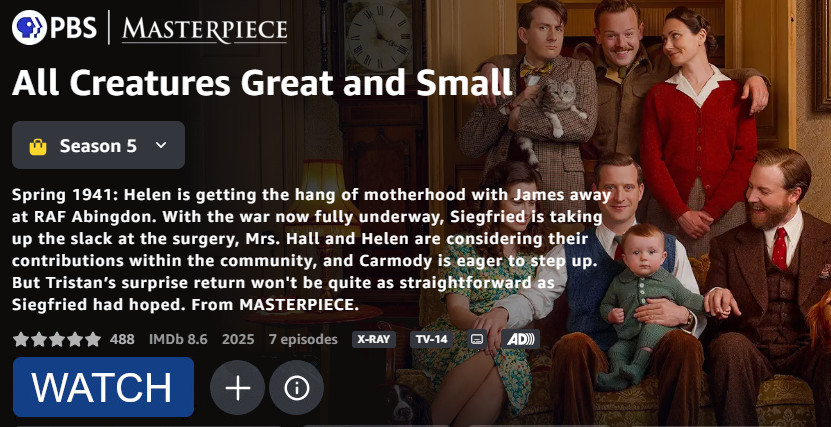

# Intent and Boundaries
Daniel Hardman &mdash; 20 June 2025

#ux #ssi #agents #ethics 

## Lip service
Recently I helped a visiting friend who was unfamiliar with our smart TV's remote. While he sat on our couch, I skimmed the catalog of our streaming service, selected a show, and clicked the big blue *Watch* button.

<figure>

<figcaption>(The interface I navigated was like this, although I captured this later, using a different show as an example, to protect the guilty.)</figcaption>
</figure>

A few minutes later, I noticed an email from the content provider, thanking me for agreeing to an upgraded subscription. Apparently, what I was watching required a fancier membership, and by streaming, I had agreed to new terms, conditions, and a bigger monthly bill.

Upgrading was not my intent when I clicked the *Watch* button. (In the web version of my streaming service's interface, this button probably said "Watch with upgrade", but I don't remember seeing that in the limited screen real estate of the TV's button.) No warning or confirmation was provided, and since the service already had my payment info, I wasn't prompted about that, either. I felt manipulated.

As builders of software, we have to handle intent better.

Thinkers have explored intent in various disciplines, including law, philosophy, religion, organizational behavior, cybersecurity, and human-computer interaction. In my experience, user intent is also discussed regularly by dev and product teams in software. Nonetheless, our industry is often careless, naive, inefficient, or downright disrespectful of the intent of those who use what we build. My story is just one example. Check out [darkpatterns.org](https://darkpatterns.org) for many more.

I'd like to raise the bar by introducing some concepts that I think our industry lacks, and then proposing some associated principles. I believe these principles are foundational to smooth and intuitive UX, efficient and safe agentic UI, and ethical and empowering identity systems.

## Mental model

### Intent
Various definitions of this word are valid. (If you want to explore, I recommend G. E. M. Anscombe's monograph, <cite>Intention</cite>). But here, I define it as follows:

><u>Intent</u> is a mental stance that explains a choice of action as contributing to a specific purpose: "When Alice clicked the button, her intent was to watch, not subscribe."

* *Purpose is required.* If we ask Alice why she clicked, and she truthfully says, "I don't know; just because?", our definition requires us to say that she didn't have intent. (Yes, we might still say "she clicked *intentionally*..." but see the last bullet in this list.)
* *Action is required.* If the action is undertaken, then the intent is *actual*. If the action is only contemplated, the intent is *potential*. But if no action is even imagined, we have an idle wish, not intent as defined above.
* *The action must be chosen.* If Alice clicks due to a fumble of her mouse, we can't ascribe intent.
* *An explanation to self is required, and it must have certain qualities.* In her self-talk, Alice must posit that the choice contributes to her purpose. (It doesn't matter if her supposition is correct or not.)
* To avoid confusion, this term is more laden with semantics than its general-purpose cousins "intentional" and "intentionally". Those words imply deliberateness, but not a self-explanation about contribution to purpose.

### Observations about intent

Given this definition, consider the following:

* In software, many stakeholders have intent. Not all intenders are "users".
* For a given intent, the associated purpose may be imagined by the intender as *narrow* or *broad*, and as *proximate* or *remote*, depending on context. Thus, Alice might say that when she clicked the button, her intent was to subscribe, or that her intent was to go to the checkout screen (so she could achieve her goal of subscribing), or that her intent was to further her quest to write a thesis on Bollywood choreography (for which subscribing was a means to an end). Alice can explain her intent in all of these ways without inconsistency.
* Purposes can have constraints. Alice may intend to subscribe, but only if she can start watching in the next 30 seconds, and at a subscription cost of less than <var>X</var> per month.
* Because intent (plus its constraints and its narrow-broad-ness and proximate-remote-ness) is a mental stance, only an intender can say definitively what intent they have. (And they can forget, lie, or make mistakes in self-analysis.)
* Notwithstanding the internal nature of intent, reality imposes some logic on an intender. Alice can't intend with actions or purposes that she can't conceive, and she can't link actions to purposes where she imagines no causal relationship. Thus, a rational Alice might have many intents when she clicks a *Watch* button, but getting the pizza out of the oven or submitting her vote in an election probably aren't in the set. Alice probably can't intend to subscribe only if the price is less than -50 quadrillion twinkies. And she probably can't click a *Watch* button with the intent of NOT watching.
* Choices about actions have consequences. Some consequences are foreseeable by any rational actor, and when they are, they attach naturally to an intent: *intending to step into a pouring rain without an umbrella is also intending to get wet*. However, many consequences are not as predictable or as well known.
* It is possible (and often, desirable and reasonable) for outsiders to guess about intent. Sometimes clues are abundant, and guesses can be quite accurate. Sometimes guesses can also be made mostly harmless, either by giving them a more narrow and proximate framing, or by making them relatively easy to correct. Context can make some guesses about FAR more appropriate than others.
* Outsiders can request an explicit confirmation of intent from the intender, and hold the intender accountable for what they say. Often, this is vital to the correctness, the trustworthiness, or the ethical soundness of software. 

### Boundaries

We can now introduce another useful concept:

>An <u>intent boundary</u> is a place where what is known about an intender's intent by an external party becomes inadequate. It is a boundary to the external party, because it prevents them from confidently characterizing the intent on the other side.

* Each external party may have different knowledge, and each decides what is "adequate" on the basis of context plus practical, financial, legal, ethical, and technical considerations. Thus, different parties may face intent boundaries in different places.
* Places may be points in time, steps in a workflow, locations in a UI, physical locations, conditions, circumstances, or similar.

## Principles
Now that we've built a mental model, let's discuss some ethical, UX, and security principles that relate to intent and intent boundaries. (I assert these particular principles based on my own experience, but I expect that readers with deep backgrounds in psychology, ethics, HCI, and software architecture will perceive deep resonance with acknowledged best practice in their respective fields.)  

### 1. Recognize boundaries
This is more than just noticing boundaries when we trip over them. "Recognize" implies that we proactively seek to understand what boundaries exist, and where, and why &mdash; and that we accept them and acknowledge to ourselves and others what we discover. Pretending that boundaries do not exist, or being casual and careless about them, can be dangerous, unethical, inefficient, or downright stupid. [Related: [Principle of Least Astonishment](https://usertimes.io/2018/12/07/the-principle-of-least-astonishment/) : [Principle of Least Privilege](https://www.cloudflare.com/learning/access-management/principle-of-least-privilege/) : [Boundaries in Personal Relationships](https://thementalmastery.com/the-psychology-of-boundaries-how-to-define-communicate-and-maintain-them-3-steps/) : [#MeToo and Consent Boundaries](https://www.ipu-berlin.de/en/crossing-sexual-boundaries-and-drawing-moral-boundaries-metoo/) : [Understood and Informed Consent in Bioethics](https://pmc.ncbi.nlm.nih.gov/articles/PMC5718441/) : [Privacy by Design](https://digitalprivacy.ieee.org/publications/topics/what-is-privacy-by-design-and-why-it-s-important/) : [Cognitive Load Theory](https://doi.org/10.1207/s15516709cog1202_4) : [Proportionality Principle in Law](https://lawforeverything.com/doctrine-of-proportionality-in-law/)]

The designers of the streaming service app on my smart TV faced an intent boundary in the UX of their *Watch* button. *Did I intend to upgrade when I clicked a button with that one-word label?* They chose to pretend the boundary did not exist, and they were wrong to do so. I claim their choice was unethical, that it created bad UX, and that it was also a bad business decision. It let them sell a subscription &mdash; for a few minutes, until I canceled &mdash; but it also earned them the lasting disgust of a user.

Those designers might push back: "We have limited space on the screen, and remotes are terrible for fancy user input. You could easily undo the upgrade. You wanted content fast, and you knew that your service sold various levels of access to the content. It was better to guess than to ask you for confirmation." This sounds like self-serving blame-the-user rationalization to me. Let's not be that way. Remember the observations above about who is the authority on the user's intent, and about how consequences of actions are not always obvious? Bundling intended and unintended consequences together and falling back on *caveat emptor* when pushed is straight out of the playbook of a sleazy used car salesman. 

Skilled doctors work hard to capture and identify symptoms, and to account for them wisely in a diagnosis. Skilled software pros work hard to recognize boundaries, becuase this helps them write ethical, effective, and pleasing software.

A corollary to this principle is also worth mentioning: *Don't imagine boundaries where they don't actually exist.* Pretending that we don't know the user's intent can add annoying and unnessary friction. If we know, let's make it so, ASAP. [Related: [DRY Principle](https://medium.com/design-bootcamp/dry-vs-wet-patterns-in-ux-design-e0ff4d1fd2ac) : [Single Source of Truth](https://martinfowler.com/articles/design-token-based-ui-architecture.html) : [Frustration Aggression Hypothesis](https://www.simplypsychology.org/frustration-aggression-hypothesis.html) : [Cognitive Friction](https://www.interaction-design.org/literature/topics/cognitive-friction)]

Of course there are times when confirmation is appropriate; unintended consequences are a risk. I appreciate having to click a final *Pay Now* button to book a $2000 plane ticket, and I'm glad GitHub asks me to type the name of a repo before I delete it. But how many times have you clicked an *Unsubscribe* link in email, only to arrive at a screen that asks you to re-enter your email address or confirm again? There is no legitimate intent boundary between clicking *Unsubscribe* and unsubscribing...

The [#NoPhoneHome movement in decentralized identity](https://nophonehome.com/) is all about how some identity technolgies silently violate the privacy intent of credential holders. [EFF](https://www.eff.org/) exists to fight similar problems.

Trustworthy AI agents can only exist if they recognize and scrupulously honor the intent boundaries of their owners. 

### 2. Consider moving rather than crossing boundaries
Let's say that you're designing software, and your analysis leads you to discover a boundary. You frankly acknowledge it, but you regret it. You'd really like to NOT have to ask a user to confirm their intent at a particular place. Is there anything you can do?

Well, good UX can often *move* a boundary instead of forcing the boundary to be crossed.

Given the normal blue *Watch* button in my streaming app, what if the *Watch* button for premium content looked like this?

There is no doubt about the user's intent when they click such a button. Better communication moves the boundary.

Teaching a user, either explicitly or through consistent cause-and-effect, can also move a boundary.

### 3. Consider peeking across boundaries
Suppose the UI team behind this streaming app is constrained by the smart TV manufacturer, whose UI library enforces that the only viable label on the button is "Watch" without a dollar sign, and the only viable color is blue.

An alternative way to reduce friction without violating boundaries would be to start the movie playing, but superimpose a message that says "This is premium content. Cancel within 60 seconds to avoid upgrade."

Friction is still low, and the app can default to the streaming provider's preferred guess about intention. But the boundary is still recognized, and nobody feels manipulated.

Lowering the stakes for a decision until you organically reach confidence about the user's intent &mdash; by restricting its scope or making it easy to undo &mdash; is a way to peek across boundaries. Testing click and mouse movement patterns, and monitoring rates at which assumptions are reversed by other users, especially other *similar* users, might also be ways to peek.

### 4. Never sneak across boundaries
Intent boundaries are lines beyond which it's inappropriate to assume what someone wants. By definition, sneaking across boundaries is therefore unethical in all cases &mdash; not just if you assume incorrectly. Smart users won't appreciate software that takes their intentions for granted, and will trust it less each time they see this happen.

Sneaking across a boundary might mean:

* Giving users a *Watch* button that automatically and silently upgrades a subscription.

* Failing to disclose that software has multiple stakeholders, and that that the software is optimizing for some of their intents at the expense of others.

* Burying your plans to reuse customer data behind vague phrases or dozens of pages of legalese.
  
* Bundling a legitimate intent with something the user doesn't intend at all, and then talking about the choice entirely in terms of the legitimate intent, minimizing the unintended consequences.

* Describing user intent inaccurately in logs ("User chose to upgrade to premium service" instead of "User clicked *Watch* button"), or preserving no audit trail when a boundary is crossed, undermining accountability for the boundary violation.

## Conclusion
Mishandled intent boundaries are at the heart of many trust problems and UX problems in software. I've now spent over a decade of my career on cybersecurity and identity technologies, and issues with intent boundaries pervade these domains. Intent is going to have to be handled with much greater sophistication as agentic AI matures. The best thinkers I've ever known in the discipline of UX were distinguished from more mediocre colleagues in large part by their understanding of and respect for intent principles.

If you're in software, I invite you to seriously consider intent boundaries as part of your next design effort. The payoff will be significant.
  