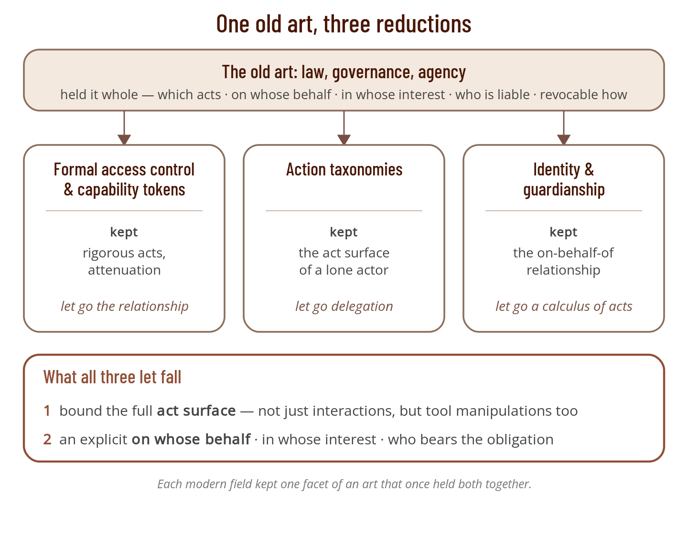
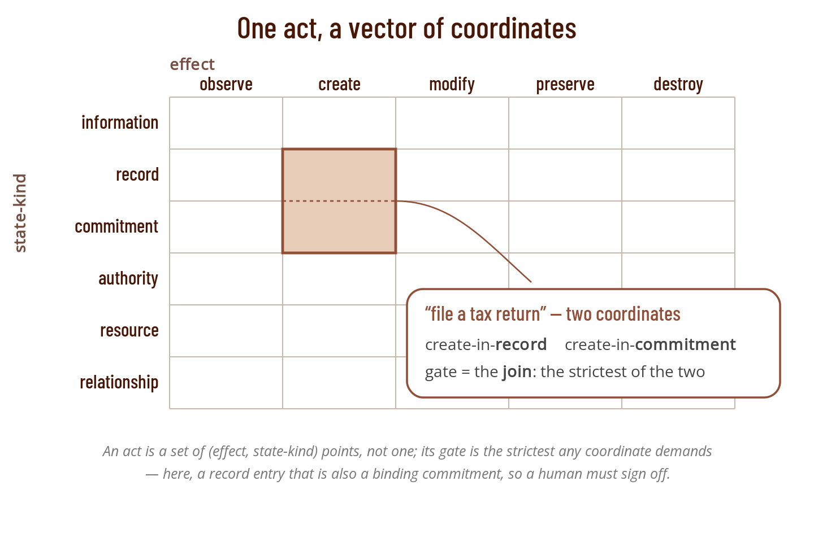
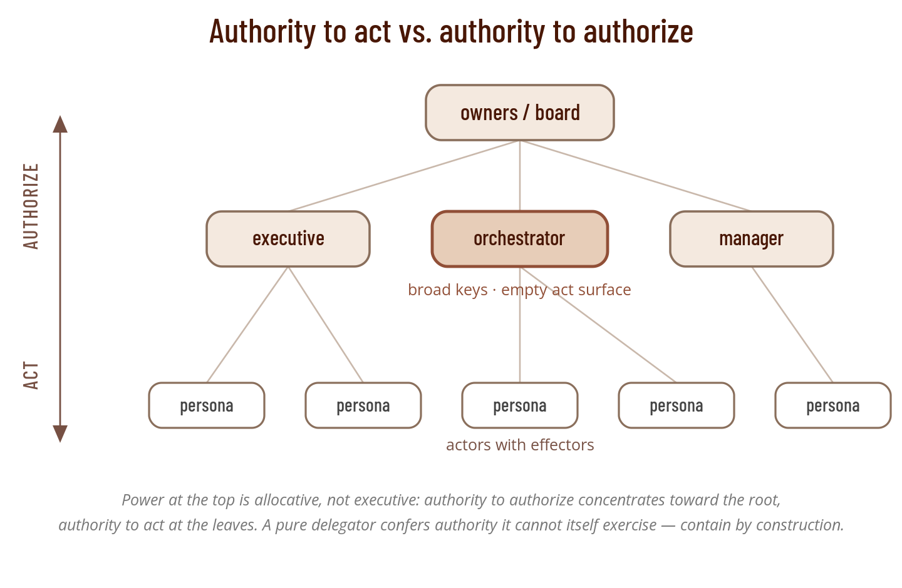

## 1. A model simpler than the problem

When Pharaoh raised Joseph over Egypt, he took the signet ring from his own hand and put it on Joseph's (Genesis 41:42). The ring *was* the authority: whatever it sealed, Egypt obeyed as though Pharaoh had sealed it himself. It was also a staggering risk — Joseph could now bind the kingdom to anything at all. Pharaoh's safeguard was not a smaller ring. It was his judgment of Joseph's capabilities, loyalties, and character.

That is one pole of a choice every ruler, household, and firm has faced ever since. To get work done in your name, you can hand over a bounded affordance — a key to one storeroom, a written list of errands. Or you can hand over the ring: the token that makes its bearer *you*. The key authorizes an act; the ring authorizes a person to stand in your place. Between those poles lies everything hard about delegation: enumerate what may be done, name the relationship it is done under, and keep the two from collapsing into each other.

Digital systems collapsed them. The dominant instrument for machine-to-machine authority is the API key or bearer token — a secret whose mere possession grants whatever the issuer attached to it, often a great deal. It is a signet ring handed out for an errand. Possession of an API key does not authorize one bounded act; it makes the holder indistinguishable from the account it belongs to, free to do anything that account can. Timo Hotti warns that an agent wielding such open-ended authority can be a "brilliant sociopath" — charming, capable, and unaccountable [1]. The instrument offers full access or none, and it comes from an era that never imagined the holder might be an inscrutable, non-deterministic reasoner acting unattended.

That era is over. Agentic AI now does real work on our behalf — filing tickets, merging code, sending mail, moving money — and its appeal is precisely that it accepts fuzzy instructions and returns non-deterministic output. Handing such a system a signet ring is a category error with consequences. The usual response is to authenticate the agent more rigorously — give it a key, sign everything, prove who acted — but that answers only who is at the door, never what they may do once inside, or for whom. The question is not "what may Alice do" but "what may Alice's agent do on Alice's behalf, and who answers if it goes wrong." And that question — authorization — is not one we get wrong for lack of attention. Every operating system, database, and web API enforces some model of it, and the research literature is an alphabet soup: role-based, attribute-based, policy-based, capability-based. The trouble is that our models are *reductions* — each buys tractability by discarding structure the problem actually has, and the discarded structure is exactly where an agent slips its leash. The API key is merely the crudest point on that spectrum; the sophisticated models sit further along and make the same trade more quietly.

The instinct behind these reductions is sound. Simplicity is a genuine virtue in a security model — a rule you cannot understand is a rule you cannot audit, and complexity is where holes hide. But it has a floor, caught by a line attributed apocryphally to Einstein: *make everything as simple as possible, but not simpler*. A model of delegation simpler than delegation in the real world is not elegant; it is wrong, and its wrongness is a standing invitation to abuse. What follows is an attempt to find that floor for delegated authority — the structure the problem actually has, and no less. This is not a plea for complexity. It is a plea against the *wrong* simplicity, the kind that drops a load-bearing wall to make the blueprint cleaner.

By *delegated authority* I mean the whole family of arrangements in which one principal acts under authority connected to another — what the identity literature calls indirect identity control [2]. It takes several forms, distinguished by whose interest governs: plain *delegation*, where an agent acts with task orientation for a still-sovereign principal; *guardianship*, where one acts generally for a dependent who cannot act themself; *controllership*, over a non-sovereign thing; and *stewardship*, where one runs another's domain as if it were one's own (with formal accountability and incentives). This paper is about all four, and part of its argument is that *which* form applies is itself a dimension the popular models simplify away. Where the narrow sense of delegation is meant, the text says so.

No system can verify intent deterministically; whether an act is *sincere* — whether the agent truly pursues the principal's purpose rather than a corrupted one — is not decidable from the outside. A taxonomy cannot fix that. What it can do is make an act's *category* machine-checkable: name the kind of thing being attempted, decide whether that kind is permitted here, gate the few crossings that warrant a fresh human decision, and audit the rest. Everything below is designed to that bound. Name the category, gate the boundary, audit the remainder — and do not pretend to check the heart.

## 2. One old art, three modern reductions

Delegated authority was not invented by computer science. It is one of the oldest arrangements in human life, and law and custom made it rich millennia before anyone tried to mechanize it. A regent rules for a child-king; a Grand Vizier acts in the sultan's name; a steward runs a household as though it were his own; a guardian stands in for an orphan; an attorney-in-fact signs where the principal cannot. Over centuries this practice accumulated exactly the structure delegation needs, and the common law of agency still states it in a sentence: an agent acts "on the principal's behalf and subject to the principal's control" [3], in the principal's interest to a fiduciary standard Cardozo set not at honesty but at "the punctilio of an honor the most sensitive" [4], within bounded, revocable authority the law has long codified as power of attorney, guardianship, and conservatorship [5]. Which acts; on whose behalf; in whose interest; who is liable; how it ends — the old art held all of it at once.

When the digital era set out to make delegation machine-checkable, it did not inherit this tradition whole. It split the problem across at least three research literatures, and each kept one facet and let the rest go. The modern, technical literatures rarely cite one another; each is rigorous exactly where it looks and thin everywhere else.

The first tradition is **formal access control and capability tokens**: role- and attribute-based access control, delegation logics, and the capability lineage that runs from SPKI through macaroons to biscuit and UCAN [6, 7, 8, 9]. Here the acts and constraints are rigorous. Capabilities attenuate — a holder can pass on only a narrowed subset of what it holds — and the narrowing is enforced cryptographically. Newer standards continue the line: OAuth's Rich Authorization Requests and the Grant Negotiation and Authorization Protocol (GNAP) replace flat scopes with structured requests carrying type, actions, locations, and datatypes [10, 11]. What this tradition lacks is the representational relation. A capability says what its bearer may do; it says nothing about whom the bearer acts *for*, or who answers if the act is wrong — the signet-ring problem in formal dress.

The second tradition is **taxonomies of action**: occupational and process catalogs like O\*NET and the *MIT Process Handbook*, legal-billing codes, and the lexical resource FrameNet [12, 13, 14]. These are the only tradition that takes the *act surface* seriously as an object of study — that tries to enumerate, at the root, a set of act-kinds that is *MECE*: mutually exclusive and collectively exhaustive [15], with no overlaps and no gaps. The Process Handbook in particular offers a genuinely MECE decomposition of how acts affect state. But every one of these is a single-actor catalog. None encodes delegation at all; the relationship is simply not in frame.

The third tradition is **identity and guardianship**, from the self-sovereign identity community — the one modern literature that consciously reached back to the old art. It borrows the law's own distinctions, partitioning indirect identity control by *the relationship* between controller and subject rather than by *what act* is performed [2, 16]: delegation, where a delegate acts for a still-sovereign delegator; guardianship, where a guardian represents a dependent who cannot be sovereign, in that dependent's interest; controllership, control over a thing. Its newest work carries the same relationship model into the agentic era, formalizing how a person delegates bounded authority to an AI agent [17, 18]. But it recovered only the relationship half of the inheritance. Of the acts themselves it has no methodical calculus; its constraint lists are frank but ad hoc.

Set the three side by side and the shape of the loss is plain. Each dropped, first, a way to bound the **full act surface** — not just interactions between willing parties, but the whole range of things a delegate might do, including the unilateral manipulation of tools — and, second, an explicit **"on behalf of · in whose interest · who bears the obligation"** dimension. The access-control people kept the acts and dropped the relationship; the taxonomy people mapped a lone actor's acts and never reached the relationship; the identity people kept the relationship and never built the acts. These are not three separate oversights. They are three ways of keeping part of one inheritance — and the two things they let fall are exactly what a steward, a guardian, or an attorney has always had to hold together.

## 3. Why a grammar of intent is not enough

The natural first move toward bounding a delegate is to name *why* an act is done — its **intent** — as distinct from the mechanical motion that carries it out. Intent is the purpose an act serves; it is what a principal actually cares about when handing off work, not the keystrokes but the end they serve. And it carries the idea a delegation most needs: the **intent boundary** [19]. An intent boundary is a point at which one party's knowledge of another's intent becomes inadequate, so that to proceed without a fresh confirmation is to overstep. That is the germ of delegation itself — to delegate is to judge how far a delegate's grasp of your intent can be trusted to run, and where it runs out, a fresh approval belongs. The gates this paper places later (§4) sit on exactly those boundaries.

The best existing grammar for intent is Syntelos: a hierarchical vocabulary of the *telos* — the end or purpose — of an interaction, from broad domains like `/trade` and `/care` down to specific ends like `/trade/lend` or `/care/treat` [20]. (Its plural is *telei*.) It has real virtues for delegation. It is hierarchical, so a single coarse grant cascades to everything beneath it and a principal can say "you may negotiate scheduling but not high-value commerce" without enumerating leaves. It draws its lines at intent boundaries — the ideal points for a consent or a gate. It makes complementary roles share one category, so a buyer and a seller meet at the same node from opposite sides.

These are the right instincts, and the model below keeps all of them. But Syntelos cannot, by construction, be the whole of a delegation vocabulary, and seeing why is instructive.

Syntelos scopes itself deliberately, through a *refusal test*: it governs interactions between volitional counterparties who could reject, delay, or negotiate the exchange based on their own agenda. Asking a hotel agent to book a room is in scope, because the agent can say no for reasons the caller cannot predict. Calling an API that unlocks a door or writes a file is explicitly *out* of scope — the called tool is deterministically obligated to execute a valid command, so there is no counterparty volition to model. This is a sound boundary for an intent-negotiation grammar. It is the wrong boundary for a delegation. The acts a delegation most needs to authorize or forbid — deploy to production, merge the branch, file the return, actuate the device, send the wire — are exactly the tool-manipulation acts the refusal test excludes. A grammar built to describe interactions between minds is silent about a delegate's dealings with tools, which is most of what a working agent does.

Two further mismatches compound the first. Syntelos is *two-party* — proposer and recipient — but a delegation is three-cornered: the principal, the delegate, and whoever answers if the act goes wrong, who may be none of the above. And Syntelos demotes bindingness, jurisdiction, and risk to *parameters* hanging off a leaf, because for intent-matching they are secondary. Whether an act legally binds the principal, in which jurisdiction, at what blast radius, is often the whole question of whether it may proceed unattended. For a delegation, they are the main event.

So intent is one axis of the answer, not the answer. Telos supplies the *why*. It cannot supply the *what* of a tool manipulation, nor the *for whom*. Those must come from somewhere else.

## 4. Giving the act a shape

Add to telos another axis that tracks *what transformation* the act works. That's **effect**, and it's a small, closed set of transformations. Five suffice: `observe` (read, no change), `create` (bring into being), `modify` (change what exists), `preserve` (actively maintain, renew, or discharge), and `destroy` (remove or terminate). CRUD recognizes the same shape; production authorization systems reach it independently. Effect is a *separate lock* from telos, and the separation buys defense in depth. A read-only monitoring persona holds `observe` and nothing else; an instruction injected into its input that says "delete the repository" fails the effect check even if it also named a permitted telos — so long as the persona's effectors are reachable only through that check. One axis contains the purpose; the other contains the power.

Effect alone is still too coarse, because the same effect means very different things depending on *what kind of state* it touches. Creating a draft, creating a ledger row, and creating a binding contract are all `create`, yet require different governance. So an act is located over a named **kind of state**: `information` (meaning not yet authoritative — a draft, an analysis), `record` (an entry others may rely on — a posted transaction, a published page), `commitment` (a social or contractual obligation that binds a principal — a contract, an invoice, a tax liability), `authority` (delegations, grants, keys — the meta-level), `resource` (systems, code, money, secrets), and `relationship` (a connection to another party). The state-kind is *named*, not inferred from the telos, because a single line of work walks across kinds: a marketing draft is `information`, its publication a `record`, and a specific factual claim inside it — "40% faster than the competitor" — a `commitment` that can create liability. The telos never changed; the kind of state did.

Two refinements make the model survive contact with real work. First, the gate an act deserves turns on its *stakes* — how much rides on it going wrong — and stakes are a continuum, not a switch. A journal entry and a tax filing are both `create` in `record`, yet one should be automatic and the other is the strictest checkpoint an organization has. The model estimates stakes from attributes of the *target*: how far the consequences reach, how hard the act is to reverse, and, for money, its value. These are proxies, and they can mislead. The same coordinates — `destroy` a `resource` — cover wiping a scratch cache and wiping the customer ledger; only the target tells them apart, and where its stakes are unclear, the call falls to a human — the intent bound again. Second, one act can occupy several points at once: filing a return is `create`-in-`record` *and* `create`-in-`commitment` in a single move. So an act is a **vector** of coordinates, and its gate is the *join* — the strictest any coordinate demands.

The payoff of naming these coordinates is that the authorization *gate* — the requirement that some act pause for a fresh approval — no longer has to be a hand-maintained table. It becomes a function of the coordinates. Creating or modifying `information` is automatic. Creating a `record` that is merely internal is automatic; creating an *authoritative* record needs an owner's sign-off. Creating or destroying a `commitment` needs a human, and specifically a legal owner if it binds a jurisdiction. Any act on `authority` — issuing, narrowing, or revoking a delegation, rotating a key — is the most reserved act of all. A money act above a threshold gates on its value. And any act on a *shared* target routes through whoever presides over that resource, not because the actor is distrusted but because coordination is owed. The gate is *derived*; and the same function that yields the gate yields the party who owns it. A persona's authority can then be stated as its telei, its effects, and its domain, and the required approvals fall out — rather than being transcribed, and mis-transcribed, by hand.

This inverts a common assumption about gates. A gate is usually read as a signal of distrust: *we make you stop and ask because we do not trust you to proceed*. But most gates in this model exist for other reasons entirely — because an act enters an authoritative record, creates a standing commitment, crosses into another domain, or must be coordinated through a shared resource. A steward can be fully trusted and competent within a domain and still owe a pause at those boundaries, the way a trusted employee still countersigns a contract. Untangling "you are gated" from "you are distrusted" is one of the quiet benefits of deriving gates from what an act *does* rather than from a judgment about who is doing it.

## 5. The relationship the act is performed under

Locating the act is half the model; the other half is the relationship it is performed under. It rides orthogonally to the act coordinates, as a *facet* on the delegation, and records in one place what the old art always specified: the **principal** the act is for, the **relationship** it is done under, the **obligation-bearer** who answers if it goes wrong, the **identity it is presented under**, and the terms of its **revocation**. The principal and the revocation terms are self-explanatory; the rest repay attention.

The relationship's *type* is the field the prior art most often drops — the single largest gap in the surveyed work — and the one that carries the most. It fixes whose interest the act must serve; and that, together with what the subject is — a still-sovereign delegator, a dependent who cannot act alone, or a non-sovereign thing — distinguishes the four forms named at the outset. (Whose interest alone will not do it: delegation and controllership both serve the acting side, and only the subject's standing tells them apart.) Serving another's interest is no soft aspiration — it is a fiduciary duty, held to the exacting standard the old art already set [4]. Stewardship is the richest form: guardianship's fiduciary posture applied to an organizational domain rather than a vulnerable person. The steward runs the domain as their own, in its best interest — which is why a steward's gates are not an insult; they protect the interest that is the steward's own charge.

But running a domain as one's own is more than autonomy; it holds only where accountability and incentive are both real. The accountability is not supervision of method but a strong retrospective account, and it runs both ways: the steward answers for outcomes, and the arrangement answers back for the mandate and resources it promised. The model makes this concrete, pairing each delegation with a signed *reciprocal record* of what the two sides owe each other and a tamper-evident log of what was done — accountability is what buys the autonomy. The incentive is just as load-bearing: a steward is incented, not merely commanded [20], and shares in how the domain fares, so that its interest and theirs converge. Command without incentive yields method-following and little judgment; incentive without accountability yields self-dealing. Stewardship needs both, which makes it the most demanding of the four relationships to establish and the most powerful once it holds.

The obligation-bearer deserves emphasis, because it is so easily conflated with the actor or the beneficiary and is often neither. An executive assistant who sends mail as an executive produces one act with two bearers: the executive carries the outward consequence, while the assistant answers inward to the executive. Beneficiary, actor, and obligation-bearer can be three different parties, and a model that conflates them cannot represent an ordinary office. Presents-as captures the same split on the identity side — the identity an act wears to the world need not be the actor's own — and the *capacity* it is worn in, signing as CEO versus as citizen, is the hinge of who is liable [21].

The facet also exposes a distinction the act coordinates cannot: between **authority to act** and **authority to authorize**. Authority to act is the set of acts a principal is entrusted to perform itself. Authority to authorize is the standing right to *sanction* others' acts within a scope — to hold the keys that a gate requires, and to enter acts onto the authoritative record. These are independent: a board can authorize a merger it could never execute alone, and a developer can execute a deployment she has no standing to approve. The extreme case proves the point: a pure manager, or a recursive orchestrator that only decomposes tasks and hands them out, can hold broad authority to authorize and *no* authority to act at all. Its act surface is empty; it can confer deploy-authority it could never exercise itself. This has a consequence for attenuation. The capability tradition says a delegate may pass on only a subset of what it *holds*; but a manager confers authority it does not hold, so the correct rule is that a principal may confer anything within its authorization *domain*, whether or not it can perform that thing. Authority to act concentrates at the leaves, where the effectors are; authority to authorize concentrates toward the root, at managers and boards and human controllers. Power at the top is *allocative, not executive* — a chief executive can personally *do* almost nothing directly, and that is by design.

That same distinction yields a containment pattern precisely where agentic systems are most dangerous. Give a powerful orchestrator broad authority to authorize but an empty act surface, and its blast radius on compromise collapses: a hijacked orchestrator can only *propose* delegations, each of which is itself a gated, attenuated act on `authority`. It cannot send, bind, spend, or exfiltrate, because it holds no direct capability to do any of those things. The most trusted node in the system is contained not by watching it but by construction.

A last distinction the facet must carry is **may versus must**. Everything so far describes what a delegate *may* do. But a steward is often obligated to act — to keep the build green, to file on time, to review anything that would bind the organization. These are *duties*: obligatory pairings of effect and telos, carried in a reciprocal record the delegator signs, optionally with a cadence. Duties are what make "act on your own initiative" and "deploy what you are entrusted with, do not merely guard it" mechanical rather than aspirational. They also introduce the one genuinely new failure mode of multi-principal authority: two principals can impose *conflicting* musts — a functional manager who requires a green build and a product manager who requires a Friday ship. The model must never silently pick one. It resolves the conflict by precedence where the duties carry it, and otherwise escalates to the nearest authority that presides over both domains. The conflict is surfaced, logged, and decided. The silent authority systems can represent none of it.

## 6. Who is acting

The relationship dimension raises a question the act axes never do: *which* identity is acting? Not every "you" is the same you. We are one self to an employer, another to a physician, another to a child's school, and we correctly resist any system that collapses these into a single correlatable record [22]. Identity, in other words, is granular along at least three dimensions — the *relationships* that give it context, the *attributes* that describe it, and the *agents* that represent it — and a delegation model has to respect that granularity or it will leak.

The mechanism is to make identity *facet-granular* [21]. A single cryptographic identifier is minted per facet, where a facet is a triple: *who* (whose self this is), *role* (the posture that distinguishes this aspect — director, employee, parent), and *context* (the scope — global, an organization, or one specific relationship). "Cecilia as chief executive at Acme," "Cecilia as an employee," and "Cecilia as a parent at her child's school" are three uncorrelatable identifiers for one person. (Those readable labels are aliases over the opaque cryptographic strings, produced by a shared naming convention [23, 24].) This gives the identity side its own triple — who, role, context — cleanly parallel to the act side's triple of telos, effect, and state-kind. Personas in an agentic system follow the same discipline: keep each one narrow, one facet and one identifier, so its authority and its correlations are both bounded.

Facet-granular identity absorbs several things a delegation model would otherwise carry as extra fields. The *relationship* dimension of identity is just *which facet is acting* — its context is the counterparty or scope, and the per-facet partitioning is what makes facets uncorrelatable. The delegate's *role* is the facet's role property. And "presents-as" becomes truthful representation rather than disguise: to present as an office — a shared "Office of the CEO" facet an assistant is delegated into — is to act under a real facet whose *who* is genuine, signed by the assistant's own key. Impersonation in this sense — minting a facet whose *who* you are not — is impossible by construction; the world sees the office, the audit sees the assistant, and neither is a lie. This is opaque *presentation* over transparent *audit*, and it is how an ordinary act of representation avoids becoming an act of forgery.

One dimension the facet does not carry, and it is worth flagging as an open axis rather than hiding it. Proof flows *inbound*: a delegate presents evidence to *gain* authority — the approval that satisfies a gate. But there is an *outbound* mirror: what a delegate may *reveal about its principal*, to whom, and unlinkably. An assistant, a marketer, and a triager can all leak the principal's data. This attribute-disclosure axis — the agent-and-attribute plane of the identity model — is the natural home for purpose-limitation, and this paper names it without claiming to have specified it.

## 7. Open loop, not closed

One architectural choice underlies all of the above, and it is the fork where this model parts from the capability tradition: *who verifies authority, and can they do it alone?*

Object capabilities are **closed-loop**. They work because the party that *issues* authority is the same party that *checks* it, or shares its state. The operating system is the canonical case: the kernel hands out file handles and also verifies them, because it can see which process holds which handle. Possession of the reference *is* the authority, and the checker has privileged visibility into who holds what. Macaroons' third-party caveats make the loop explicit — to verify, you must fetch a discharge from the third party, a phone-home to someone who shares the secret.

Verifiable credentials are **open-loop**. The entire point is that a third party who is *not* the issuer can verify authority *without* consulting the issuer — no callback, no shared state — from the credential and the actor's key-state alone. Authority is analyzed by a stranger. A traveller trusts a sealed letter of introduction without contacting the writer, and a bank can honor a power of attorney it did not draft — the artifact carries its own proof, with no call back to its source. That is what lets authorization survive outside the system that granted it.

"Capabilities versus credentials" is really "closed loop versus open loop," and the choice is consequential. Choosing open-loop *forces* full disclosure: a stranger deciding whether to honor an act must see *every* constraint on it, because it cannot ask the issuer what was meant — there is no graduated, ask-as-you-go disclosure when there is no one to ask. It forces the gate function itself to be *published*, part of a governance ruleset every verifier can read, so that any two verifiers compute the same gate from the same credential. And it forces every proof and approval to be a *self-verifiable artifact* rather than a callback — the human approval that unlocks a send must travel *with* the act, not sit behind a request to the approver.

The practical upshot is a clean division of what to borrow and what to reject. The capability tradition's *vocabulary* is excellent: caveats, scopes, attenuation, thresholds, and the analyzable policy languages like Cedar that can prove what a rule set allows [25]. Take all of it. But reject the tradition's *evaluation model* — possession checked by the granting system — because it quietly reintroduces the closed loop. A registry consulted at verification time is a phone-home in disguise. The discipline is strict: verification must succeed from the credential and key-state alone, and any registry or log is an issuance-time and audit-time convenience, never a verification-time dependency.

There is one more reason the open loop matters, and it is the strongest form of the whole argument. Some constraints can be enforced not at verification time but *by construction*, at the layer where identifiers themselves are formed. In cooperative delegation schemes, a delegate's very identifier commits to its delegator and to a small set of configuration traits, so that certain acts become not merely *rejected* but structurally invalid — a delegate configured never to sub-delegate produces no sub-delegation any verifier will honor, because the constraint is welded into its identifier rather than left to each checker's diligence [26, 27]. This is the digital realization of the lord who hands over a key to one door rather than the authority to sign treaties: the affordance itself is limited, so the forbidden act is not merely against the rules but outside the space of possible moves. Where a credential says "a verifier will refuse this," construction says "this cannot be built." The two layers compose. Construction governs the coarse, structural powers over one's own authority; credentials govern the fine, semantic scope of what those powers may touch. Together they turn "contain by construction" from a slogan into a mechanism.

## 8. What is settled, and what is open

The model has a spine that survives being stress-tested against real and constructed roles. A read-only triager gains defense in depth: an injected command to broadcast to customers fails on two independent locks, the telos it lacks and the effect it lacks, where the older single-fact defense had only one. A marketing drafter's two different gatekeepers — an owner for ordinary publication, a lawyer for a binding factual claim — stop being a hand-written rule and fall out of the state-kind of what is being published. A bookkeeper's tax filing inherits the strictest treatment of its two coordinates at once, because it is a record entry and a commitment in the same act. And the perennial "AI advises, human decides" arrangement becomes a *structural consequence* rather than a policy bolted on: an AI reviewer holds authority to act — it may read and produce a memo, both automatic — while the human holds the authority to authorize that a binding commitment requires. The reviewer's approval-shaped output is a recommendation; the binding sign-off is a key-act the reviewer simply does not hold.

Real questions remain open, and naming them honestly is part of the model's claim to be a Paper rather than a pitch. The exact record shape — which fields live on the delegation, which on the reciprocal record — is unsettled. So is the root of the chain: authority must bottom out somewhere, and a threshold of owners is the leading candidate. The *mechanism* for such a root is less open than that makes it sound — it need not be a heavyweight shared multisig. *Joint issuance* [28], formalized in the verifiable-dossier work, lets a grant be satisfied by a weighted threshold of endorsements, each owner signing from their own identifier, asynchronously and with no shared key. That refines KERI's multisig into something lighter and composable, and it is exactly what a threshold root — or any cross-cutting, multi-principal grant — would be built from. What stays open is not the root's mechanism but the chaining of stewardship down from it, and the record shape around it. Monotone attenuation across long delegation chains, and the aggregation problem — individually authorized reads that combine into an unauthorized synthesis — remain unsolved here as everywhere. And one claim the paper makes but does not prove: that its closed sets — five effects, six kinds of state, four relation types — are the *fewest* that suffice. Each earns its place in the argument. Whether a smaller set would do is itself open.

And the honest bound from the first section still holds at the last. This model makes an act's *category* checkable: it can tell, mechanically, that an attempted act is a `create` on a `commitment` that binds a jurisdiction, and route it accordingly. It cannot tell whether the agent attempting it is faithful. Sincerity stays gate-able and auditable, never provable. That is not a defect of the model; it is a property of the world, and a model that claimed otherwise would be lying. The contribution is narrow, and narrow by design: give delegated authority a shape — the acts it covers, the relationship it is performed under, the identity that performs it, and an open loop that lets a stranger check all three. That shape is more than a scope string and less than a rulebook — as simple as the problem allows. Get it right, and the errand can be an errand, and the signet ring can stay on the lord's hand.

None of this is new to human practice. The steward, the regent, the attorney-in-fact have always bounded the acts, named the principal, and borne the obligation; the law of agency wrote it down long ago. What is new is only that the check no longer needs a human who knows the parties — a stranger, or a machine, can run it from the artifact alone. The model is less an invention than a recovery, and it is meant to be general: it was developed to run an organization of humans and AI agents under one authority model, but the shape is not proprietary to any product. The tools we hand our agents are only as safe as the authority we can express, and right now we mostly cannot express it. We can start.

## References
[1] Hotti, T. 2026. The Missing Layer: Why Agentic AI Without Agentic Trust Ends in Tears. (Feb. 24, 2026). https://timohotti.substack.com/p/the-missing-layer-why-agentic-ai (industry essay; cited for the "Brilliant Sociopath" framing, not as a technical authority.)

[2] Hyperledger Aries. RFC 0103: Indirect Identity Control. Aries RFCs, hosted at identity.foundation. https://identity.foundation/aries-rfcs/latest/concepts/0103-indirect-identity-control/

[3] American Law Institute. 2006. Restatement (Third) of Agency. American Law Institute Publishers.

[4] Meinhard v. Salmon, 249 N.Y. 458, 164 N.E. 545 (1928) (Cardozo, C.J.).

[5] Uniform Law Commission. Uniform Power of Attorney Act (2006) and Uniform Guardianship, Conservatorship, and Other Protective Arrangements Act (2017). https://www.uniformlaws.org/ (U.S. model acts codifying delegated authority as power of attorney, and guardianship/conservatorship, respectively.)

[6] Ellison, C., Frantz, B., Lampson, B., Rivest, R., Thomas, B., and Ylonen, T. 1999. SPKI Certificate Theory. RFC 2693. IETF. https://www.rfc-editor.org/rfc/rfc2693

[7] Birgisson, A., Politz, J. G., Erlingsson, U., Taly, A., Vrable, M., and Lentczner, M. 2014. Macaroons: Cookies with Contextual Caveats for Decentralized Authorization in the Cloud. In Proceedings of the Network and Distributed System Security Symposium (NDSS 2014). Internet Society. DOI: https://doi.org/10.14722/ndss.2014.23212

[8] Fission and the UCAN Working Group. User Controlled Authorization Networks (UCAN) Specification. https://github.com/ucan-wg/spec

[9] W3C Credentials Community Group. Authorization Capabilities for Linked Data (ZCAP-LD). https://w3c-ccg.github.io/zcap-spec/

[10] Richer, J. (Ed.) and Imbault, F. 2024. Grant Negotiation and Authorization Protocol (GNAP). RFC 9635. IETF. DOI: https://doi.org/10.17487/RFC9635

[11] Lodderstedt, T., Richer, J., and Campbell, B. 2023. OAuth 2.0 Rich Authorization Requests. RFC 9396. IETF. https://www.rfc-editor.org/rfc/rfc9396

[12] Malone, T. W., Crowston, K., and Herman, G. A. (eds.) 2003. Organizing Business Knowledge: The MIT Process Handbook. MIT Press.

[13] National Center for O\*NET Development. O\*NET Content Model: Work Activities. U.S. Department of Labor. https://www.onetcenter.org/content.html

[14] Baker, C. F., Fillmore, C. J., and Lowe, J. B. 1998. The Berkeley FrameNet Project. In Proceedings of the 36th Annual Meeting of the ACL and 17th International Conference on Computational Linguistics (COLING-ACL '98). Association for Computational Linguistics, 86–90. DOI: https://doi.org/10.3115/980845.980860

[15] Minto, B. 1996. The Minto Pyramid Principle: Logic in Writing, Thinking, and Problem Solving. Minto International. (Origin of the MECE — mutually exclusive, collectively exhaustive — principle, from Minto's work at McKinsey & Company.)

[16] Sovrin Foundation Guardianship Working Group. 2023. On Guardianship in Self-Sovereign Identity, V2. Sovrin Foundation. https://sovrin.org/wp-content/uploads/Guardianship-Whitepaper-V2.pdf (first edition: Guardianship Task Force, v1.2, Dec. 2019.)

[17] South, T., Marro, S., Hardjono, T., Mahari, R., Whitney, C. D., Greenwood, D., Chan, A., and Pentland, A. 2025. Authenticated Delegation and Authorized AI Agents. arXiv:2501.09674. https://arxiv.org/abs/2501.09674

[18] Decentralized Identity Foundation and Trust over IP Foundation. 2025. New Working Groups for Trust in the Age of AI (including the DIF Trusted AI Agents Working Group). LF Decentralized Trust. https://www.lfdecentralizedtrust.org/blog/toip-and-dif-announce-three-new-working-groups-for-trust-in-the-age-of-ai

[19] Hardman, D. 2025. Intent and Boundaries: A Framework for Digital Agency. Codecraft Papers. https://dhh1128.github.io/papers/intent-monograph.html DOI: https://doi.org/10.2139/ssrn.5909382

[20] Hardman, D. 2025. Syntelos: A Hierarchical Taxonomy of Intent in Digital Interactions. Codecraft Papers. https://dhh1128.github.io/papers/syntelos.html

[21] Hardman, D. 2026. Identity Facets. Codecraft Papers. https://dhh1128.github.io/papers/if.html

[22] Hardman, D. and Law, J. 2019. Three Dimensions of Identity. Codecraft Papers. https://dhh1128.github.io/papers/3dim.html

[23] Hardman, D. 2026. Opaque Identifier Aliases. Codecraft Papers. https://dhh1128.github.io/papers/oia.html

[24] Hardman, D. 2025. Conventions for Opaque Identifier Aliases (COIA). https://dhh1128.github.io/coia

[25] Cutler, J. W., Disselkoen, C., Eline, A., He, S., Headley, K., Hicks, M., Hietala, K., Ioannidis, E., Kastner, J., Mamat, A., McAdams, D., McCutchen, M., Rungta, N., Torlak, E., and Wells, A. M. 2024. Cedar: A New Language for Expressive, Fast, Safe, and Analyzable Authorization. Proceedings of the ACM on Programming Languages 8, OOPSLA1, Article 118. DOI: https://doi.org/10.1145/3649835

[26] Smith, S. M. 2019. Key Event Receipt Infrastructure (KERI). arXiv:1907.02143. Maintained as the KERI specification, Trust over IP Foundation KERI Suite Working Group: https://trustoverip.github.io/kswg-keri-specification/

[27] Smith, S. M. Authentic Chained Data Containers (ACDC). IETF Internet-Draft draft-ssmith-acdc; Trust over IP Foundation. https://trustoverip.github.io/kswg-acdc-specification/

[28] Trust over IP Foundation. Verifiable Dossiers. KERI Suite Working Group. https://trustoverip.github.io/kswg-dossier-specification/ (defines joint issuance, threshold operators, and revocation over ACDCs.)
