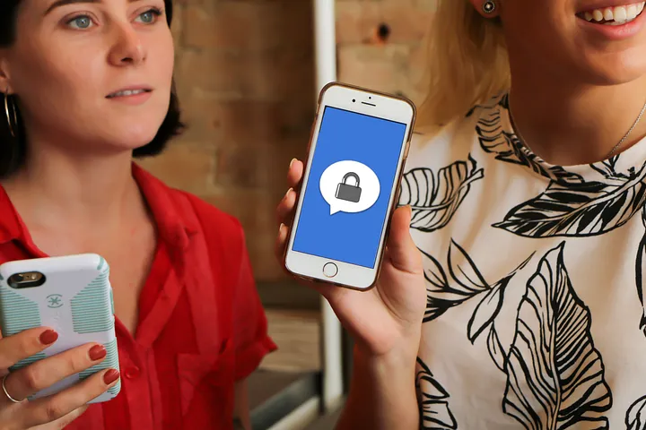

I just got a new mobile phone and phone number. You can guess the hoop-jumping that ensued as I installed apps and updated dozens of account profiles.

One adjustment on my to-do list was Signal. I use Signal on my phone to chat securely and privately with friends; naturally I wanted it on my shiny new device…

<figure>
  
  <figcaption>Photo derived from one by 7shifts on Unsplash</a>.</figcaption>
</figure>

Well, it turns out that’s much trickier than it sounds. Signal installs on new devices just fine, but its account security is tied to control of a phone number — a new identifier that is rented by my employer rather than owned by me — and [Signal is unwilling to let me transfer the binding](https://web.archive.org/web/20200227005300/https://support.signal.org/hc/en-us/articles/360007062012-New-Number-or-New-Phone). I have to start over from scratch. (EDIT, Aug 2024: this seems to have changed since I wrote the original post. Cool!)

This is not a rant against Signal (I understand their rationale). Nor is it an exploration of clever workarounds (which may exist). Rather, this is a meditation on a lesson that the Signal friction taught me. I should have understood it long ago, perhaps — but the epiphany was slow in coming. I’m slapping my forehead.

## Why I Should Have Been Smarter
For the past five years, I’ve been working on a new form of digital identity. It goes by various names (“decentralized identity”, “credential-based identity”…) — but the market seems to prefer the label “[self-sovereign identity](http://www.lifewithalacrity.com/2016/04/the-path-to-self-soverereign-identity.html)” (SSI). This term emphasizes that the identity is owned by you or me. It’s not bestowed by corporate IT (Active Directory/LDAP systems); it’s not granted by internet giants (“sign in with Google/Facebook”); it’s not arranged through single sign-on vendors. SSI is for ordinary people who detest their messy collection of usernames and passwords, and just want bad guys to go away and good guys to enjoy the trust they deserve. SSI puts us — not institutions that [leak our data to hackers](https://haveibeenpwned.com/), [sell our data to partners](https://www.schneier.com/books/data-and-goliath/), or [surveil us for their own purposes](https://www.schneier.com/books/data-and-goliath/) — in charge. It also empowers governments, businesses, and other institutions that want to [revolutionize privacy](wbca.md), redefine the [cybersecurity](https://www.securitymagazine.com/articles/93356-self-sovereign-identity-the-true-password-killer) and [regulatory landscape](https://medium.com/inside-r3/is-self-sovereign-identity-the-answer-to-gdpr-compliance-15c289ac3c27), [reduce cost and risk](https://sovrin.org/the-promise-of-self-sovereign-identity-and-its-impact-across-industries/), [keep people safe in pandemics](https://www.lfph.io/cci/), and [do right by the people they serve](https://www.eff.org/fight). If you want to read more about it, I recommend [this introductory piece](3dim.md), or [this definitive, in-depth treatment](https://www.manning.com/books/self-sovereign-identity) with contributions from dozens of experts.

Anyway, the point is that I’ve been evangelizing the notion of personal identity empowerment for years, without truly understanding a key aspect of the breakthrough right in front of me.

One of the technologies at the core of SSI is [decentralized identifiers](https://www.w3.org/TR/did-core/) (DIDs). You can think of these like phone numbers or internet domain names or social media handles or email addresses — except that instead of renting them as a scarce resource from a central authority, anyone can create as many as they like. No permission is needed, no coordination is necessary, and depending on which method you use, costs can be low or zero.

Just like traditional identifiers have metadata (phone numbers: associated devices and billing info; internet domains: IP addresses and MX records…), DIDs have metadata. But what’s cool about DIDs (besides their self-service creation) is that their metadata is cryptographically verifiable. That means that anyone in the world can tell whether the metadata is legit, in the blink of an eye, just by asking software to check some math. And it also means that you can build a transport-independent, tamper-proof, encrypted communication channel with whoever controls a DID.

## Secure Communication Is the Enabler, Not the Breakthrough
Check your intuition. Which italicized words in that last sentence are most exciting?

I think the value of secure DID-based communication (“DIDComm” for short) felt obvious to many of us from the early days of SSI. [Hyperledger started incubating DIDComm in 2018](https://github.com/hyperledger/aries-rfcs/blob/master/concepts/0005-didcomm/README.md), and a number of [vendors now ship mobile apps and enterprise frameworks that use the technique](https://github.com/hyperledger/aries-rfcs/blob/master/concepts/0302-aries-interop-profile/README.md). [Important interoperability achievements](https://sovrin.org/sovrin-stewards-wallet-portability/) are demoed. The Trust Over IP Foundation recognizes [DIDComm as an important component of its vision](https://ieeexplore.ieee.org/document/9031548) for a next-gen Internet. The Decentralized Identity Foundation (DIF) currently has a [working group](https://identity.foundation/working-groups/did-comm.html) dedicated to writing [version 2 of the DIDComm spec](https://identity.foundation/didcomm-messaging/spec/). And the W3C has explored several variations on formal DIDComm that deliver similar value in similar ways.

But I no longer think that “tamper-proof, encrypted communication channel” is the headline. I’m more excited about “transport-independent” and “whoever controls a DID.”

About the same time that I was wrestling with Signal on my new phone, I was also observing a W3C effort to curate a list of pivotal use cases for DIDs. Two of my friends suggested that DIDComm ought to be featured there, and submitted PRs (1, 2). The document editors quite sensibly [pushed back](https://github.com/w3c/did-use-cases/pull/126#issuecomment-754107993). In essence, they said: “Yes, we can do secure communication with DIDs. We’re glad. But secure communication is a solved problem. Have you ever heard of Signal or WhatsApp or iMessage or Matrix? How about TLS that encrypts traffic to and from every website on the planet? How about SSH, for Pete’s sake? A safe channel is table stakes; it hardly provides a raison d’etre to showcase what makes DIDs special.”

It was hard to argue with that logic. And yet my friend Nader, who submitted the second of these PRs, had a feeling that something was missing from this analysis. What, exactly? We discussed it in the DIDComm working group, and in the W3C github repo. Examples were proposed and critiqued and abandoned. Eventually clarity emerged — and this is the epiphany that made me slap my forehead:

>*DIDs make a trust context portable.* Sure, without DIDs, secure communication is still pretty cheap and easy to come by. But it’s also *siloed* — owned by whoever provides the channel, not by you.

## Portable (= Self-Sovereign) Security
To understand what this means, go back to my experience with Signal. Signal certainly provides secure communication. It also boasts a protocol that’s open and widely supported; I believe WhatsApp and Skype and Facebook Messenger all have implementations. But these Signal-based technologies silo their users; a WhatsApp user can’t send a Signal user a message. (EDIT Aug 2024: Signal now supports a migration, though!) You can’t use your Signal security in your email client. You can’t transfer your Signal reputation and connections from one phone number to another.

Another way to say this might be:

>DIDs provide *self-sovereign security*. Existing solutions don’t.

(SSH keys do have some characteristics that could be used to build self-sovereign security. However, they lack a standard for verifiable metadata, as well as some privacy and security features of DIDs. That’s a whole ‘nuther story.)

Suppose I start a conversation with Alice on Signal. What I wish I could do is switch the phone number Signal knows me by, but not Alice’s perception of the secure and private pipe we share. That is, I’d like vendors to provide transports and form factors, but let me bring (and take away!) my own trust context.

I’d like to switch to WhatsApp or iMessage or a COVID contact tracing app, or some new app that hasn’t been invented yet, or just plain email, without any backchannel coordination— and have Alice and me both still recognize each other as the same parties, and apply the same trust that we built in the original home of our interactions. I’d like to reply to one of Alice’s tweets, and have her know it’s me even if she’s never seen my Twitter handle. I’d like Alice to go to my website and be able to login without creating a new account on the server, because she and I already “know” each other. When Alice and I meet at a conference, I’d like to embed a private joke to her as a QR code on my presentation slides. If the Internet is down, I’d like to chat with her over a mesh-networked BLE tool like [Briar](https://briarproject.org/). I’d like to send Alice a thumb drive by snail mail; when Alice inspects the encrypted files, I want her to be able to verify that they came from me, and decrypt them using the same keys and algorithms that are already protecting our interactions elsewhere.

And oh by the way — I want to do this with all my contacts, not just Alice. And I want to do it without paying a company for the privilege, without accepting obnoxious terms and conditions, without having to be a technogeek, without running afoul of government regulations, and in a way that no other entity on the face of the planet can correlate the two of us by the identifiers we’re using.

*That* would be self-sovereign security.

*That* is what DIDs and DIDComm offer. [Really](https://w3c.github.io/did-use-cases/#messaging).

And I think that’s a pretty big deal. Can you see why I’m excited?
