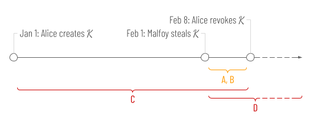

# Why Anchored Signatures?
20 Feb 2025

By themselves, digital signatures are much weaker evidence than casual thinkers might imagine. The reason is that the secret upon which they depend (a private key) can be compromised or revoked, but *simple signatures are difficult to sequence relative to a compromise or revocation event*. An inability to reason about sequence enables retrograde attacks.

Here's how a retrograde attack works:

* On Jan 1, Alice creates a keypair, K.
* A month later, on Feb 1, Malfoy steals K.
* A week later, on Feb 8, Alice becomes suspicious and rotates or revokes her key.
* At any time on or after Feb 1, Malfoy uses K to sign something in Alice's name, creating fake evidence of her intent that purports to originate during the time between Jan 1 and Feb 8.

A naïve analysis would assume that Alice is only vulnerable to Malfoy's mischief between Feb 1 and Feb 8. This is time period A in the diagram. Further, it would assume that any signed events that Malfoy creates for Alice during the vulnerable window must reference a timestamp between Feb 1 and Feb 8. This is time period B in the diagram.

Unfortunately, Alice's exposure in this situation is much worse than the naïve assumption. Malfoy can easily backdate a fraudulent affidavit, mortgage, or business document from Alice to any point in time when K was known to be valid. This is time period C in the diagram &mdash; the true window for timestamps that an attacker can use.

It gets even worse. Nothing magic happens on Feb 8 that shuts down such retrograde attacks. Sure, K is unavailable for evidence that claims to originate in the future. Nevertheless, Malfoy can keep generating new evidence that looks like it originated in the past, *forever*! The time period when Alice is at risk is labeled D in the diagram, and as the dotted lines at the right show, it has no end point. Worse still, Alice remains at risk *even if she rotates or revokes K before Malfoy steals it*. If K *ever* comes into his possession, even a year after it was revoked, a retrograde attack is possible.

## Mitigation 1 (very flawed)
Contextual clues may make some of Malfoy's mischief impractical. For example, if Malfoy sends a backdated, fraudulent invoice in Alice's name in April, he may find it rejected because in March, Alice already sent another invoice to the same recipient, showing a zero balance.

Some business processes generate a lot of contextual clues like this. However, clues might not always be sufficient. Even if they are, they might not be obvious, and human attention and wisdom are both unreliable.

## Mitigation 2 (very flawed)
Alice can try to forestall Malfoy's mischief by taking aged evidence off the table. In an urgent and forceful announcement to all stakeholders, she can assert that any artifacts signed by her and encountered for the first time after the date of her revocation must be disregarded, even if they carry an apparently good signature. Essentially, this makes revocation retroactive.

One problem with this is that Alice might not be able to enumerate or reach all stakeholders. Malfoy isn't limited to interactions with people that Alice knows about...

Another problem is that Alice can't force every stakeholder to honor her wishes. If Christie's is auctioning a Basquiat painting, and is about to receive what looks like Alice's signed bid, is it fair to the other bidders, the seller, or the auction house to let Alice off the hook, rewinding thirty seconds of dramatic buying (or non-buying) decisions by all? What if another bidder will abandon their purchase plans upon hearing Alice's bid? Or what if they will escalate a bidding war, instead? Maybe altering the behaviors or outcome of the auction, rather than buying the painting, accomplishes Malfoy's nefarious purpose. How do stakeholders decide which branches of possible reality deserve cancellation, and how do they all agree on the same branches?

Yet another problem with retroactive revocation is that it lets Alice cheat. Maybe Alice actually *did* make the bid, then realize she can't afford it. Should she be allowed to repudiate her own signed actions just by claiming that her key has been stolen and that therefore, any actions taken with it are now untrustworthy? Only moments ago, she was demanding trust in that same key...

In certain carefully designed governance frameworks, retroactive revocation may be practical, but in general, it is dangerous and foolish. Revocation establishes a point beyond which provably *new* actions are invalid, but if you can't prove what's new, it doesn't eliminate retrograde attacks.

## Mitigation 3 (pyrrhic victory)
Faced with this problem, many authentication mechanisms eliminate risk by designing such that any analysis of Alice's past actions is out of scope. Whenever purported evidence from Alice is encountered, the only question that can be validly asked about it is: *Does Alice's signature validate this evidence in the current moment?* Such designs let Alice revoke, and have everybody react with (approximately) low latency &mdash; but they make it impossible to use signatures to prove anything about her historical actions. After-the-fact audits are impossible, because anything in the past can be faked with compromised keys.

This is like saying that Alice can submit signed bids at an auction, but she must stay on a phone so the auctioneer can verify her signature by verballing confirming with her each time. It creates all kinds of logistical problems and maintenance headaches, and there's no proof of what happened on the phone, other than the auctioneer's say-so.

In general, X509 certificates embrace this limitation &mdash; you can ask whether one is valid *now* (e.g., as you're loading a web page), but you can't ask whether it was valid a week ago, when someone signed with the private key that's bound to that certificate via its public key. (Entries in CRLs do contain a revocation date, but CRLs as a source of revocation *sequence* are quite problematic. Besides, OCSP is becoming more common, and it only gives a current status. And with either CRLs or OCSP, verifiers have a "phone home" model, which is obnoxious for other reasons. For all practical purposes, certs support only queries about *now*.)

What may not be obvious is that many other security mechanisms share this same limitation. JWTs are almost always verified against a key state that is only ephemerally testable (whether they contain an `x5u`, an embedded JWK, or an embedded JWKS). OAuth2 and OIDC and SD-JWTs use JWTs as tokens; they inherit the same limitation.

What about DIDs and W3C verifiable credentials (VCs)? Well, if a DID method doesn't support the [`versionId` or `versionTime` parameter](https://www.w3.org/TR/did-1.1/#did-parameters), then there's no way to ask it about a previous key state, and historical actions with its DIDs are unprovable. Have a look at DID methods, and you'll discover that *most DIDs, including crowd favorites like did:web, can only be resolved to the current key state*.

Think for a minute about the consequences for issuers and holders of VCs that use DIDs as identifiers. If an issuer has a key compromise, they can rotate keys &mdash; but doing so *invalidates all the evidence they have ever created*. This creates massive practical difficulties, because reissuing evidence requires new interactions with holders, and holders might not be available. What would you think of a driver's license bureau whose recover-from-breach plan required all current license holders to come back to the office?

Burdensome recovery scenarios like this also imply lots of reputational damage, which creates a strong incentive to NOT do the right thing. Instead of (or before) rotating the key on their issuer DID, issuers may be tempted to do lots of individual revocations. If they do, they'll be in the same situation as Alice before she finally does a revocation &mdash; risk growing without bounds. And we haven't even considered how this complicates trust registries...

I am not trying to diss JWTs or OIDC or VCs across the board. Sometimes they can deliver excellent value with ephemeral evidence. However, it's common to underestimate the practical consequences of mitigating retrograde attacks the way they do. As a result, they get used for problems that don't fit well, with subtle but profound drawbacks. In telco, which is my current focus, I believe evidence with this flawed strategy is a major reason for the failure of some staggeringly expensive initiatives.

## Solution

If obvious mitigations for retrograde attacks aren't satisfying, what would a real solution look like? The formula, which I'll call *anchored signatures* in line with [KERI](https://trustoverip.github.io/tswg-keri-specification) terminology, is actually simple:

>Keep tamper-evident records that can prove how a given signing event relates in time to changes in the associated key state.

*If Alice does this, Malfoy can't get away with backdating evidence*. Alice is still vulnerable to mischief until she notices a compromise. However, during this time Malfoy is forced to create evidence with new dates, to avoid out-of-order errors. And once Alice rotates her key, Malfoy's attack window closes forever.

In reaction to the formula above, some might say, "Sounds like blockchain." And they would be partly right &mdash; blockchain *is* one way to do it. (Of course, this assumes that blockchain is applied correctly to the problem. If events like issuance or signing arbitrary data happen without some provable link back to the blockchain, all bets are off. Maybe the existence of gaps like this have caused designers of blockchain-based DID methods to throw up their hands in despair rather than doing what's necessary to add support for `versionId` or `versionTime`...)

But think carefully about the wording of that requirement, and you'll see that something simpler than blockchain might also work. We don't need to know the relative order of two signing events &mdash; only how any one event relates to its key state. That means no total ordering, and no cumbersome consensus algorithm. We don't need to know how Alice's key state or signing events relate to Bob's; Alice can keep her own records. That means no permissioning problem, no big central *anything* in the sky, no scale or performance bottlenecks, and no regulatory problems with data locality, privacy, or erasure.

KERI's implementation of this requirement uses tiny, identifier-specific files called KELs (key event logs) and TELs (transaction event logs). They resemble the concept of microledgers that was discussed in Hyperledger Indy circles years ago. KERI anchors (records the hashes of) signed TEL events in the KEL to make sequence unambiguous. The KEL/TEL mechanism is lightweight and elegant, and I recommend it.

For completeness, there are still other alternatives. A randomness beacon emits unpredictable entropy every N seconds, saving a timestamped record of its activity. I could use the latest value from such a beacon as input to my digital signatures and key rotation events, making them *provably after* the entropy. If I also use the hash of a *provably-after* event as input to something else that's reliably timestamped (e.g., an ad in a newspaper), or as input to another cryptographic artifact (e.g., an IPFS CID), my event also becomes *provably-before*. In other words, it's *anchored*, just like the KERI or blockchain mechanisms.

## Conclusion

Regardless of details, anchoring eliminates an important class of vulnerability with digital signatures. Retrograde attacks become impossible. An analysis of an anchored signature will produce the same result no matter when it happens, which makes historical audits of cryptographic decisions possible. Signed evidence can remain valid across any number of key rotations, making it effecitvely permanent. All of these benefits should matter deeply to practitioners of decentralized identity.

I am not claiming that ephemeral evidence should be eliminated. It's lightweight to create and to verify, and that might matter a lot. Login that doesn't require an audit trail is a ubiquitous use case in digital identity; it can be solved nicely with ephemeral evidence. However, it is a seriously bad idea to identify issuers and holders of credentials in a way that can only be analyzed at the current moment. And many non-VC use cases for raw digital signatures also require protection from retrograde attacks. Believe me, lots of Malfoys know this. To frustrate them, we really need anchored signatures.

