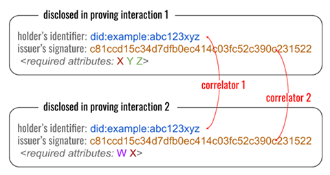
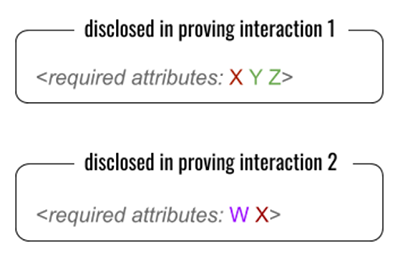
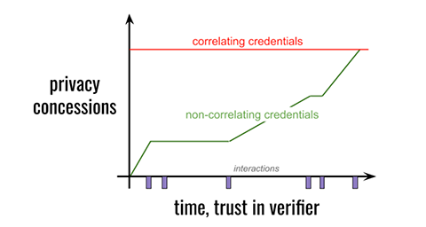

In a previous post, I described how verifiable credentials differ in their approach to privacy:

Correlating credentials correlate their holder to a disclosed identifier, and a disclosed signature, that’s the same in every use of a given credential. Other attributes are often identical as well, but these two perfect correlators are guaranteed to be present no matter how selective disclosure operates. The claim of proponents is that this disclosure discourages fraudulent transfer by putting the holder’s reputation at risk.
With correlating credentials, any two credentials can be linked because they share a common identifier

Non-correlating credentials help a holder to prove control over a credential in a way that reveals neither a public identifier nor a signature; contexts are harder to stitch together. The claim of proponents is that this improves privacy, and that there are better ways to discourage fraud than always revealing a perfect correlator.

Evernym has built and deployed a non-correlating credentials ecosystem. We regularly receive pushback from fans of the opposite approach. The debate is passionate and involved; exploring it in full would take more word count than any blog can handle, but today I’d like to explore just one point of contention more deeply.

Proponents of correlating credentials often make an argument that sounds like this:

>Going to great lengths to avoid correlation is wasted effort, because we’ll be correlated anyway. Just accept that and quit trying to fight a losing battle. Our energy is better used elsewhere.

Given today’s surveillance economy, this thinking might feel like savvy pragmatism. Plenty of pessimists have proclaimed that privacy is dead. However, it falls apart under careful analysis. Yes, to some extent we’ll be correlated anyway, but:

* How expensive will the correlation be?
* Exactly who is going to correlate you?
* When are they going to correlate you?
* How completely are they going to correlate you?
* How much control will you retain?

## How expensive will the correlation be?
Today, correlation is a for-profit enterprise conducted by huge automated engines that crunch through oceans of poorly organized data that often contradicts, overlaps, or repeats itself. Is Alice Jones in Houston the same as Allie B. Jones who lived in Sugarland six months ago, or as Sally Jones née Black who graduated from college and moved to the Houston area in 2016? Correlating this data takes effort, unfolds over time as imperfect clues accumulate, requires maintenance as context triggers re-evaluation, and is often probabilistic. That cost is reflected in the prices that data brokers and private detectives charge.

So, what happens if we make correlation far easier, far more accurate, and far cheaper to maintain? What if every use of Alice’s driver’s license exposes the same signature, no matter which fields were selectively disclosed, and no matter whether Alice relocated or changed her name? What if all the false positives can be erased with one simple test for identifier or signature equality? That’s the effect of correlating credentials. They shift the economics of correlation, trivializing the assembly of rich profiles on those who use them.

Non-correlating credentials create economic pressure in the opposite direction, going out of their way to hide unnecessary detail. Thus, the profit in correlation is affected by the type of credentials we popularize.

*Even if “we’ll be correlated anyway,” we’re better off keeping correlation expensive.*

## Exactly who is going to correlate you?
Today, most verifiable credential workflows involve regulated public institutions as both issuers and verifiers. These are institutions we already trust to some degree: banks, schools, health care providers, employers, airlines, credit reporting agencies, internet giants, governments. All have legitimate reasons to know some of our personal details; most have such details already. 

The argument for correlating credentials, then, becomes: Since these institutions are heavily regulated, can’t we use the law rather than tech to protect us?

Partly. Maybe. The jury’s still out on whether data brokers can be constrained effectively, and whether privacy regulations will change behavior at Facebook and Google as much as we’d like. Remember that despite good intentions, these are the same regulated institutions that fail to protect the public in the breaches every day; think Target, Yahoo, Equifax, Marriott, the Office of Personnel Management, Aadhaar/UIDAI…

But framing the question this way hides a graver risk. Today’s verifiable credential workflows may involve big, regulated, public institutions; tomorrow’s will involve ordinary people — and that makes correlation much harder to regulate. If Alice is using correlating credentials tomorrow, the shifty guy who begs for Alice’s verifiable business card at the bar has access to the same lookup power as the HR department where Alice applies for a job. It doesn’t matter that Alice only discloses her first name at the bar; the shifty guy gets a perfect correlator anyway. Notice, too, how the issue of expense affects who does correlation…

*Even if “we’ll be correlated anyway,” we’re better off not putting industrial-strength lookup tools backed by cheap data in the hands of random strangers.*

## When are they going to correlate you?
It’s common for online subscriptions to offer a free trial with no credit card required. This is effective because we naturally want to ratchet trust; we don’t want a business to have our credit card until the relationship proves useful and the other party seems trustworthy.

Today, some conventions in the financial industry militate against ratcheting. We may be forced to disclose name and tax ID number, as well as debt and income details, before a bank will commit to an interest rate in a potential loan. But given a choice as we borrow, we prefer to disclose intrusive details later. Responding to that demand, some innovative lenders advertise prequalification on the basis of streamlined questions. Wouldn’t it be nice to take this further? What if we could prove credit worthiness (credit score, income bracket, debt-to-income ratio) to discover the best available rates, without disclosing our name or the exact income number from last year’s taxes? This is the value proposition of businesses that match lenders and borrowers — except without the privacy risks. It doesn’t eliminate the correlation that a lender will eventually do, if we choose them, but it does change when that correlation happens, and it means all the other lenders we approach don’t get to build a profile on us.

With correlating credentials, all the trust is up-front, because you give away a perfect correlator with your first use of credentials. With non-correlating credentials, it is theoretically possible to defer correlation until you’re ready. I am not claiming that this difference will have immediate benefit in every industry in every jurisdiction; the capabilities of non-correlating credentials are not yet familiar to lawmakers. But this difference does have value. I predict it will matter immediately in some contexts, and over the long haul, it will be acknowledged and even relied upon in regulation and industry best practice.

*Even if “we’ll be correlated anyway,” having finer control over the timing of correlation matters.*

## How completely are they going to correlate you?
We don’t mind if the government knows enough about our income to evaluate whether we’re paying taxes. But we don’t want the government to know what goes on behind our closed bedroom door or bathroom stall. This is the real meaning of privacy — not that we have constant anonymity, but that we can create a few private spaces. 99% of the space in our lives might be public, but protecting the remaining 1% is really important.

The approach that a credential takes to correlation affects whether we can create private spaces. Suppose Alice gets a job and uses her verifiable driver’s license as identification for her new-hire paperwork. She also uses her driver’s license as identification when she drops off a blood test at the hospital lab, and when she registers as a voter at her local political caucus meeting, and when she checks into a hotel on vacation.

If Alice is using non-correlating credentials, she can probably keep these interactions separate — for a time, to some reasonable degree. But if she’s using the correlating variety, all of these interactions are guaranteed to be part of one giant context, unified by the perfect correlators of Alice’s DID as the credential holder, and the issuer’s signature over the credential. She can’t partition her life such that her political party membership and the results from her lab work are separable from the driver’s license that her employer saw. In fact, it is impossible for Alice to use her driver’s license, ever, anywhere, without adding to the overall correlatable context. The scope of correlation and the scope of her credential use are co-equal by design. It is true that not all of this correlatable context may be visible to a given party, but once it’s all known, it glues together into a complete, not partial, picture.

This may sound like repetition of a point made earlier, but here I’m emphasizing a different consequence: completeness. Because the evidence of Alice’s credential use is guaranteed to be correlatable 100% of the time — not 9x% or 8x% or 3x%— it’s now possible to search for Alice’s correlators and know with perfect accuracy whether she used a credential in a given context, even if the answer is no. This lets parties with a wealth of data prove facts that are only probabilities today. Do we want a world where an impeached president can identify a whistleblower by quickly and perfectly disproving all other candidates? Or where a repressive government can prove you skipped three Party rallies in a row?

*Even if “we’ll be correlated anyway” in many contexts, enabling a few private places is wise.*

## How much control will you retain?
When Alice proves to Bob that she’s HIV positive, does she have any control over how Bob proves it to anybody else?

With correlating credentials, the answer is no. Bob can show Alice’s proof to anyone he likes, whenever he likes, without involving Alice further. This is a characteristic of the cryptography Alice uses.

With non-correlating credentials, the answer is maybe. Bob and Alice negotiate about this in advance. If Bob needs to be able to prove to an auditor that Alice is HIV positive, Alice can generate a proof that makes this possible. But she does not automatically give away this control; she also has the option of proving only to Bob, such that Bob has to come back to her when he wants to reshare the proof.

It could be argued that Bob knows Alice’s HIV status regardless of what proving technique she follows, and that he can therefore reshare his knowledge no matter what. This is true, but it conflates knowledge with proof. If Bob wants to dox or bully or blackmail Alice, there’s a world of difference between making unsubstantiated assertions about her, and being able to prove them.

*Even if “we’ll be correlated anyway,” it’s worth giving the credential holder as many control options as possible over how proof flows.*

## Conclusion
The assertion that “we’ll be correlated anyway” is true, in a limited way. We won’t avoid correlation in contexts where strong identification is a legitimate requirement, and we probably won’t avoid some impositions of a surveillance economy. However, it’s misguided and dangerous to conclude from this that managing correlation is a waste of effort. We can influence the economics and thus the incentives for correlation. We have a say in who correlates us, and when, and how completely. We can retain some control over how credential-based proof is used, and how much consent is required.

Non-correlating credentials are a granular, sophisticated tool that offers genuine privacy benefits. Correlating credentials are a blunt instrument with no such control. Each credential type has its place; in a future post I’ll explore why correlating credentials have benefits and should play a role in an overall strategy. But for individuals who want reasonable amounts of privacy, non-correlating credentials are the way to go.
