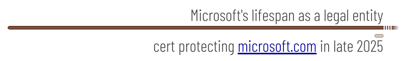

# Why X509 Certs Should Be Secondary Evidence of Org Identity
15 Nov 2024; revised Nov 2025

The technology in PKI and X509 certificates delivers value on the web every day. It has excellent tools, is widely adopted, and has a 40-year track record of solid cryptography. However, I am advocating that [ACDCs](https://trustoverip.github.io/tswg-acdc-specification/) — specifically [vLEIs](https://www.gleif.org/en/vlei/introducing-the-vlei-ecosystem-governance-framework) or credentials with similar schemas and governance — be used as longlived evidence of organizational identity, with certs used more in a supporting role.

Why not build on certs?

Don't get me wrong. I am not down on certs. However, I am *up* on using the right tool for the job. They say that to a hammer, everything looks like a nail. The analog in cybersecurity might be that to PKI experts, every verification problem looks like a place for certs. And such experts aren't wrong to love certs. However, screws are drastically better than nails, for certain carpentry tasks. Likewise, ACDCs are drastically better than certs, as primary proof of organizational identity. They are more stable, more transparent, more scalable, safer, and cheaper in the long run. Plus, they don't require certificate authorities, which means they cross jurisdiction boundaries in ways that certs just can't. This produces some important decentralization benefits.

Again, this is not a critique of certs. In low-security, ephemeral contexts where costs can't be amortized and existing tools are the only option, certs can be a great choice. But given today's cybertrust issues, such contexts are becoming rarer, and certs should, too. It's time for newer tech to play a primary role.   

Let's explore the details.

## Lifespans don't match
How often do you renew your birth certificate?

Identity is stable. In fact, identity means *sameness*; it's what holds constant across contexts. On the other hand, privileges are dynamic. 

Certs are designed to be dynamic privilege mechanisms (that's why they're perfect for domains), and both tooling and tribal knowledge about them encourages short lifespans. Using certs to prove a permanent identity rather than a temporary privilege means that *evidence must turn over regularly*. This builds implicit maintenance costs into a solution, and it creates other nagging problems that will never be resolved.

<figure>
  
  <figcaption>A scale drawing of the identity of Microsoft Corporation (incorporated several times stretching back to 1975) and an actual cert that Microsoft used for a while to prove its identity. Why is its proof of identity more ephemeral than its articles of incorporation?</figcaption>
</figure>

A cert is a bit like a business license. Renewing a business license makes sense, just like renewing proof that a business owns an internet domain makes sense. But renewing an *identity* is a non-sequitur. A renewed credential has to be tied to a *sameness* that spans the before and after. If the only sameness is a relationship with a certificate authority (CA), but the CA can also change, we have a shaky foundation. Unstable registration in the governance scheme of a certificate-rooted ecosystem should not be confused with an identity that's actually defined elsewhere. The identity of organizations is defined in the legal system where they're incorporated; anything a certificate authority says is inherently secondary.

People renew driver's licenses and passports. These are intended to prove privilege; their usefulness on identity questions is secondary and derivative. On the other hand, people don't renew birth certificates, because they're primary identity documents with the same lifespan as the person. A business renews its registration (privilege to operate) regularly. On the other hand, a business typically gets a legal identity only once. 

Dynamic privilege is not stable identity. Certs &mdash; artifacts with a dynamic sweet spot and lifespans measured in weeks or months &mdash; shouldn't be used to prove the identity of something with a lifespan measured in decades.

## Governance is opaque, centralized, and inconsistent
A cert is protected by a cryptographic key. This sounds fancy, but it boils down to a single secret. How the secret was created and how it is managed on an ongoing basis are undefined. All the tech guarantees, from the key binding in a cert, is that someone provided a public key before the certificate was created.

Suppose I told you that a ballistic missile silo was safe from unauthorized access because, at the time of construction, its builders had configured a secret to guard the unlocking of the front door. Suppose the silo's location appeared publicly on GPS, and I cheerfully admitted that there were no guards, fences, surveillance, deadbolts, or other safeguards. Suppose I provided no further details about this solitary secret or its management, except that the secret was replaced every few months. How confident would you be of adequate security? Would you be impressed with the planning of the builders?

Certs are only guarded by one opaquely managed secret, just like the dangerous missile silo...

[In 2021](https://www.valuationresearch.com/insights/trillions-goodwill-balance-sheet-s-p-500-needs-attention/), 479 of the S&amp;P 500 listed "good will" (the value of public reputation and brand) as an asset on a balance sheet, at an average valuation of 7.8 billion USD and a total valuation of 3.6 trillion USD. Is it wise to protect permanent org identity and its associated reputation with single secrets? Is it okay to know almost nothing about who holds the secrets, what triggered their rotation, or how the mechanics of rotation were secured?

A certificate expert might reassure, citing layers of cybersecurity defense that IT departments typically deploy. But ponder that adverb, "typically". It means that protections may exist, in a lot of IT departments. However, it's left to each party to devise and implement (or not implement) as they see fit &mdash; and nobody can audit their decisions or competence. Designers of an ecosystem that's supposed to guarantee solid identity for all stakeholders should be very uncomfortable about such a state of affairs, because human nature guarantees implementation mistakes for anything that's not enforced.

Typically, cert ecosystems implement policies to compensate for key management vulnerabilities, and these policies are touted as a reason to trust. The policies may be quite ambitious, but they don't deliver. Consider the STI-GA that administers certificate-based SHAKEN governance in US VOIP calls. Its governing spec, RFC9448, carefully describes how parties asking for a cert are authenticated. This is foundational to the whole ecosystem, since it determines whether certificates are issued to the intended party. But the RFC [notes in section 4](https://www.rfc-editor.org/rfc/rfc9448.html#name-tnauthlist-identifier-autho):

>The challenge "token-authority" parameter is only used in cases where the VoIP telephone network requires the CA to identify the Token Authority. This is currently not the case for the Signature-based Handling of Asserted information using toKENs (SHAKEN) [ATIS-1000080] certificate framework governance but may be used by other frameworks. If a "token-authority" parameter is present, then the ACME client MAY use the "token-authority" value to identify the URL representing the Token Authority that will provide the TNAuthList Authority Token response to the challenge. *If the "token-authority" parameter is not present, then the ACME client MUST identify the Token Authority based on locally configured information or local policies.*

Here is a certificate ecosystem purpose-built to achieve high assurance of "identity" in telco, and one of its foundational protections is abdicated to undefined local judgment. (Compare section 6 of [ATIS1000080](https://access.atis.org/higherlogic/ws/public/download/69428), which documents other, higher-level SHAKEN requirements. Can we reason confidently about trust?

In most analyses, we assume that certs are issued by certificate authorities. These are vetted orgs, earnest about security. Having carefully qualified certificate authorities (like eIDAS enforces with QTSPs) should help, right?

I am all for strong CA vetting, but this still focuses in the wrong place. *Certificate authorities aren't the ones that choose or manage the keys in certs.* Holders of certs do that. It's the key management of *holders* that's the ubiquitous locus of the risk, and extra protections that ignore it are inadequate by definition. Focusing on CAs is like insisting that the control panel on our missile silo door must have its wiring and programming inspected by a master electrician who's careful and cautious &mdash; but allowing that electrician to input the governing secret for the door based on advice from any employee of the construction company. Is that employee truly representing the construction company's intent? Does he write passwords down on post-it notes and leave them on his lunchbox? Does she text the secret to her boss over SMS? The problem is not just that protections on this secret might be *weak* &mdash; it's that *nothing is known about the risks and protections on that secret*. Knowing nothing about the root of ecosystem security is not a good basis for trust.

>Extended validation certificates do address some of the concerns we're addressing here, but they are costly to generate. If certs had longer lifespans, that cost could be amortized &mdash; but they have to be rotated regularly, just like any other cert. As a result, nobody is seriously proposing mass EV certs in contexts I'm familiar with. 

How many of the following issues, unspecified (or at least, not having transparent answers) by best-of-breed cert governance, can we afford to ignore if we want to achieve strong organizational identity?

* What terms and conditions did the certificate holder (and provider of a cryptographic key) accept?
* What locally configured information and policies were used by the CA to issue a given certificate?
* Is the locally configured information that drives local policies equally accurate and equally up-to-date for each applicant, or does it produce uneven levels of quality?
* Are these local policies fair to all applicants?
* Who are the human beings, not just the institutions, who requested this certificate?
* What evidence exists that these humans are authorized by their institution to act on the institution's behalf, with respect to certificate issuance?
* What checks and balances exist on their behavior?
* What happens if these humans change their affiliation with the org?
* What IT practices protect the keys of the certificate holder?
* What guarantees does the certificate holder make about transparency in the event of key compromise?

I could go on...

Perhaps the policy administrator enforces good answers to some of these questions, but in my experience they're not quickly available in public documentation. Furthermore, using delegated certs &mdash; a feature pressure that's inevitable, if you want to do org identity right &mdash; makes the opacity even worse, and the governance challenges far harder.

## Path to post-quantum is slow
Even though quantum computers aren't commercially available yet, part 1 of many quantum hacks is [already unfolding](https://www.paloaltonetworks.com/cyberpedia/what-is-quantum-computings-threat-to-cybersecurity). Today, clever adversaries are saving encrypted, Diffie Hellman sessions driven by certs &mdash; knowing that tomorrow's quantum computers will enable part 2. Soon they'll crack the sessions, reveal the robust symmetric keys inside, and use them to access encrypted insider secrets, IP, M&amp;A plans, sensitive HR data, and more. Vast numbers of companies are already compromised; only the eventual date of the exploit is unknown.

And harvest-now-decrypt later is just one aspect of post-quantum risk. There are others, such as surprise control attacks.

This is a scary enough issue that [NIST](https://csrc.nist.gov/projects/post-quantum-cryptography), [ENISA](https://enisa.europa.eu/sites/default/files/2024-11/2024%20Report%20on%20the%20State%20of%20Cybersecurity%20in%20the%20Union%20-%20Condensed%20version.pdf), and [other authorities](https://www.tec.gov.in/pdf/TR/Final%20technical%20report%20on%20migration%20to%20PQC%2028-03-25.pdf) have issued strongly worded guidance about beginning post-quantum transitions *now*. Governments are beginning to impose deadlines. 

RFC 9881 tells how X509 certificates may be adapted to use post-quantum primitives. However, the standard was just released in October 2025; so far it has only limited adoption. Given the inertia and variety in the world's cert technologies, upgrades are sure to be slow, expensive, and inconsistent, with the need to accommodate a long tail of late adopters. This makes certs a dangerous way to protect identities that must stay safe into the post-quantum era.

## One key isn't realistic
A huge body of practical experience tells us that organizations need nuanced signing policies to spend large amounts, authorize a merger or fire a CEO. Almost 3800 years ago, the <cite>Code of Hammurabi</cite> required more than one attestation of certain high-stakes transactions (see, for example, [law 7](https://www.gutenberg.org/files/17150/17150-h/17150-h.htm)). The law of Moses had similar requirements (see, for example, [Deuteronomy 19:15](https://www.sefaria.org/Deuteronomy.19.15?lang=bi&aliyot=0)). Double-entry accounting was [invented in medieval Italy](https://monily.com/blog/double-entry-accounting-explained) to formalize such checks and balances, and is an accepted best practice for all modern bookkeeping.

So why are we imagining, millennia after adopting such protections, that it's safe to use the single-signature mechanism of X509 certs as the only gate on unlocking the entire reputation of modern corporations? Fraud certainly hasn't become less common, or slower. Leaked keys on certs have bitten large, sophisticated organizations like [Microsoft](https://www.wired.com/story/china-backed-hackers-steal-microsofts-signing-key-post-mortem/). Surely millions of less sophisticated organizations will be no safer.

If we want our identity mechanism to reflect hard-won wisdom in the analog world, we need something where 3 out of 7 members of the board must sign if the stakes are at level X -- or an exec VP plus 2 out of 5 IT engineers must sign if the stakes are at level Y.

## Prerotation is missing
The identity of an org should be guarded not just by an assertion about its current key, but by a cryptographic commitment to the next key (the one the owner will rotate to next). The next key is then managed in a different place, with independent protections. Such a scheme is called *prerotation*, and it drastically improves security, because even if a hacker can abuse a current key, they can't rotate to new keys and take permanent control without accomplishing a second hack somewhere else. The identity owner thus has a failsafe that they can use to take control back.

Prerotation isn't just a recovery issue. Lacking prerotation, certificate rotation produces anemic cryptographic proof of continuity of control by the certificate holder. Without evidence, we must trust the assertion of the CA that the old cert holder and the new cert holder are the same party.

An X509 extension could be designed for prerotation, perhaps using Certificate Transparency. However, such a mechanism would need to be developed, standardized, and adopted before it is accurate to claim it as a cert feature. Cert technology in its general deployment doesn't support this crucial feature.

## Signatures aren't sequenced
The binding between a private key, its public complement, and an X509 certificate is [inherently subject to retrograde attacks](was.md), because there is only a crude, unreliable way to guess at the timing of the event relative to the timing of a revocation or key rotation. This means that certificate-based identity solutions cannot provide a solid audit trail or answer historical questions; they can only be evaluated in real-time. Yet many implementers assume otherwise, and make serious security mistakes as a result.

## Maintenance is expensive
Question: What work is necessary if the issuee has to rotate their key?

Answer: the old certificate has to be revoked, and a new one has to be issued.

This is painful, even with certificate management automation. It means that reissuance, redeployment, reconfiguration, and rebuilding of caches is a constant task. CRLs are useful, but complex. They can be inconvenient when connectivity is imperfect. OCSP and Certificate Transparency are also clever tools, but each has its own complications and challenges. (See [1](https://x509errors.org/guides/openssl-crl), [2](https://github.com/openssl/openssl/issues/26079), [3](https://www.fastly.com/blog/addressing-challenges-tls-revocation-and-ocsp), [4](https://letsencrypt.org/2024/07/23/replacing-ocsp-with-crls/), [5](https://www.ibm.com/docs/en/sdk-java-technology/8?topic=provider-determine-x509-certificate-revocation-status-ocsp), [6](https://educatedguesswork.org/posts/transparency-part-2/), [7](https://bit.ly/41k4ojw), [8](https://dl.acm.org/doi/10.1145/3278532.3278562), [9](https://javanexus.com/blog/common-pitfalls-certificate-transparency-java), [10](https://bit.ly/3VkMl99), [11](https://research.cloudflare.com/publications/Stark2019/), [12](https://www.encryptionconsulting.com/the-hidden-risks-of-expired-certificate-revocation-lists-crl/), [13](https://www.net.in.tum.de/fileadmin/bibtex/publications/papers/sosnowski2024certificates.pdf), [14](https://www.portnox.com/cybersecurity-101/certificate-revocation-list/)). The tools that do maintenance aren't free to buy, deploy, operate, or develop, and they [don't guarantee perfect outcomes](https://community.letsencrypt.org/t/sometimes-its-required-to-break-the-rules-and-to-change-these/115567). Gaps can and do occur, even with sophisticated and well funded orgs — and they are painful, as embarrassed admins from Cisco, Microsoft, Google, Spotify, LinkedIn, Ericsson, Equifax, AWS, and Apple [have admitted](https://www.encryptionconsulting.com/10-cases-of-certificate-outages-involving-human-error/).

## Security is disincented
When conditions change, timely revocation is vital. However, the cost and effort to maintain a fabric of certs creates a strong [incentive](https://www.pkisolutions.com/blog/to-revoke-or-not-to-revoke-balancing-security-with-performance-and-operational-complexity/) to [avoid revocation](https://doi.org/10.1007/978-3-031-56252-5_14).

To alleviate the tension, the thinking is: *Let's make certs expire often, and delay revocation or key rotation until a new cert is issued on a natural expiration boundary.*

Setting aside the way this plays into the original argument about mismatched lifespans, is this effective?

Suppose typical cert lifespan is 1 year, and PhonesRUs (a company that sells phone numbers and signs STIR/SHAKEN traffic on behalf of its customers) averages 1 cert key compromise every 2 years. This would mean that half of PhonesRUs's certs will be compromised during their lifespan, and if they are compromised on average halfway through their lifespan, then for 6 months out of every 2 years, PhonesRUs will be operating with a compromised cert. But if PhonesRUs has an average cert lifespan of 90 days (the recommendation from STI-GA), then on the 1 occasion in 2 years that a cert is compromised, it is likely to be rotated within 45 days. Operating for 45 days with bad security is clearly better than operating that way for 6 months.

>Note: It might seem like I'm being overly pessimistic to posit a cert key compromise every 2 years. However, 2 years is the midpoint in guidance about a safe key cryptoperiod in [NIST 800-57 rev 5, section 5.3.4](https://nvlpubs.nist.gov/nistpubs/SpecialPublications/NIST.SP.800-57pt1r5.pdf). And "compromise" doesn't mean "known loss of control" but rather "meaningful risk that control could have been lost". Most IT teams experience staff turnover more than once every 2 years... And on top of that, we could consider the frequency of phishing, smishing, APTs, ransomware, bloatware, unpatched software,  social engineering, and other sources of compromise. The risk that confident control over a cert's key might decay in 2 years is *at least* "meaningful".

The conclusion that 45 days is better than 6 months is true as far as it goes, but: A) to shrink the insecure window by 4x, we have traded 4x the maintenance burden; and B) 45 days of compromised operations is still *terrible*, especially considering the fact that PhonesAreUs may be signing for tens of thousands of enterprises.

Suppose we shrink the lifespans of certs far more aggressively — i.e., to a week. Now we have 52x as many certificate request, issuance, installation, revocation, caching, and de-caching operations, and thousands of PhonesRUs customers still have 3.5 days of faulty security, on average, in a 2-year period. Presumably, other STIR/SHAKEN signers would be similar. How much havoc can fraudsters accomplish during 3.5 days when calls for thousands of enterprises go out under a false signature? And how much has our flawed protection cost us?

What's possibly worse is that by obsessively pursuing short-lived evidence, we've created a strong incentive to take the insecure and easy path: if there's a risk of a compromised key, just wait until the cert expires. Because the management burden is already so high, nobody in such an ecosystem wants to do the secure thing: act immediately, be transparent, and cancel all the evidence that's in active use. It's just more management bother.

## Scale and performance are constrained
One of the fundamental challenges with current cert-based organizational security initiatives is that the signers and cert holders are often trusted third parties, because they are the ones with the certs. This is true of STIR/SHAKEN in secure voice, for example, where the signature on a call is affixed by an originating service provider, not by the enterprise that makes the call.

Proposals to improve this are on the table, and Provenant strongly supports the general idea. Signing must be done not by phone companies, but by holders of telephone numbers.

But picking the right signer isn't the only ingredient in a fix; [signing based on the right evidence is also vital](ev-life). Having enterprises sign with certs means delegate certs are needed, and this creates a huge scaling challenge. All of the preceding concerns become more acute if the number of signers and certificate holders changes from hundreds of PhonesRUs companies, to millions of enterprises and small businesses. Shall we increase the maintenance burden by 52x (certs rotate weekly), AND multiply the number of certificate holders by 10,000?

At such scales, performance also decreases (or cache latency goes up, a lot).

## Much better alternatives exist
Since about 2016, the decentralized identity movement has been championing an upgrade to PKI's 40-year-old "issue to keys" paradigm. W3C's Decentralized Identifiers (DIDs), a standard since 2022, is a first wave of progress, and embodies much industry and cybersecurity wisdom. The Verifiable Credentials (VCs) standard, also released in 2022, builds atop DIDs and could be roughly characterized as next-generation X509. Conformant implementations now protect millions of identities, are in active exploration by big tech, and are the basis of citizen identity programs in many parts of Europe and Asia.

DIDs and verifiable credentials solve the problems with key rotation by creating an indirection: evidence is issued to *an identifier, not a key*, so the issuee's identifier can update its key state without invalidating the evidence. I worked on both of these standards, and I remain proud of their virtues.

But there's a hitch.

Evidence is also *issued by* an identifier, and the issuer's identifier also has a rotatable key state. If the issuer updates their identifier, old evidence is invalidated, because the old key could be compromised and abused after the rotation. This risk is poorly understood in SSI circles, and deserves an article of its own (see [here](was.md)).

One solution is to anchor issuance activity to a blockchain or similar data structure that proves when an issuance occurred. Unfortunately, the SSI community has been wrestling with the centralization, scale, and regulatory compliance challenges of blockchains for almost a decade, and success is elusive. Anybody who tells you the problems are happily solved is either uninformed or disingenuous. There are very real and very uncomfortable tradeoffs.

Also, even if DIDs and VCs solve some problems in identity evidence 1.0, opaque and clunky governance is still a headache. The best answer of the community so far is trust registries. These are a band aid; they just move the centralization back to a different level of the architecture. They are also immature and fragmented. And they primarily address governance for issuers, not issuees.

But there's good news.

If DIDs and VCs are a second-generation solution, we've had identity evidence 3.0 since December 2022, when the first global-scale systems went to production with Authentic Chained Data Containers ([ACDCs](https://github.com/trustoverip/tswg-acdc-specification)).

ACDCs are not just a format &mdash; they're a *methodology* for creating verifiable evidence. ACDCs are *issued by* and *issued to* autonomic identifiers (AIDs). These are like DIDs, but with far stronger security guarantees. They impose stringent requirements on the key management behaviors of issuers and issuees. They support weighted multisig, prerotation, and transparent, independent witnesses to detect compromise. They can be upgraded to postquantum algorithms without disruption. They don't require a blockchain, and thus have none of the challenges with scale, performance, or regulatory compliance across jurisdictions.

AIDs are [post-quantum ready](kspqs.pdf).

The chaining in ACDCs is like X509 chaining on steroids. It is safer, more efficient, and more cacheable. It doesn't depend on certificate authorities. It eliminates the need for trust registries. Links in a chain can be weighted, and they can have a variety of semantic meanings.

As a bonus, ACDCs are actually smaller and simpler than VCs, and they are also more expressive. ACDCs can represent everything that fits in the VC data model, and many things that don't. And ACDCs come with a graduated disclosure feature that achieves important privacy objectives. This model is more flexible than the one in SD-JWTs, uses less exotic cryptography than AnonCreds, and will make regulators, law enforcement, and private citizens happier than alternatives.

ACDCs and their related underpinnings have been codified by the Trust Over IP Foundation. The recently released ISO17442-3 (vLEIs) uses them.

For more details, you may want to read [this comparison of ACDCs and SD-JWTs](sdjwt-acdc.md).

Identity is hard. Getting the evidence right is crucial. We've had X509 and PKI for four decades, and they've served us well. We're all glad our TLS sessions are pretty safe. However, certs aren't the right building block for major new identity infrastructure. It's high time for an upgrade.