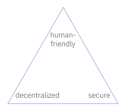
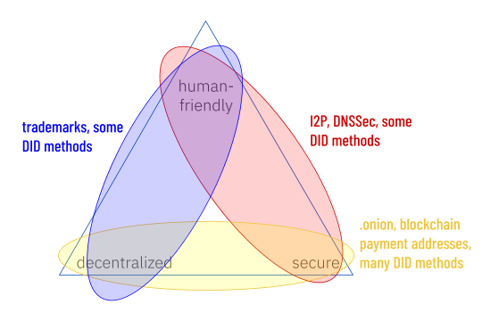
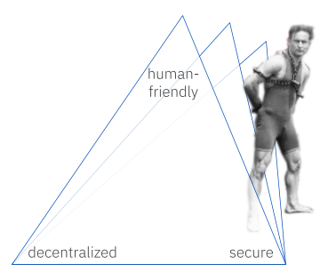
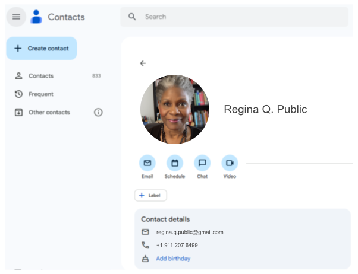

# Zooko and Houdini: A Flatland Parable
Daniel Hardman &mdash; 20 June 2024 &mdash; [DICE 2024](https://www.didas.swiss/2024/11/26/dice-2024-shaping-the-future-of-digital-trust/) &mdash; [slides](https://bit.ly/3VrSMpp)

#identity #ux

## Pick 2 of 3

[Zooko's triangle](https://en.wikipedia.org/wiki/Zooko%27s_triangle) is a familiar trilemma in identity circles. Zooko [asserted](https://web.archive.org/web/20011020191610/http://zooko.com/distnames.html) that it is possible to build an identifier mechanism for use in a network protocol such that it satisfies 2 out of 3 desirable properties &mdash; but never all 3 at the same time:

The Wikipedia article about the triangle describes a few attempts to get around this constraint, with debatable success. Setting aside esoteric approaches, it's easy to see how different identifier schemes make different tradeoffs under this constraint:

However, resolving the trilemma is easy, if you are willing to question some assumptions. And therein lies a story.

## The parable

Once upon a time there was a [flatlander](https://www.gutenberg.org/ebooks/45506) who found himself trapped inside a triangle. Being a 2-dimensional being, the walls of this triangle looked all-encompassing and impervious.

However, this flatlander was named Houdini, and he was a clever escape artist. He had spent many years thinking about how to do things that looked impossible to his peers.

Houdini realized that *each human has their own definition of what makes an identifier "friendly"* &mdash; and that this meant that one corner of the triangle projected into a third dimension. Since he couldn't take the perspective of anyone else, Houdini couldn't see this other dimension, but if he could conceive it, it would let him step out of prison.

When Houdini stopped assuming that an identifier needed to be human-friendly in the same way to every observer, he escaped.

## No fancy math needed

Houdini can pull off this trick without fancy equations to impress Einstein. In fact, all of us already take advantage of his trick, every single day. Have a look at your address book:

The person that I call "Regina Q. Public", you might call "Reggie P" or "Mom" or "the boss". The differences in these names don't bother us at all, because we don't look up Regina in others' contacts lists; we only look her up in our own.

This might seem like cheating. After all, Zooko's triangle was formulated in terms of a *network protocol*. Wouldn't everybody who interacts over a network protocol want to use the same human-friendly identifier, to eliminate ambiguity?

## Thinking more carefully about friendliness

I claim that the answer is an emphatic "No". Humans don't speak network protocols, so making human-friendliness a success criterion of network protocols is a mistake.

Zooko described his trilemma in 2001, at a time of intense debate about the wisdom of centralization in DNS and ICANN. Napster and Gnutella were emerging as ways to share content. He wanted to identify remote counterparties in a way that was efficient and unambiguous for computers, without relying on a single namespace arbiter. And he wanted identifiers to be easy for humans to share and remember, because this would facilitate discovery and prevent human mistakes. A decade later, Aaron Swartz [applied the model to blockchain problems](http://www.aaronsw.com/weblog/squarezooko) and described how a blockchain could be used to resolve names ("Alice" &rarr; `bc1qw508d6qejxtdg4y5r3zarvary0c5xw7kygt080`). Namecoin, Ethereum Name Service, and Handshake all use variations on this idea.

But is Swartz's conclusion &mdash; a name like "Alice" is human-friendly because "the name can be whatever string you like" &mdash; touting the friendliness that we actually want?

How many users of a blockchain are well acquainted with a person named "Alice" that might NOT be associated with our imaginary payment address `bc1qw508d6qejxtdg4y5r3zarvary0c5xw7kygt080`? Is the name "Alice" friendly for them? And what if the name isn't Alice, but rather Αλίκη, Алиса, アリス, عائشة, אנה, अनन्या, 아름, or 美丽 instead? If you speak one of those languages, you might be delighted that the name has become more friendly &mdash; but if not, you might have exactly the opposite reaction. This is especially true if you have to type such names, read them out loud, or figure out how to spell them. Remember (the artist formerly known as) "Prince", who changed his name in 1993 to a symbol that had no pronunciation and no representation in Unicode?

Real friendliness adapts itself to the needs of the user. The user's context is not always the global network on which a protocol must run, and their needs might include:

* accessibility (usefulness in spoken as well as written forms)
* memorability
* discovery and comparison (both exact and fuzzy searches, per circumstance)
* losslessness across transcription and font changes
* cultural sensitivity (an innocent word in one language might be offensive in another)

Not every human that needs friendliness will need, or want, the same solution, because each human imputes meaning differently. Given this variety, it's impossible to make identifiers globally friendly to all the humans who might ever use them. We exit the trilemma, and we achieve far better friendliness anyway, if we let humans look up identifiers using discoverable attributes, *including friendly names they choose themselves*, and then convert to an identifier that's secure and decentralized when they want to use actual protocols.

## Commonalities in friendly names

This is not to say that totally unfettered variation is optimal. A convention about how to choose friendly names would be very helpful &mdash; not as a constraint imposed from above, but as a teaching aid. It might teach a correct mental model, eliminating some important cybersecurity risks and helping people make choices that set them up for success, before they understand the complexities they'll eventually face on the digital identity landscape.

Such a convention is the subject of a different essay.

